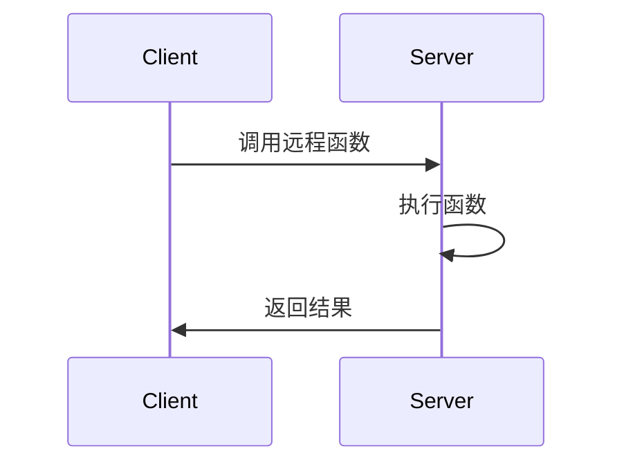

# RPC通信

## 介绍

远程过程调用（Remote Procedure Call，简称RPC）是一种允许程序调用另一个地址空间（通常是另一台机器上）的过程或函数的协议。RPC 使得开发者可以像调用本地函数一样调用远程服务，从而简化了分布式系统的开发。

RPC 的核心思想是隐藏网络通信的复杂性，使得开发者可以专注于业务逻辑。它通常用于客户端-服务器架构中，客户端通过 RPC 调用服务器上的函数，服务器执行函数并返回结果。

## RPC 的工作原理

RPC 的工作流程可以分为以下几个步骤：

1. **客户端调用本地代理**：客户端调用一个看起来像本地函数的代理函数。
2. **代理函数打包参数**：代理函数将参数打包成一个消息，并通过网络发送到服务器。
3. **服务器接收消息**：服务器接收到消息后，解包参数并调用实际的函数。
4. **服务器执行函数**：服务器执行函数并将结果打包成消息返回给客户端。
5. **客户端接收结果**：客户端接收到结果后，解包并返回给调用者。



## RPC 的代码示例

以下是一个简单的 RPC 示例，使用 Python 的 `xmlrpc` 库来实现。

### 服务器端代码

```python
from xmlrpc.server import SimpleXMLRPCServer

def add(x, y):
    return x + y

server = SimpleXMLRPCServer(("localhost", 8000))
server.register_function(add, "add")
server.serve_forever()
```

### 客户端代码

```python
import xmlrpc.client

proxy = xmlrpc.client.ServerProxy("http://localhost:8000/")
result = proxy.add(2, 3)
print(result)  # 输出: 5
```

在这个示例中，服务器端定义了一个 `add` 函数，客户端通过 RPC 调用这个函数并获取结果。

## RPC 的实际应用场景

RPC 广泛应用于分布式系统中，以下是一些常见的应用场景：

1. **微服务架构**：在微服务架构中，各个服务之间通过 RPC 进行通信。例如，订单服务可能需要调用库存服务来检查库存。
2. **分布式计算**：在分布式计算中，任务可以分布到多个节点上执行，节点之间通过 RPC 进行通信。
3. **远程数据库访问**：应用程序可以通过 RPC 调用远程数据库服务来执行查询或更新操作。

## 总结

RPC 是一种强大的工具，它使得分布式系统的开发变得更加简单和直观。通过隐藏网络通信的复杂性，RPC 允许开发者像调用本地函数一样调用远程服务。理解 RPC 的工作原理和应用场景对于构建高效的分布式系统至关重要。

## 附加资源与练习

- **资源**：
  - [gRPC 官方文档](https://grpc.io/docs/)
  - [XML-RPC 官方文档](https://docs.python.org/3/library/xmlrpc.html)
- **练习**：
  - 尝试使用 gRPC 实现一个简单的 RPC 服务。
  - 修改上面的示例，使其支持更多的数学运算（如减法、乘法、除法）。

:::tip
在实际开发中，选择合适的 RPC 框架（如 gRPC、Thrift、XML-RPC 等）非常重要。不同的框架有不同的性能和功能特点，选择适合你项目的框架可以大大提高开发效率。
:::