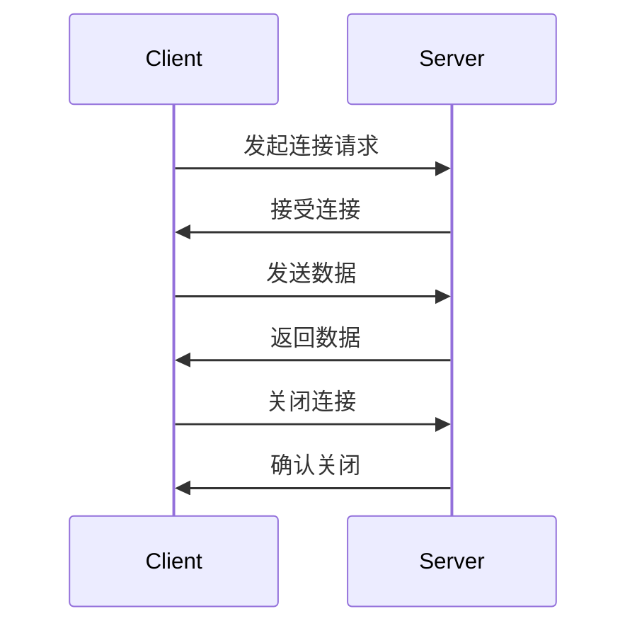

# TCP Socket编程

在网络编程中，**TCP Socket** 是一种用于实现网络通信的编程接口。它允许应用程序通过网络发送和接收数据。TCP（传输控制协议）是一种可靠的、面向连接的协议，确保数据在传输过程中不会丢失或损坏。Socket则是TCP/IP协议栈中的一个抽象层，用于在客户端和服务器之间建立连接。

本文将逐步介绍TCP Socket编程的基础知识，并通过代码示例和实际案例帮助你理解其工作原理。

## 1. 什么是Socket？

Socket是网络通信的端点，可以理解为一个“插座”。它允许应用程序通过网络与其他应用程序通信。Socket通常由IP地址和端口号组成，IP地址用于标识主机，端口号用于标识主机上的特定服务。

:::note
Socket是双向的，既可以发送数据，也可以接收数据。
:::

## 2. TCP Socket的工作流程

TCP Socket通信通常分为以下几个步骤：

1. **创建Socket**：客户端和服务器分别创建一个Socket。
2. **绑定Socket**：服务器将Socket绑定到一个特定的IP地址和端口。
3. **监听连接**：服务器开始监听客户端的连接请求。
4. **建立连接**：客户端向服务器发起连接请求，服务器接受连接。
5. **数据传输**：客户端和服务器通过Socket发送和接收数据。
6. **关闭连接**：通信结束后，关闭Socket。



## 3. 代码示例：简单的TCP客户端和服务器

### 3.1 服务器端代码

以下是一个简单的TCP服务器代码示例，使用Python编写：

```python
import socket

# 创建Socket
server_socket = socket.socket(socket.AF_INET, socket.SOCK_STREAM)

# 绑定IP地址和端口
server_socket.bind(('127.0.0.1', 12345))

# 监听连接
server_socket.listen(5)
print("服务器已启动，等待连接...")

# 接受客户端连接
client_socket, addr = server_socket.accept()
print(f"已连接客户端：{addr}")

# 接收数据
data = client_socket.recv(1024)
print(f"收到数据：{data.decode('utf-8')}")

# 发送数据
client_socket.send("你好，客户端！".encode('utf-8'))

# 关闭连接
client_socket.close()
server_socket.close()
```

### 3.2 客户端代码

以下是一个简单的TCP客户端代码示例：

```python
import socket

# 创建Socket
client_socket = socket.socket(socket.AF_INET, socket.SOCK_STREAM)

# 连接服务器
client_socket.connect(('127.0.0.1', 12345))

# 发送数据
client_socket.send("你好，服务器！".encode('utf-8'))

# 接收数据
data = client_socket.recv(1024)
print(f"收到数据：{data.decode('utf-8')}")

# 关闭连接
client_socket.close()
```

### 3.3 运行结果

1. 首先运行服务器端代码，服务器会等待客户端连接。
2. 然后运行客户端代码，客户端会连接到服务器并发送数据。
3. 服务器接收到数据后，会返回一条消息给客户端。
4. 客户端接收到服务器的消息后，关闭连接。

输出示例：

```
服务器已启动，等待连接...
已连接客户端：('127.0.0.1', 12345)
收到数据：你好，客户端！
```

```
收到数据：你好，服务器！
```

## 4. 实际应用场景

TCP Socket编程广泛应用于各种网络通信场景，例如：

- **Web服务器**：处理HTTP请求和响应。
- **聊天应用**：实现实时消息传输。
- **文件传输**：通过Socket发送和接收文件。
- **远程控制**：通过网络控制远程设备。

:::tip
在实际开发中，通常会使用更高级的网络库（如Python的`asyncio`或`Twisted`）来简化Socket编程。
:::

## 5. 总结

TCP Socket编程是网络编程的基础，掌握它可以帮助你理解网络通信的原理。本文介绍了Socket的基本概念、工作流程，并通过代码示例展示了如何实现一个简单的TCP客户端和服务器。希望这些内容能帮助你入门网络编程。

## 6. 附加资源与练习

- **练习**：尝试修改代码，实现一个简单的聊天程序，允许多个客户端连接到服务器并互相发送消息。
- **资源**：
  - [Python官方文档 - socket](https://docs.python.org/3/library/socket.html)
  - [TCP/IP协议详解](https://www.tcpipguide.com/)

:::caution
在实际应用中，务必处理异常情况，如连接中断或数据丢失。
:::