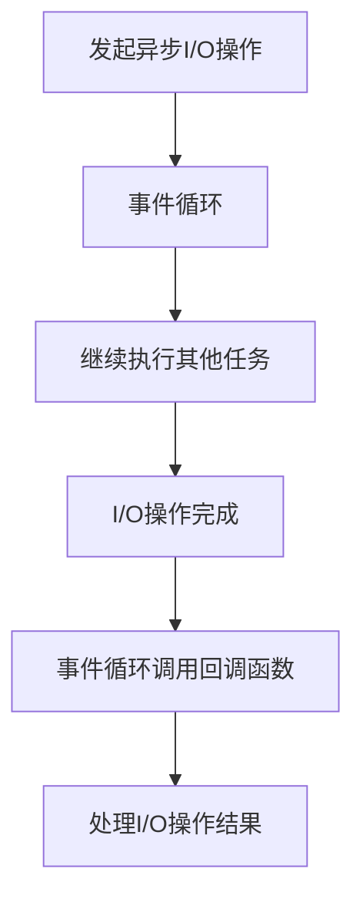

# 异步I/O

在现代网络编程中，异步I/O（Asynchronous I/O）是一个非常重要的概念。它允许程序在等待I/O操作（如读取文件、网络请求等）完成的同时，继续执行其他任务，从而提高了程序的效率和响应速度。本文将详细介绍异步I/O的概念、工作原理以及如何在代码中实现它。

## 什么是异步I/O？

异步I/O是一种非阻塞的I/O操作方式。与同步I/O不同，同步I/O在等待I/O操作完成时会阻塞程序的执行，而异步I/O则允许程序在等待I/O操作的同时继续执行其他任务。这种方式特别适用于需要处理大量I/O操作的场景，如网络服务器、数据库访问等。

### 同步I/O vs 异步I/O

为了更好地理解异步I/O，我们可以将其与同步I/O进行对比。

- **同步I/O**：程序在发起I/O操作后，必须等待操作完成才能继续执行后续代码。这种方式简单直观，但在处理大量I/O操作时，会导致程序效率低下。
  
- **异步I/O**：程序在发起I/O操作后，可以立即继续执行后续代码，而不必等待I/O操作完成。当I/O操作完成后，程序会通过回调函数、事件或Promise等方式得到通知。

## 异步I/O的工作原理

异步I/O的核心思想是将I/O操作交给操作系统或底层库来处理，程序在发起I/O操作后立即返回，继续执行其他任务。当I/O操作完成后，操作系统会通知程序，程序再处理I/O操作的结果。

### 事件循环（Event Loop）

在异步I/O的实现中，事件循环（Event Loop）是一个关键概念。事件循环是一个不断运行的循环，它负责监听和处理各种事件，如I/O操作完成、定时器到期等。当事件发生时，事件循环会调用相应的回调函数来处理事件。



## 异步I/O的实现方式

在不同的编程语言和框架中，异步I/O的实现方式有所不同。以下是几种常见的实现方式：

### 1. 回调函数（Callback）

回调函数是最早的异步I/O实现方式之一。程序在发起I/O操作时，会传递一个回调函数给操作系统或底层库。当I/O操作完成后，操作系统会调用这个回调函数来处理结果。

```javascript
const fs = require('fs');

fs.readFile('example.txt', 'utf8', (err, data) => {
    if (err) {
        console.error('读取文件出错:', err);
    } else {
        console.log('文件内容:', data);
    }
});

console.log('继续执行其他任务...');
```

**输出：**
```
继续执行其他任务...
文件内容: 这是文件的内容。
```

### 2. Promise

Promise是一种更现代的异步编程方式，它允许我们以更清晰的方式处理异步操作。Promise对象表示一个异步操作的最终完成（或失败）及其结果值。

```javascript
const fs = require('fs').promises;

fs.readFile('example.txt', 'utf8')
    .then(data => {
        console.log('文件内容:', data);
    })
    .catch(err => {
        console.error('读取文件出错:', err);
    });

console.log('继续执行其他任务...');
```

**输出：**
```
继续执行其他任务...
文件内容: 这是文件的内容。
```

### 3. async/await

`async/await`是基于Promise的语法糖，它使得异步代码看起来更像同步代码，从而提高了代码的可读性。

```javascript
const fs = require('fs').promises;

async function readFile() {
    try {
        const data = await fs.readFile('example.txt', 'utf8');
        console.log('文件内容:', data);
    } catch (err) {
        console.error('读取文件出错:', err);
    }
}

readFile();
console.log('继续执行其他任务...');
```

**输出：**
```
继续执行其他任务...
文件内容: 这是文件的内容。
```

## 实际应用场景

异步I/O在网络编程中有着广泛的应用。以下是一个简单的HTTP服务器示例，展示了如何使用异步I/O处理客户端请求。

```javascript
const http = require('http');

const server = http.createServer(async (req, res) => {
    if (req.url === '/') {
        res.writeHead(200, { 'Content-Type': 'text/plain' });
        res.end('Hello, World!\n');
    } else if (req.url === '/data') {
        try {
            const data = await fs.readFile('data.json', 'utf8');
            res.writeHead(200, { 'Content-Type': 'application/json' });
            res.end(data);
        } catch (err) {
            res.writeHead(500, { 'Content-Type': 'text/plain' });
            res.end('Internal Server Error\n');
        }
    } else {
        res.writeHead(404, { 'Content-Type': 'text/plain' });
        res.end('Not Found\n');
    }
});

server.listen(3000, () => {
    console.log('服务器运行在 http://localhost:3000/');
});
```

在这个示例中，服务器使用异步I/O来处理文件读取操作，从而避免了阻塞其他请求的处理。

## 总结

异步I/O是现代网络编程中不可或缺的一部分。它通过非阻塞的方式处理I/O操作，提高了程序的效率和响应速度。本文介绍了异步I/O的基本概念、工作原理以及几种常见的实现方式，并通过实际案例展示了异步I/O在网络编程中的应用。

:::tip
**提示**：在实际开发中，选择合适的异步I/O实现方式非常重要。回调函数虽然简单，但在处理复杂的异步逻辑时容易导致“回调地狱”。Promise和`async/await`提供了更清晰和可维护的代码结构，推荐优先使用。
:::

## 附加资源与练习

- **资源**：
  - [Node.js 官方文档](https://nodejs.org/en/docs/)
  - [MDN Web Docs: 异步 JavaScript](https://developer.mozilla.org/en-US/docs/Learn/JavaScript/Asynchronous)

- **练习**：
  1. 修改上面的HTTP服务器示例，使其能够处理更多的URL路径，并返回不同的响应。
  2. 尝试使用`async/await`重写一个使用回调函数的异步代码，观察代码的可读性变化。
  3. 编写一个简单的文件下载器，使用异步I/O来下载文件并保存到本地。

通过本文的学习，你应该对异步I/O有了初步的了解。继续实践和探索，你将能够更深入地掌握这一重要的编程概念。