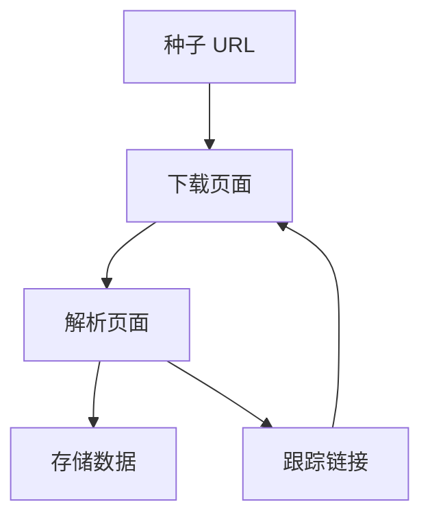

## 什么是网络爬虫？

网络爬虫（Web Crawler），也称为网络蜘蛛（Web Spider），是一种自动化的程序，用于从互联网上抓取数据。它通过访问网页、提取信息并跟踪链接来收集数据。网络爬虫广泛应用于搜索引擎、数据分析、价格监控等领域。

:::note
网络爬虫的核心任务是模拟人类浏览网页的行为，但以更高效和自动化的方式完成。
:::

## 网络爬虫的工作原理

网络爬虫的工作流程通常包括以下几个步骤：

1. **种子 URL**：爬虫从一个或多个初始 URL（称为种子 URL）开始。
2. **下载页面**：爬虫访问这些 URL，并下载页面的 HTML 内容。
3. **解析页面**：爬虫解析 HTML 内容，提取有用的信息（如文本、图片、链接等）。
4. **存储数据**：提取的数据被存储到数据库或文件中。
5. **跟踪链接**：爬虫从当前页面中提取新的链接，并将它们添加到待访问的 URL 队列中。
6. **重复过程**：爬虫重复上述步骤，直到满足某些停止条件（如达到指定的深度或抓取足够的数据）。



## 使用 Python 编写简单的网络爬虫

Python 是编写网络爬虫的流行语言，因为它有丰富的库支持，如 `requests` 和 `BeautifulSoup`。下面是一个简单的网络爬虫示例，它从一个网页中提取所有链接。

### 安装依赖

首先，确保你已经安装了 `requests` 和 `BeautifulSoup` 库：

```bash
pip install requests beautifulsoup4
```

### 示例代码

```python
import requests
from bs4 import BeautifulSoup

# 目标 URL
url = "https://example.com"

# 发送 HTTP 请求
response = requests.get(url)

# 检查请求是否成功
if response.status_code == 200:
    # 解析 HTML 内容
    soup = BeautifulSoup(response.text, 'html.parser')
    
    # 提取所有链接
    links = soup.find_all('a')
    
    # 打印链接
    for link in links:
        print(link.get('href'))
else:
    print(f"Failed to retrieve the page. Status code: {response.status_code}")
```

### 代码解释

1. **发送请求**：使用 `requests.get()` 方法发送 HTTP 请求，获取网页内容。
2. **解析 HTML**：使用 `BeautifulSoup` 解析 HTML 内容，提取出所有的 `<a>` 标签。
3. **提取链接**：通过 `link.get('href')` 获取每个链接的 URL。
4. **打印链接**：将提取到的链接打印出来。

:::tip
在实际应用中，你可能需要处理更复杂的情况，如处理 JavaScript 渲染的页面、处理分页、遵守网站的 `robots.txt` 规则等。
:::

## 实际应用场景

网络爬虫在许多领域都有广泛的应用，以下是一些常见的应用场景：

1. **搜索引擎**：搜索引擎使用爬虫来抓取网页内容，建立索引。
2. **价格监控**：电商网站使用爬虫来监控竞争对手的价格变化。
3. **数据挖掘**：研究人员使用爬虫来收集数据，用于分析和建模。
4. **内容聚合**：新闻网站使用爬虫来聚合来自不同来源的内容。

:::caution
在使用网络爬虫时，务必遵守相关法律法规和网站的 `robots.txt` 文件中的规则，避免对目标网站造成过大的负载。
:::

## 总结

网络爬虫是一种强大的工具，能够自动化地从互联网上收集数据。通过理解其工作原理和使用 Python 编写简单的爬虫，你可以开始探索更复杂的应用场景。

## 附加资源与练习

- **练习**：尝试修改上面的代码，使其能够提取网页中的图片链接。
- **资源**：
  - [BeautifulSoup 官方文档](https://www.crummy.com/software/BeautifulSoup/bs4/doc/)
  - [Requests 官方文档](https://docs.python-requests.org/en/latest/)
  - [Scrapy 框架](https://scrapy.org/)：一个强大的 Python 爬虫框架，适合更复杂的爬虫任务。

:::warning
请始终确保你的爬虫行为符合道德和法律要求，避免对目标网站造成不必要的负担。
:::