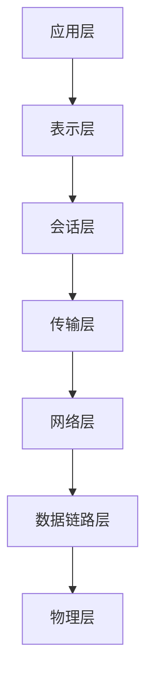

## 什么是OSI七层模型？

OSI（Open Systems Interconnection）七层模型是国际标准化组织（ISO）提出的一个网络通信框架。它将网络通信过程分为七个层次，每一层都有特定的功能和协议。通过分层设计，OSI模型使得网络通信更加模块化、易于管理和扩展。

:::tip
OSI模型是一个理论框架，实际网络协议（如TCP/IP）并不完全遵循它，但理解OSI模型有助于更好地掌握网络通信的原理。
:::

## OSI七层模型的层次结构

以下是OSI七层模型的七个层次，从底层到高层依次为：

1. **物理层（Physical Layer）**
2. **数据链路层（Data Link Layer）**
3. **网络层（Network Layer）**
4. **传输层（Transport Layer）**
5. **会话层（Session Layer）**
6. **表示层（Presentation Layer）**
7. **应用层（Application Layer）**

接下来，我们将逐一介绍每一层的功能及其在实际中的应用。

---

### 1. 物理层（Physical Layer）

物理层是OSI模型的最底层，负责在物理介质上传输原始的比特流。它定义了电缆、光纤、无线电波等物理介质的特性，以及如何将数据转换为电信号、光信号或无线电波。

**功能：**
- 定义物理介质的类型（如双绞线、光纤等）。
- 定义数据传输速率和信号编码方式。
- 管理物理连接（如建立、维护和断开连接）。

**实际应用：**
- 以太网（Ethernet）中的网线和网卡。
- Wi-Fi中的无线电波传输。

:::note
物理层不关心数据的含义，只负责将比特流从一个设备传输到另一个设备。
:::

---

### 2. 数据链路层（Data Link Layer）

数据链路层负责在直接相连的两个节点之间可靠地传输数据帧。它将物理层传输的比特流组织成帧，并处理错误检测和纠正。

**功能：**
- 将比特流封装成帧。
- 提供错误检测和纠正机制（如CRC校验）。
- 管理物理地址（MAC地址）。

**实际应用：**
- 以太网中的MAC地址和交换机。
- Wi-Fi中的无线链路管理。

:::caution
数据链路层只能在同一局域网（LAN）内工作，跨网络通信需要网络层的支持。
:::

---

### 3. 网络层（Network Layer）

网络层负责在不同网络之间传输数据包。它通过逻辑地址（如IP地址）找到目标设备，并选择最佳路径进行数据传输。

**功能：**
- 提供逻辑地址（如IP地址）。
- 路由选择和数据包转发。
- 处理网络拥塞和流量控制。

**实际应用：**
- IP协议（IPv4和IPv6）。
- 路由器的工作。

:::tip
网络层是互联网通信的核心，它使得数据能够跨越多个网络传输。
:::

---

### 4. 传输层（Transport Layer）

传输层负责端到端的通信，确保数据可靠、有序地传输。它提供了两种主要的传输协议：TCP（传输控制协议）和UDP（用户数据报协议）。

**功能：**
- 提供可靠的数据传输（TCP）。
- 提供无连接的数据传输（UDP）。
- 处理数据分段和重组。

**实际应用：**
- TCP用于需要可靠传输的场景（如网页浏览、文件传输）。
- UDP用于实时性要求高的场景（如视频流、在线游戏）。

:::warning
TCP虽然可靠，但开销较大；UDP虽然高效，但不保证数据可靠性。
:::

---

### 5. 会话层（Session Layer）

会话层负责建立、管理和终止会话。它允许不同设备上的应用程序之间进行通信，并管理会话的同步和恢复。

**功能：**
- 建立、维护和终止会话。
- 管理会话的同步和检查点。
- 处理会话恢复。

**实际应用：**
- 远程过程调用（RPC）。
- 网络文件系统（NFS）。

:::note
会话层在现代网络协议中较少被单独提及，其功能通常由应用层或传输层实现。
:::

---

### 6. 表示层（Presentation Layer）

表示层负责数据的格式化和转换，以确保不同系统之间的数据能够被正确理解。它处理数据的加密、压缩和编码。

**功能：**
- 数据格式转换（如ASCII到Unicode）。
- 数据加密和解密。
- 数据压缩和解压缩。

**实际应用：**
- SSL/TLS加密协议。
- JPEG、MPEG等多媒体格式的编码。

:::tip
表示层使得不同系统之间的数据交换更加灵活和高效。
:::

---

### 7. 应用层（Application Layer）

应用层是OSI模型的最高层，直接为用户提供服务。它包含了各种网络应用程序和协议，如HTTP、FTP、SMTP等。

**功能：**
- 提供用户接口和网络服务。
- 处理应用程序之间的通信。
- 管理用户身份验证和权限。

**实际应用：**
- 网页浏览（HTTP/HTTPS）。
- 电子邮件（SMTP、POP3、IMAP）。
- 文件传输（FTP）。

:::caution
应用层协议通常依赖于下层协议（如TCP/IP）来实现数据传输。
:::

---

## 实际案例：网页浏览中的OSI模型

让我们以访问一个网页为例，看看OSI模型是如何工作的：

1. **应用层**：用户在浏览器中输入URL，浏览器使用HTTP协议向服务器发送请求。
2. **表示层**：服务器将网页内容（如HTML、CSS）转换为浏览器可以理解的格式。
3. **会话层**：浏览器与服务器建立会话，管理请求和响应的交互。
4. **传输层**：TCP协议确保数据可靠地传输到服务器。
5. **网络层**：IP协议将数据包从客户端路由到服务器。
6. **数据链路层**：以太网协议将数据包封装成帧，并通过交换机传输。
7. **物理层**：网卡将数据帧转换为电信号，通过网线传输到服务器。

---

## 总结

OSI七层模型是理解网络通信的基础框架。通过分层设计，它使得网络通信更加模块化和易于管理。每一层都有特定的功能和协议，共同协作完成数据的传输。

:::tip
虽然实际网络协议（如TCP/IP）并不完全遵循OSI模型，但理解OSI模型有助于更好地掌握网络通信的原理。
:::

## 附加资源与练习

- **练习**：尝试分析你日常使用的网络应用（如电子邮件、视频流）在OSI模型中的工作流程。
- **资源**：阅读更多关于TCP/IP协议的内容，了解其与OSI模型的异同。