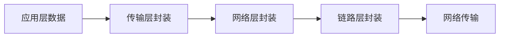
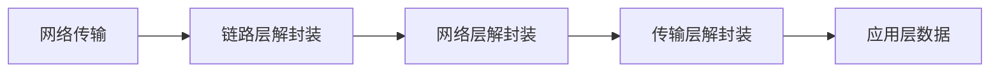

## 介绍

在网络通信中，数据需要经过多个层次的处理才能从发送方传递到接收方。**协议封装与解封装**是这一过程中的核心概念。简单来说，**封装**是指将数据按照特定协议格式包装成适合传输的形式，而**解封装**则是在接收端将数据从协议格式中提取出来。

这一过程通常发生在网络协议栈的各个层次中，例如在 TCP/IP 模型中，数据会依次经过应用层、传输层、网络层和链路层。每一层都会对数据进行封装或解封装，以确保数据能够正确传输。

---

## 协议封装

### 什么是封装？

封装是指将数据按照特定协议的要求添加头部（Header）和尾部（Trailer）信息的过程。这些信息通常包括源地址、目标地址、校验和、协议类型等元数据，用于确保数据能够正确传输和解析。

### 封装的层次

以 TCP/IP 模型为例，封装过程通常分为以下几个步骤：

1. **应用层**：生成原始数据（例如 HTTP 请求）。
2. **传输层**：添加 TCP 或 UDP 头部（包括端口号、序列号等）。
3. **网络层**：添加 IP 头部（包括源 IP 地址和目标 IP 地址）。
4. **链路层**：添加以太网头部和尾部（包括 MAC 地址和校验信息）。

以下是一个简单的封装过程示意图：



### 示例：TCP 封装

假设我们有一个简单的 HTTP 请求，内容为 `GET /index.html HTTP/1.1`。以下是它在传输层的封装过程：

1. **应用层**：生成原始数据 `GET /index.html HTTP/1.1`。
2. **传输层**：添加 TCP 头部，包括源端口号（例如 5000）和目标端口号（例如 80）。
3. **网络层**：添加 IP 头部，包括源 IP 地址（例如 `192.168.1.1`）和目标 IP 地址（例如 `192.168.1.2`）。
4. **链路层**：添加以太网头部，包括源 MAC 地址（例如 `00:1A:2B:3C:4D:5E`）和目标 MAC 地址（例如 `00:1A:2B:3C:4D:5F`）。

最终的数据包结构如下：

```
[以太网头部][IP 头部][TCP 头部][HTTP 请求][以太网尾部]
```

---

## 协议解封装

### 什么是解封装？

解封装是封装的逆过程。当数据到达接收端时，每一层会依次移除对应的头部和尾部信息，最终提取出原始数据。

### 解封装的层次

以 TCP/IP 模型为例，解封装过程通常分为以下几个步骤：

1. **链路层**：移除以太网头部和尾部，提取 IP 数据包。
2. **网络层**：移除 IP 头部，提取 TCP 或 UDP 数据段。
3. **传输层**：移除 TCP 或 UDP 头部，提取应用层数据。
4. **应用层**：处理原始数据（例如解析 HTTP 请求）。

以下是一个简单的解封装过程示意图：



### 示例：TCP 解封装

假设接收端收到一个数据包，其结构如下：

```
[以太网头部][IP 头部][TCP 头部][HTTP 请求][以太网尾部]
```

解封装过程如下：

1. **链路层**：移除以太网头部和尾部，提取 IP 数据包。
2. **网络层**：移除 IP 头部，提取 TCP 数据段。
3. **传输层**：移除 TCP 头部，提取 HTTP 请求。
4. **应用层**：处理 HTTP 请求 `GET /index.html HTTP/1.1`。

---

## 实际应用场景

### 场景 1：HTTP 请求与响应

当你在浏览器中输入一个 URL 并按下回车时，浏览器会生成一个 HTTP 请求。这个请求会经过封装过程，最终通过网络传输到服务器。服务器收到请求后，会进行解封装，处理请求并返回响应。响应数据同样会经过封装和解封装过程，最终显示在浏览器中。

### 场景 2：视频流传输

在视频流传输中，数据会被分割成多个小包进行传输。每个包都会经过封装和解封装过程，以确保数据能够正确到达接收端并重新组合成完整的视频流。

---

## 总结

协议封装与解封装是网络通信中的基础概念。通过封装，数据能够按照协议要求进行传输；通过解封装，数据能够被正确解析和处理。理解这一过程对于学习网络协议和开发网络应用至关重要。

---

## 附加资源与练习

### 资源
- [TCP/IP 协议详解](https://example.com/tcp-ip-guide)
- [网络协议栈的工作原理](https://example.com/network-stack)

### 练习
1. 使用 Wireshark 抓取一个 HTTP 请求，分析其封装和解封装过程。
2. 编写一个简单的 Python 程序，模拟 TCP 数据的封装与解封装过程。
3. 研究 UDP 协议的封装与解封装过程，并与 TCP 进行对比。

:::tip
如果你对网络协议感兴趣，可以尝试深入学习 TCP/IP 模型的其他层次，例如网络层的 IP 协议和链路层的以太网协议。
:::