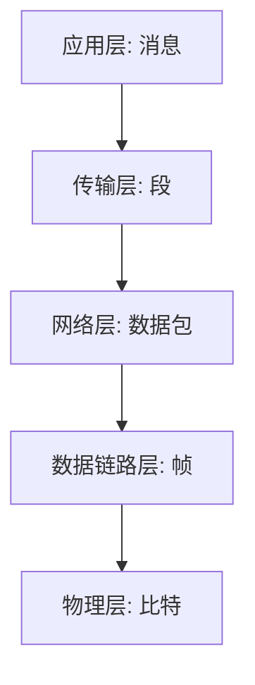

# 协议数据单元(PDU)

在网络通信中，**协议数据单元（Protocol Data Unit, PDU）** 是一个非常重要的概念。它是指在网络协议栈的每一层中，数据被封装和传输的基本单位。理解 PDU 是掌握网络协议工作原理的关键。

## 什么是协议数据单元(PDU)?

PDU 是网络协议栈中每一层处理数据的基本单位。每一层都会对数据进行封装，添加特定的头部或尾部信息，以便在通信过程中传递控制信息和数据。不同层的 PDU 有不同的名称，例如：

- **物理层**：比特（Bit）
- **数据链路层**：帧（Frame）
- **网络层**：数据包（Packet）
- **传输层**：段（Segment）或数据报（Datagram）
- **应用层**：消息（Message）

:::tip
PDU 的名称因协议栈的层次而异，但其核心作用是相同的：在每一层中传递数据和控制信息。
:::

## PDU 的封装与解封装

在网络通信中，数据从发送方到接收方的传输过程中，会经过协议栈的每一层。每一层都会对数据进行封装或解封装。

### 封装过程
1. **应用层**：生成原始数据（消息）。
2. **传输层**：将消息封装为段（Segment），添加传输层头部（如 TCP 或 UDP 头部）。
3. **网络层**：将段封装为数据包（Packet），添加网络层头部（如 IP 头部）。
4. **数据链路层**：将数据包封装为帧（Frame），添加数据链路层头部和尾部（如以太网头部和 CRC 校验）。
5. **物理层**：将帧转换为比特流（Bit），通过物理介质传输。

### 解封装过程
接收方收到数据后，会按照相反的顺序逐层解封装：
1. **物理层**：将比特流转换为帧。
2. **数据链路层**：移除帧的头部和尾部，提取数据包。
3. **网络层**：移除网络层头部，提取段。
4. **传输层**：移除传输层头部，提取消息。
5. **应用层**：接收原始数据。

:::note
封装和解封装是网络通信的核心机制，确保数据能够正确地从发送方传递到接收方。
:::

## 实际案例：HTTP 请求中的 PDU

让我们通过一个实际的 HTTP 请求来理解 PDU 的作用。

1. **应用层**：用户通过浏览器发送一个 HTTP GET 请求，生成一条消息。
2. **传输层**：消息被封装为 TCP 段，添加 TCP 头部（包含源端口、目标端口等信息）。
3. **网络层**：TCP 段被封装为 IP 数据包，添加 IP 头部（包含源 IP 地址、目标 IP 地址等信息）。
4. **数据链路层**：IP 数据包被封装为以太网帧，添加以太网头部和尾部。
5. **物理层**：以太网帧被转换为比特流，通过网线传输。

接收方的网络设备会逐层解封装，最终将 HTTP 请求传递给目标服务器。

## 总结

协议数据单元（PDU）是网络通信中每一层处理数据的基本单位。通过封装和解封装，数据能够在网络中高效、可靠地传输。理解 PDU 的概念对于掌握网络协议的工作原理至关重要。

:::caution
初学者在学习 PDU 时，容易混淆不同层的 PDU 名称。记住每一层的 PDU 名称及其作用，有助于更好地理解网络通信过程。
:::

## 附加资源与练习

### 推荐资源
- 《计算机网络：自顶向下方法》——深入了解网络协议栈的经典教材。
- [Wireshark](https://www.wireshark.org/)——一款强大的网络协议分析工具，可以帮助你观察 PDU 的实际传输过程。

### 练习
1. 使用 Wireshark 捕获一个 HTTP 请求，分析每一层的 PDU。
2. 尝试编写一个简单的网络程序，模拟数据的封装和解封装过程。

通过实践，你将更深入地理解 PDU 的作用及其在网络通信中的重要性。