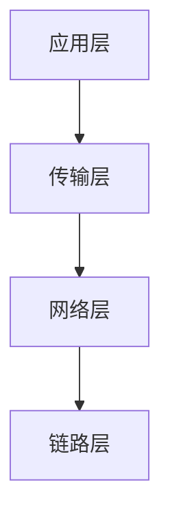

## 介绍

在网络通信中，**协议栈**（Protocol Stack）是指一组分层的网络协议，每一层负责处理特定的通信任务。协议栈的实现是网络编程的核心，它定义了数据如何在网络中传输、如何被封装和解封装，以及如何确保数据的可靠性和安全性。

协议栈通常遵循**OSI模型**或**TCP/IP模型**，每一层都有其特定的功能和协议。例如，TCP/IP模型包括应用层、传输层、网络层和链路层。理解协议栈的实现，有助于我们更好地掌握网络通信的底层原理。

## 协议栈的分层结构

协议栈的分层结构是其核心设计理念。每一层都依赖于下一层提供的服务，并为上一层提供服务。以下是一个典型的TCP/IP协议栈的分层结构：



- **应用层**：负责处理应用程序之间的通信，如HTTP、FTP、SMTP等。
- **传输层**：提供端到端的通信服务，如TCP和UDP。
- **网络层**：负责数据包的路由和转发，如IP协议。
- **链路层**：处理物理网络设备之间的数据传输，如以太网协议。

## 协议栈的实现步骤

### 1. 定义协议栈的接口

首先，我们需要为每一层定义接口。这些接口规定了每一层如何与上下层进行交互。例如，传输层需要提供发送和接收数据的接口，而网络层则需要提供路由和转发数据的接口。

```python
class TransportLayer:
    def send(self, data):
        pass

    def receive(self):
        pass

class NetworkLayer:
    def route(self, packet):
        pass
```

### 2. 实现每一层的功能

接下来，我们需要实现每一层的具体功能。以传输层为例，我们可以实现一个简单的TCP协议：

```python
class TCP(TransportLayer):
    def __init__(self):
        self.buffer = []

    def send(self, data):
        # 模拟TCP发送数据的过程
        print(f"Sending data: {data}")
        self.buffer.append(data)

    def receive(self):
        # 模拟TCP接收数据的过程
        if self.buffer:
            return self.buffer.pop(0)
        return None
```

### 3. 层与层之间的交互

协议栈的每一层都需要与上下层进行交互。例如，当应用层发送数据时，数据会先传递给传输层，传输层再将数据传递给网络层，依此类推。

```python
class ApplicationLayer:
    def __init__(self, transport_layer):
        self.transport_layer = transport_layer

    def send_data(self, data):
        self.transport_layer.send(data)

    def receive_data(self):
        return self.transport_layer.receive()
```

### 4. 封装与解封装

在协议栈中，数据在每一层都会被封装或解封装。例如，当数据从应用层传递到传输层时，传输层会在数据前面添加一个TCP头。当数据到达链路层时，链路层会添加一个以太网帧头。

```python
class NetworkLayer:
    def encapsulate(self, packet):
        # 添加IP头
        return f"IP Header | {packet}"

    def decapsulate(self, packet):
        # 移除IP头
        return packet.split(" | ")[1]
```

## 实际案例：简单的HTTP服务器

让我们通过一个简单的HTTP服务器来展示协议栈的实现。这个服务器将使用TCP协议来接收和发送HTTP请求。

```python
import socket

class HTTPServer:
    def __init__(self, host='127.0.0.1', port=8080):
        self.host = host
        self.port = port
        self.server_socket = socket.socket(socket.AF_INET, socket.SOCK_STREAM)
        self.server_socket.bind((self.host, self.port))
        self.server_socket.listen(1)

    def handle_request(self, client_socket):
        request = client_socket.recv(1024).decode('utf-8')
        print(f"Received request: {request}")
        response = "HTTP/1.1 200 OK\n\nHello, World!"
        client_socket.send(response.encode('utf-8'))
        client_socket.close()

    def start(self):
        print(f"Server started on {self.host}:{self.port}")
        while True:
            client_socket, addr = self.server_socket.accept()
            self.handle_request(client_socket)

if __name__ == "__main__":
    server = HTTPServer()
    server.start()
```

在这个例子中，我们实现了一个简单的HTTP服务器。它使用TCP协议来接收客户端的请求，并返回一个简单的HTTP响应。

## 总结

协议栈的实现是网络编程的基础。通过分层设计，我们可以将复杂的网络通信问题分解为多个简单的子问题。每一层都有其特定的功能，层与层之间通过接口进行交互。理解协议栈的实现，有助于我们更好地掌握网络通信的底层原理。

## 附加资源

- [TCP/IP协议详解](https://www.example.com/tcp-ip)
- [OSI模型与TCP/IP模型的对比](https://www.example.com/osi-tcpip)
- [网络编程入门指南](https://www.example.com/network-programming)

## 练习

1. 尝试扩展上面的HTTP服务器，使其能够处理不同的HTTP方法（如GET、POST）。
2. 实现一个简单的UDP协议，并与TCP协议进行对比。
3. 研究一下如何在实际项目中使用协议栈，例如在物联网设备中。

:::tip
在实现协议栈时，务必注意每一层的职责划分，确保每一层只处理自己负责的任务，避免功能重叠。
:::