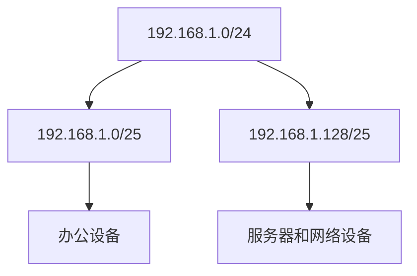

# IP地址规划

在网络配置与管理中，IP地址规划是一个至关重要的步骤。它决定了如何为网络中的设备分配唯一的IP地址，以确保数据能够正确传输。本文将带你从基础概念入手，逐步了解IP地址规划的核心内容，并通过实际案例帮助你掌握其应用。

## 什么是IP地址规划？

IP地址规划是指为网络中的设备分配IP地址的过程。它不仅仅是简单地分配地址，还需要考虑网络的规模、子网划分、路由需求以及未来的扩展性。合理的IP地址规划可以提高网络的可管理性、安全性和性能。

:::note
IP地址是网络中设备的唯一标识符，类似于现实生活中的门牌号。IPv4地址由32位二进制数组成，通常以点分十进制表示（如 `192.168.1.1`）。
:::

## IP地址的分类

IPv4地址分为五类：A、B、C、D和E。其中，A、B、C类用于普通网络，D类用于组播，E类保留用于实验。

- **A类地址**：范围是 `1.0.0.0` 到 `126.0.0.0`，适用于大型网络。
- **B类地址**：范围是 `128.0.0.0` 到 `191.255.0.0`，适用于中型网络。
- **C类地址**：范围是 `192.0.0.0` 到 `223.255.255.0`，适用于小型网络。

:::tip
在实际应用中，私有地址范围（如 `10.0.0.0/8`、`172.16.0.0/12` 和 `192.168.0.0/16`）常用于局域网中，以避免与公网地址冲突。
:::

## 子网划分

子网划分是将一个大的IP地址空间划分为多个较小的子网的过程。通过子网划分，可以更高效地利用IP地址资源，并提高网络的安全性。

### 子网掩码

子网掩码用于区分IP地址中的网络部分和主机部分。例如，`255.255.255.0` 表示前24位是网络地址，后8位是主机地址。

```plaintext
IP地址：192.168.1.1
子网掩码：255.255.255.0
网络地址：192.168.1.0
主机地址：0.0.0.1
```

### CIDR表示法

CIDR（无类别域间路由）表示法是一种简化的子网掩码表示方法。例如，`192.168.1.0/24` 表示前24位是网络地址。

```plaintext
192.168.1.0/24
```

:::caution
子网划分时，需要确保每个子网的主机数量不超过其可用地址范围。例如，`/24` 子网最多支持254个主机（`2^8 - 2`）。
:::

## 实际案例：小型办公室网络规划

假设你需要为一个拥有50台设备的小型办公室设计IP地址规划。以下是具体步骤：

1. **选择私有地址范围**：使用 `192.168.1.0/24`。
2. **划分子网**：将 `192.168.1.0/24` 划分为两个子网：
   - 子网1：`192.168.1.0/25`（支持126台设备）
   - 子网2：`192.168.1.128/25`（支持126台设备）
3. **分配IP地址**：
   - 子网1用于办公设备（如电脑、打印机）。
   - 子网2用于服务器和网络设备（如路由器、交换机）。



:::warning
在实际部署中，务必为网络设备（如路由器、交换机）保留固定的IP地址，以便管理和维护。
:::

## 总结

IP地址规划是网络设计中的关键步骤。通过合理的子网划分和地址分配，可以提高网络的效率和可管理性。本文介绍了IP地址的基础知识、子网划分方法以及一个实际案例，帮助你理解如何为小型网络设计IP地址规划。

## 附加资源与练习

- **练习1**：尝试为一个拥有200台设备的网络设计IP地址规划，使用 `10.0.0.0/8` 地址范围。
- **练习2**：研究IPv6地址规划，并与IPv4进行比较。
- **推荐阅读**：
  - [RFC 1918 - 私有网络地址分配](https://tools.ietf.org/html/rfc1918)
  - [CIDR表示法详解](https://en.wikipedia.org/wiki/Classless_Inter-Domain_Routing)

通过不断实践和学习，你将能够掌握更复杂的网络规划技巧，为未来的网络设计打下坚实基础。