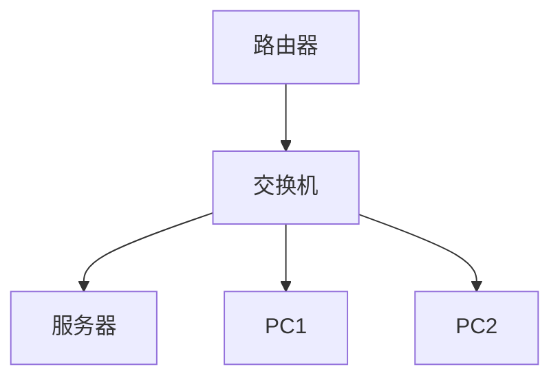

## 介绍

网络文档管理是指对网络配置、拓扑、设备信息、故障记录等文档进行系统化管理和维护的过程。良好的网络文档管理不仅能提高网络维护的效率，还能帮助团队快速定位和解决问题，特别是在复杂的网络环境中。

对于初学者来说，理解网络文档管理的重要性是掌握网络配置与管理的第一步。本文将逐步讲解网络文档管理的核心概念，并通过实际案例展示其应用。

---

## 为什么需要网络文档管理？

在网络环境中，设备和配置可能会频繁变化。如果没有系统化的文档管理，以下问题可能会出现：

- **配置丢失**：设备配置未记录，导致故障时无法快速恢复。
- **信息混乱**：团队成员对网络拓扑或设备信息理解不一致。
- **效率低下**：查找关键信息耗时过长，影响问题解决速度。

通过有效的网络文档管理，可以避免这些问题，并确保网络的稳定性和可维护性。

---

## 网络文档管理的主要内容

网络文档管理通常包括以下几个方面：

1. **网络拓扑图**：展示网络中设备之间的连接关系。
2. **设备配置文档**：记录每个设备的配置信息。
3. **IP 地址分配表**：记录网络中所有设备的 IP 地址和子网划分。
4. **故障记录**：记录网络故障的原因、解决方法和时间。
5. **变更日志**：记录网络配置的变更历史。

---

## 如何创建网络拓扑图

网络拓扑图是网络文档管理的重要组成部分。它可以帮助团队直观地理解网络结构。以下是一个简单的网络拓扑图示例：



:::tip
使用工具如 [Draw.io](https://draw.io) 或 [Lucidchart](https://www.lucidchart.com/) 可以轻松创建和共享网络拓扑图。
:::

---

## 设备配置文档的管理

设备配置文档记录了每个网络设备的配置信息。以下是一个路由器配置的示例：

```plaintext
hostname Router1
interface GigabitEthernet0/0
 ip address 192.168.1.1 255.255.255.0
 no shutdown
!
interface GigabitEthernet0/1
 ip address 192.168.2.1 255.255.255.0
 no shutdown
!
```

:::caution
确保定期备份设备配置文档，并在每次配置变更后更新文档。
:::

---

## IP 地址分配表

IP 地址分配表记录了网络中所有设备的 IP 地址信息。以下是一个简单的 IP 地址分配表示例：

| 设备名称 | IP 地址       | 子网掩码         | 用途         |
|----------|---------------|------------------|--------------|
| 路由器   | 192.168.1.1   | 255.255.255.0    | 网关         |
| 服务器   | 192.168.1.10  | 255.255.255.0    | 文件存储     |
| PC1      | 192.168.1.20  | 255.255.255.0    | 办公电脑     |
| PC2      | 192.168.1.21  | 255.255.255.0    | 开发电脑     |

---

## 实际案例：网络故障排查

假设某天网络突然中断，团队通过查看网络文档快速定位问题：

1. **查看网络拓扑图**：确认所有设备连接正常。
2. **检查设备配置文档**：发现路由器的配置被意外修改。
3. **恢复配置**：根据备份的配置文档，快速恢复路由器配置。

:::note
如果没有网络文档管理，排查此类问题可能需要数小时甚至更长时间。
:::

---

## 总结

网络文档管理是网络配置与管理中不可或缺的一部分。通过系统化地管理网络拓扑图、设备配置文档、IP 地址分配表等信息，可以显著提高网络的稳定性和维护效率。

---

## 附加资源与练习

### 资源
- [网络文档管理最佳实践](https://www.cisco.com/c/en/us/support/docs/ip/routing-information-protocol-rip/13788-3.html)
- [Draw.io 教程](https://www.drawio.com/doc/)

### 练习
1. 为你的家庭网络创建一个简单的网络拓扑图。
2. 记录你家中路由器的配置信息，并尝试备份。
3. 设计一个 IP 地址分配表，记录你家中所有设备的 IP 地址。

通过实践，你将更好地理解网络文档管理的重要性！