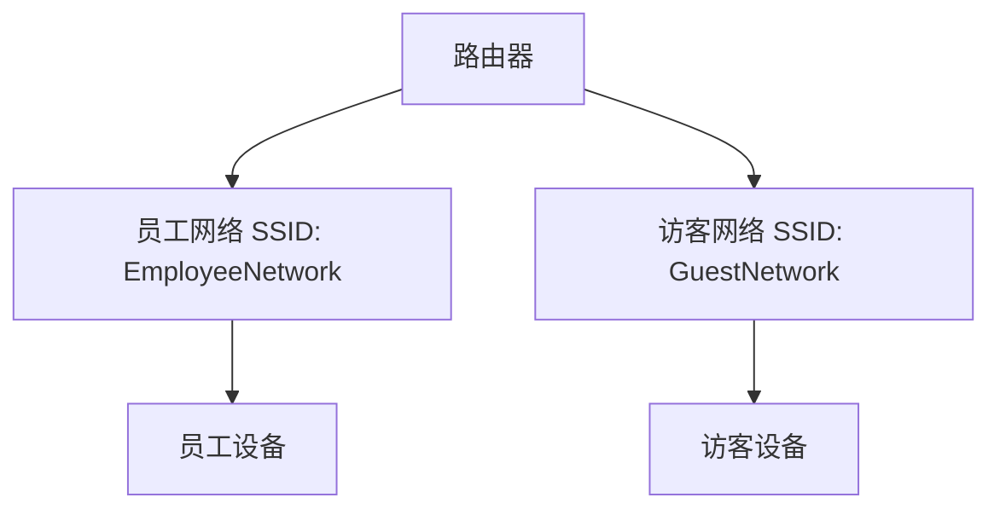

# 无线网络配置

无线网络配置是现代网络管理中的重要组成部分，它允许设备通过无线信号连接到互联网或局域网。与有线网络相比，无线网络提供了更大的灵活性和便利性，但也带来了额外的配置和管理挑战。本文将逐步讲解无线网络配置的基本概念、配置步骤以及实际应用场景。

## 什么是无线网络配置？

无线网络配置是指通过无线接入点（如路由器）将设备连接到网络的过程。它涉及设置无线网络的名称（SSID）、安全协议（如WPA2/WPA3）、密码以及其他相关参数。无线网络配置的目标是确保设备能够安全、稳定地连接到网络。

## 无线网络配置的基本步骤

### 1. 选择无线网络设备
首先，你需要选择一个支持无线网络的路由器或接入点。大多数现代路由器都支持无线功能，并提供了管理界面用于配置。

### 2. 登录路由器管理界面
通常，你可以通过浏览器访问路由器的管理界面。常见的路由器管理地址是 `192.168.1.1` 或 `192.168.0.1`。你需要输入路由器的用户名和密码（通常可以在路由器背面找到）。

```bash
# 示例：访问路由器管理界面
http://192.168.1.1
```

### 3. 配置无线网络名称（SSID）
SSID 是无线网络的名称，用户可以通过它识别并连接到网络。你可以在路由器的管理界面中设置 SSID。

```bash
# 示例：设置 SSID 为 "MyHomeNetwork"
SSID: MyHomeNetwork
```

### 4. 设置无线网络密码
为了保护无线网络的安全，你需要设置一个强密码。常见的加密协议包括 WPA2 和 WPA3。

```bash
# 示例：设置 WPA2 密码为 "SecurePassword123"
Security Protocol: WPA2
Password: SecurePassword123
```

### 5. 保存并应用配置
完成配置后，记得保存并应用更改。路由器会重新启动无线网络，新的配置将生效。

## 实际应用场景

### 家庭无线网络配置
假设你正在为家庭配置无线网络。你可以将 SSID 设置为 "HomeNetwork"，并选择一个强密码来保护网络。这样，家中的设备（如手机、笔记本电脑）都可以通过无线信号连接到互联网。

### 企业无线网络配置
在企业环境中，无线网络配置可能更加复杂。你可能需要配置多个 SSID 来区分不同的用户组（如员工和访客），并设置更严格的安全策略。



## 总结

无线网络配置是网络管理中的基础技能。通过本文，你学习了如何选择无线设备、登录路由器管理界面、设置 SSID 和密码，以及应用配置。无论是家庭还是企业环境，掌握这些技能都能帮助你更好地管理和维护无线网络。

## 附加资源与练习

- **练习**：尝试在你的路由器上配置一个新的无线网络，并测试设备的连接。
- **资源**：查阅路由器的用户手册，了解更多高级配置选项。

:::tip
如果你在配置过程中遇到问题，可以尝试重启路由器或恢复出厂设置，然后重新配置。
:::

:::caution
确保你的无线网络密码足够强大，以防止未经授权的访问。
:::