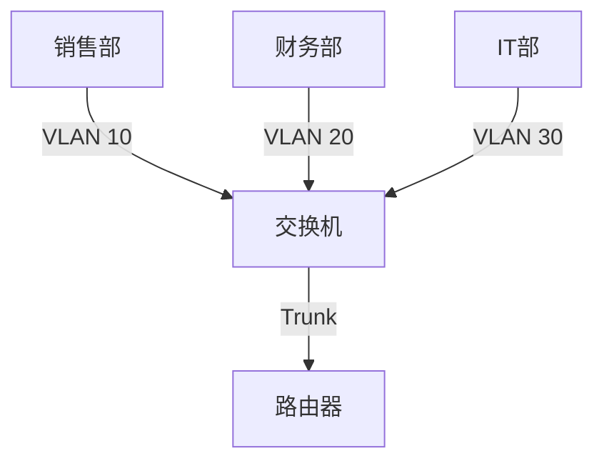

# VLAN配置实践

## 什么是VLAN？

VLAN（Virtual Local Area Network，虚拟局域网）是一种将物理网络划分为多个逻辑网络的技术。通过VLAN，您可以在同一个物理网络设备（如交换机）上创建多个独立的广播域，从而提高网络的安全性、灵活性和管理效率。

:::tip
VLAN的主要优点包括：
- **隔离广播域**：减少广播流量，提高网络性能。
- **增强安全性**：不同VLAN之间的通信需要经过路由器或三层交换机。
- **简化管理**：通过逻辑划分网络，更容易进行管理和维护。
:::

## VLAN的基本概念

在配置VLAN之前，您需要了解一些基本概念：

1. **VLAN ID**：每个VLAN都有一个唯一的标识符，称为VLAN ID，范围是1到4094。
2. **Trunk端口**：用于在不同交换机之间传输多个VLAN的流量。
3. **Access端口**：用于连接终端设备（如PC、打印机等），通常只属于一个VLAN。
4. **Native VLAN**：在Trunk端口上，未标记的流量默认属于Native VLAN。

## VLAN配置步骤

### 1. 创建VLAN

在交换机上创建VLAN非常简单。以下是一个在Cisco交换机上创建VLAN的示例：

```bash
Switch# configure terminal
Switch(config)# vlan 10
Switch(config-vlan)# name Sales
Switch(config-vlan)# exit
```

在这个例子中，我们创建了一个VLAN ID为10的VLAN，并将其命名为“Sales”。

### 2. 配置Access端口

将端口配置为Access端口，并将其分配给特定的VLAN。以下是一个示例：

```bash
Switch(config)# interface GigabitEthernet0/1
Switch(config-if)# switchport mode access
Switch(config-if)# switchport access vlan 10
Switch(config-if)# exit
```

在这个例子中，我们将GigabitEthernet0/1端口配置为Access端口，并将其分配给VLAN 10。

### 3. 配置Trunk端口

在交换机之间传输多个VLAN的流量时，需要将端口配置为Trunk端口。以下是一个示例：

```bash
Switch(config)# interface GigabitEthernet0/24
Switch(config-if)# switchport mode trunk
Switch(config-if)# switchport trunk allowed vlan 10,20
Switch(config-if)# exit
```

在这个例子中，我们将GigabitEthernet0/24端口配置为Trunk端口，并允许VLAN 10和20的流量通过。

### 4. 验证VLAN配置

配置完成后，您可以使用以下命令来验证VLAN配置：

```bash
Switch# show vlan brief
```

该命令将显示所有VLAN的简要信息，包括VLAN ID、名称和端口成员。

## 实际案例：企业网络中的VLAN配置

假设您在一家中小型企业中负责网络管理。公司有多个部门，包括销售部、财务部和IT部。为了提高网络的安全性和性能，您决定为每个部门配置一个独立的VLAN。

### 网络拓扑



### 配置步骤

1. **创建VLAN**：
   - VLAN 10：销售部
   - VLAN 20：财务部
   - VLAN 30：IT部

2. **配置Access端口**：
   - 将销售部的端口分配给VLAN 10
   - 将财务部的端口分配给VLAN 20
   - 将IT部的端口分配给VLAN 30

3. **配置Trunk端口**：
   - 将连接路由器的端口配置为Trunk端口，并允许所有VLAN的流量通过。

4. **验证配置**：
   - 使用`show vlan brief`命令验证VLAN配置。
   - 使用`show interfaces trunk`命令验证Trunk端口的配置。

## 总结

通过本文，您已经学习了VLAN的基本概念、配置步骤以及实际应用场景。VLAN是网络管理中的重要工具，能够帮助您提高网络的安全性、灵活性和管理效率。

:::caution
在实际配置中，请确保正确配置Trunk端口的Native VLAN，以避免潜在的安全风险。
:::

## 附加资源与练习

- **练习**：在您的实验环境中配置多个VLAN，并尝试在不同VLAN之间进行通信。
- **进一步学习**：了解VLAN间路由（Inter-VLAN Routing）的配置方法，以实现不同VLAN之间的通信。

希望本文对您的学习有所帮助！如果您有任何问题，欢迎在评论区留言。