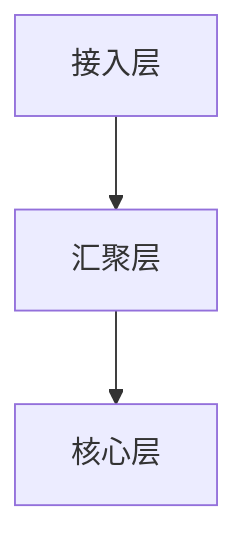

# 数据中心网络概述

## 介绍

数据中心网络是现代计算基础设施的核心组成部分，它连接了数据中心内的服务器、存储设备和其他网络设备，确保数据的高效传输和处理。随着云计算和大数据技术的快速发展，数据中心网络的设计和优化变得尤为重要。

## 数据中心网络的基本概念

### 什么是数据中心网络？

数据中心网络是指在一个数据中心内部，连接各种计算、存储和网络设备的网络系统。它的主要任务是确保数据在服务器、存储设备和其他网络设备之间的高效传输。

### 数据中心网络的组成

一个典型的数据中心网络通常包括以下几个部分：

1. **服务器**：执行计算任务的核心设备。
2. **存储设备**：用于存储数据的设备，如硬盘阵列（SAN）和网络附加存储（NAS）。
3. **网络设备**：包括交换机、路由器和负载均衡器等，用于连接和管理网络流量。
4. **网络链路**：连接各种设备的物理或虚拟链路，如光纤、铜缆或无线连接。

## 数据中心网络的架构

### 传统三层架构

传统的数据中心网络通常采用三层架构，包括：

1. **接入层（Access Layer）**：连接服务器和存储设备，提供基本的网络接入功能。
2. **汇聚层（Aggregation Layer）**：汇聚接入层的流量，并提供高级网络服务，如负载均衡和防火墙。
3. **核心层（Core Layer）**：提供高速的数据传输和路由功能，连接不同的汇聚层设备。



### 现代数据中心网络架构

随着数据中心规模的扩大和虚拟化技术的普及，现代数据中心网络逐渐向扁平化、软件定义网络（SDN）和网络功能虚拟化（NFV）方向发展。

## 数据中心网络的关键技术

### 虚拟局域网（VLAN）

VLAN 是一种将物理网络划分为多个逻辑网络的技术，可以提高网络的安全性和管理效率。

```bash
# 配置 VLAN 示例
switchport mode access
switchport access vlan 10
```

### 软件定义网络（SDN）

SDN 通过将网络控制平面与数据平面分离，实现了网络的集中管理和自动化配置。

```python
# SDN 控制器示例代码
from ryu.base import app_manager
from ryu.controller import ofp_event
from ryu.controller.handler import MAIN_DISPATCHER
from ryu.controller.handler import set_ev_cls

class SimpleSwitch13(app_manager.RyuApp):
    def __init__(self, *args, **kwargs):
        super(SimpleSwitch13, self).__init__(*args, **kwargs)

    @set_ev_cls(ofp_event.EventOFPPacketIn, MAIN_DISPATCHER)
    def packet_in_handler(self, ev):
        msg = ev.msg
        datapath = msg.datapath
        ofp = datapath.ofproto
        ofp_parser = datapath.ofproto_parser

        actions = [ofp_parser.OFPActionOutput(ofp.OFPP_FLOOD)]
        out = ofp_parser.OFPPacketOut(
            datapath=datapath, buffer_id=msg.buffer_id, in_port=msg.in_port,
            actions=actions)
        datapath.send_msg(out)
```

### 网络功能虚拟化（NFV）

NFV 通过将网络功能（如防火墙、负载均衡器等）虚拟化，提高了网络的灵活性和可扩展性。

## 实际案例

### 案例：大型云服务提供商的数据中心网络

某大型云服务提供商的数据中心网络采用了 SDN 和 NFV 技术，实现了网络的自动化管理和高效资源利用。通过 SDN 控制器，该提供商能够动态调整网络流量，确保高可用性和低延迟。

## 总结

数据中心网络是现代计算基础设施的重要组成部分，其设计和优化对于确保数据的高效传输和处理至关重要。通过理解数据中心网络的基本概念、架构和关键技术，初学者可以为深入学习网络工程和云计算打下坚实的基础。

## 附加资源

- [数据中心网络设计指南](https://example.com/data-center-network-design)
- [SDN 和 NFV 入门教程](https://example.com/sdn-nfv-tutorial)
- [VLAN 配置实战](https://example.com/vlan-configuration)

## 练习

1. 解释传统数据中心网络的三层架构，并绘制其示意图。
2. 编写一个简单的 SDN 控制器代码，实现基本的网络流量控制。
3. 研究并描述一个实际的数据中心网络案例，分析其采用的网络技术和架构。
