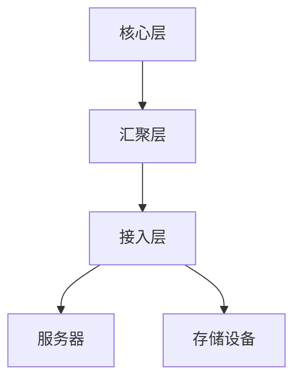
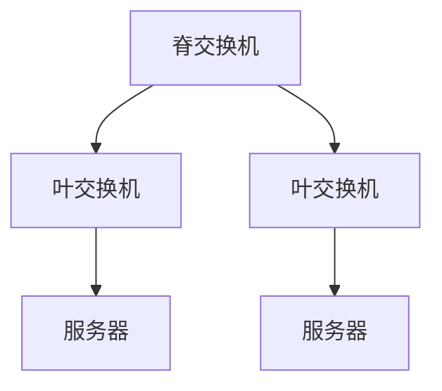

# 数据中心网络架构

## 介绍

数据中心网络架构是指用于连接和管理数据中心内各种计算、存储和网络资源的网络设计。它是现代数据中心的核心组成部分，负责确保数据的高效传输、低延迟和高可用性。随着云计算和大数据的兴起，数据中心网络架构的设计变得越来越复杂，但也越来越重要。

## 基本概念

### 1. 数据中心网络的层次结构

数据中心网络通常采用分层架构，主要包括以下三层：

- **核心层（Core Layer）**：负责高速数据传输和连接多个汇聚层设备。
- **汇聚层（Aggregation Layer）**：连接核心层和接入层，提供策略控制和服务集成。
- **接入层（Access Layer）**：直接连接服务器和存储设备，提供网络接入。



### 2. 网络拓扑

常见的网络拓扑包括：

- **树形拓扑（Tree Topology）**：传统的三层架构，简单易管理，但存在单点故障风险。
- **叶脊拓扑（Leaf-Spine Topology）**：现代数据中心常用的架构，具有高带宽和低延迟的特点。



### 3. 虚拟化与软件定义网络（SDN）

虚拟化技术允许在物理网络之上创建多个虚拟网络，从而提高资源利用率。软件定义网络（SDN）通过将控制平面与数据平面分离，提供了更灵活的网络管理方式。

## 实际案例

### 案例 1：大型云服务提供商

大型云服务提供商（如 AWS、Azure）通常采用叶脊拓扑来支持其大规模数据中心。这种架构能够提供高带宽和低延迟，满足大量用户同时访问的需求。

### 案例 2：企业内部数据中心

企业内部数据中心可能采用传统的树形拓扑，结合虚拟化技术来提高资源利用率。通过 SDN，企业可以更灵活地管理网络流量，提高安全性。

## 代码示例

以下是一个简单的 Python 脚本，用于模拟网络流量在不同拓扑中的传输：

```python
class NetworkTopology:
    def __init__(self, topology_type):
        self.topology_type = topology_type

    def transmit_data(self, source, destination):
        if self.topology_type == "tree":
            return f"Data transmitted from {source} to {destination} via Tree Topology"
        elif self.topology_type == "leaf-spine":
            return f"Data transmitted from {source} to {destination} via Leaf-Spine Topology"
        else:
            return "Unknown topology"

# 示例使用
network = NetworkTopology("leaf-spine")
print(network.transmit_data("Server1", "Server2"))
```

**输出：**
```
Data transmitted from Server1 to Server2 via Leaf-Spine Topology
```

## 总结

数据中心网络架构是现代数据中心的核心，其设计直接影响到数据中心的性能、可靠性和可扩展性。通过理解基本概念、网络拓扑和虚拟化技术，初学者可以更好地掌握数据中心网络架构的设计原则和应用场景。

## 附加资源与练习

- **资源：**
  - [数据中心网络设计指南](https://www.example.com/data-center-network-design)
  - [软件定义网络（SDN）入门](https://www.example.com/sdn-intro)

- **练习：**
  1. 设计一个简单的叶脊拓扑，并解释其优势。
  2. 使用 Python 编写一个脚本，模拟不同网络拓扑中的数据流量。

:::tip
建议初学者从简单的树形拓扑开始学习，逐步过渡到更复杂的叶脊拓扑和 SDN 技术。
:::