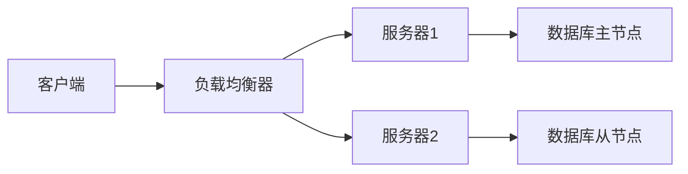

# 高可用性网络设计

在现代的云和数据中心环境中，**高可用性（High Availability, HA）** 是确保服务持续运行的关键目标。高可用性网络设计旨在通过冗余、故障转移和负载均衡等技术，最大限度地减少系统停机时间，确保即使在硬件或软件故障的情况下，服务也能继续运行。

## 什么是高可用性？

高可用性是指系统或服务在预定的时间内保持正常运行的能力。通常用“**99.9%**”或更高的可用性百分比来表示。例如，99.9% 的可用性意味着系统每年只能有约 8.76 小时的停机时间。

:::note
高可用性不仅仅是硬件冗余，还包括软件、网络和数据的冗余设计。
:::

## 高可用性网络设计的关键组件

### 1. 冗余设计
冗余是高可用性网络设计的核心。通过在关键组件上增加备份，确保当一个组件失效时，另一个组件可以立即接管。



在上图中，客户端请求通过负载均衡器分发到多个服务器。如果服务器1失效，负载均衡器会将流量重定向到服务器2，确保服务不中断。

### 2. 故障转移（Failover）
故障转移是指当主系统失效时，自动切换到备用系统的过程。故障转移可以是手动的，也可以是自动的。

:::tip
自动故障转移通常通过心跳检测（Heartbeat）实现，主系统和备用系统之间定期发送信号，如果信号中断，备用系统会接管。
:::

### 3. 负载均衡
负载均衡通过将流量分发到多个服务器，避免单点过载，从而提高系统的可用性和性能。

```bash
# 示例：使用 Nginx 实现负载均衡
http {
    upstream backend {
        server 192.168.1.1;
        server 192.168.1.2;
    }

    server {
        listen 80;

        location / {
            proxy_pass http://backend;
        }
    }
}
```

在上面的 Nginx 配置中，`backend` 组包含两个服务器，Nginx 会自动将请求分发到这两个服务器上。

### 4. 数据备份与恢复
数据是高可用性设计中的重要部分。定期备份数据，并确保在数据丢失时能够快速恢复，是保证高可用性的关键。

:::caution
数据备份不仅仅是存储数据，还需要定期测试恢复过程，确保备份的有效性。
:::

## 实际应用场景

### 案例 1：电商网站的高可用性设计
一个电商网站在“双十一”期间可能会面临巨大的流量压力。通过高可用性设计，网站可以确保在高峰期仍然能够正常运行。

1. **负载均衡**：使用负载均衡器将流量分发到多个服务器。
2. **数据库冗余**：主数据库和从数据库实时同步，确保在主数据库失效时，从数据库可以立即接管。
3. **CDN 加速**：通过内容分发网络（CDN）缓存静态资源，减少服务器压力。

### 案例 2：金融系统的高可用性设计
金融系统对可用性要求极高，任何停机都可能导致巨大的经济损失。

1. **多数据中心部署**：在多个地理位置部署数据中心，确保在一个数据中心失效时，其他数据中心可以接管。
2. **自动故障转移**：通过心跳检测实现自动故障转移，确保系统在几秒钟内恢复。
3. **数据加密与备份**：定期加密备份数据，确保数据安全。

## 总结

高可用性网络设计是现代云和数据中心架构中不可或缺的一部分。通过冗余、故障转移、负载均衡和数据备份等技术，可以最大限度地减少系统停机时间，确保服务的持续运行。

:::warning
高可用性设计需要综合考虑成本与收益。过度设计可能导致资源浪费，而设计不足则可能无法满足业务需求。
:::

## 附加资源与练习

### 资源
- [Nginx 负载均衡官方文档](https://nginx.org/en/docs/http/load_balancing.html)
- [AWS 高可用性架构设计指南](https://aws.amazon.com/architecture/high-availability/)

### 练习
1. 使用 Nginx 配置一个简单的负载均衡器，并将流量分发到两个后端服务器。
2. 设计一个高可用性数据库架构，确保在主数据库失效时，从数据库可以立即接管。
3. 研究一个实际的高可用性案例（如 Netflix 或 Google），并分析其设计思路。

通过以上内容，您应该对高可用性网络设计有了初步的了解。接下来，您可以通过实践和进一步学习，深入掌握这一重要概念。