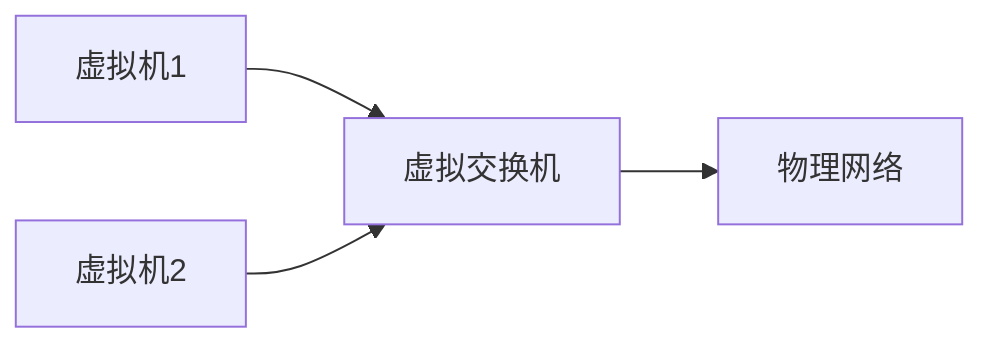

# 虚拟交换机

## 介绍

虚拟交换机（Virtual Switch）是网络虚拟化中的关键组件，它允许虚拟机（VM）之间以及虚拟机与物理网络之间的通信。与物理交换机类似，虚拟交换机也负责数据包的转发，但它运行在软件层面，通常作为虚拟化平台的一部分。

虚拟交换机的主要功能包括：
- 数据包转发
- VLAN 划分
- 流量监控
- 安全策略实施

## 虚拟交换机的工作原理

虚拟交换机的工作原理与物理交换机类似，但它运行在虚拟化环境中。以下是虚拟交换机的基本工作流程：

1. **数据包接收**：虚拟交换机从虚拟机或物理网络接口接收数据包。
2. **数据包处理**：根据配置的规则（如 VLAN、ACL 等）处理数据包。
3. **数据包转发**：将处理后的数据包转发到目标虚拟机或物理网络接口。

### 代码示例

以下是一个简单的虚拟交换机配置示例，使用 Open vSwitch（OVS）命令行工具：

```bash
# 创建一个虚拟交换机
ovs-vsctl add-br br0

# 添加一个端口到虚拟交换机
ovs-vsctl add-port br0 eth0

# 设置 VLAN
ovs-vsctl set port eth0 tag=10
```

### 输入与输出

- **输入**：`ovs-vsctl add-br br0`
- **输出**：创建一个名为 `br0` 的虚拟交换机。

- **输入**：`ovs-vsctl add-port br0 eth0`
- **输出**：将物理接口 `eth0` 添加到虚拟交换机 `br0`。

- **输入**：`ovs-vsctl set port eth0 tag=10`
- **输出**：将 `eth0` 端口设置为 VLAN 10。

## 实际应用场景

### 云环境中的虚拟交换机

在云环境中，虚拟交换机用于连接虚拟机与外部网络。例如，在 OpenStack 中，虚拟交换机（如 OVS）用于管理虚拟机之间的网络流量。



### 数据中心网络

在数据中心网络中，虚拟交换机用于实现网络虚拟化，提供灵活的网络配置和管理。例如，VMware 的 vSphere 使用虚拟交换机来管理虚拟机之间的通信。

## 总结

虚拟交换机是网络虚拟化中的核心组件，它允许虚拟机之间以及虚拟机与物理网络之间的通信。通过虚拟交换机，管理员可以灵活地配置和管理网络流量，提高网络的可用性和安全性。

## 附加资源与练习

- **资源**：
  - [Open vSwitch 官方文档](https://docs.openvswitch.org/en/latest/)
  - [VMware vSphere 网络指南](https://docs.vmware.com/en/VMware-vSphere/index.html)

- **练习**：
  1. 使用 Open vSwitch 创建一个虚拟交换机，并添加多个端口。
  2. 配置 VLAN，并测试虚拟机之间的通信。
  3. 使用流量监控工具（如 tcpdump）观察虚拟交换机的数据包转发过程。

:::tip
虚拟交换机的配置和管理需要一定的网络知识，建议在学习过程中多动手实践，以加深理解。
:::