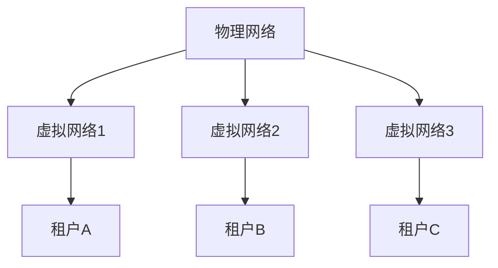

# 网络虚拟化技术

网络虚拟化技术是现代数据中心和云计算环境中的关键技术之一。它允许在物理网络基础设施之上创建多个虚拟网络，从而提高资源利用率、简化网络管理并支持灵活的网络配置。本文将逐步介绍网络虚拟化的基本概念、工作原理以及实际应用场景。

## 什么是网络虚拟化？

网络虚拟化是指通过软件定义的方式，将物理网络资源抽象为多个虚拟网络。这些虚拟网络可以独立运行，彼此隔离，并且可以根据需求动态调整。网络虚拟化的核心目标是将网络资源与物理硬件解耦，从而实现更高效的资源管理和更灵活的网络配置。

:::note
网络虚拟化与传统的物理网络不同，它允许在同一个物理基础设施上运行多个逻辑网络，每个逻辑网络可以有不同的配置和安全策略。
:::

## 网络虚拟化的工作原理

网络虚拟化通过以下关键技术实现：

1. **虚拟交换机（vSwitch）**：虚拟交换机是网络虚拟化的核心组件之一。它在虚拟机（VM）之间或虚拟机与物理网络之间转发数据包。常见的虚拟交换机包括 VMware 的 vSwitch 和 Open vSwitch（OVS）。

2. **虚拟局域网（VLAN）**：VLAN 是一种将物理网络划分为多个逻辑网络的技术。每个 VLAN 可以独立配置，并且 VLAN 之间的通信需要通过路由器或三层交换机。

3. **网络功能虚拟化（NFV）**：NFV 是将传统的网络功能（如防火墙、负载均衡器等）虚拟化为软件实例的技术。这些虚拟化的网络功能可以在通用硬件上运行，从而降低硬件成本并提高灵活性。

4. **软件定义网络（SDN）**：SDN 是一种将网络控制平面与数据平面分离的技术。通过集中式的控制器，SDN 可以动态配置和管理网络设备，从而实现更灵活的网络管理。

## 代码示例：配置 Open vSwitch

以下是一个简单的 Open vSwitch 配置示例，展示了如何创建一个虚拟交换机并添加端口：

```bash
# 创建一个名为 ovs-br0 的虚拟交换机
ovs-vsctl add-br ovs-br0

# 添加一个物理接口 eth0 到虚拟交换机
ovs-vsctl add-port ovs-br0 eth0

# 添加一个虚拟接口 veth0 到虚拟交换机
ovs-vsctl add-port ovs-br0 veth0
```

:::tip
在实际应用中，Open vSwitch 通常与 SDN 控制器（如 OpenDaylight 或 ONOS）结合使用，以实现更复杂的网络配置和管理。
:::

## 实际应用场景

### 1. 云计算环境中的多租户网络

在云计算环境中，多个租户共享同一个物理网络基础设施。通过网络虚拟化，可以为每个租户创建一个独立的虚拟网络，确保租户之间的网络流量隔离和安全。



### 2. 数据中心网络优化

在数据中心中，网络虚拟化可以用于优化网络资源的利用率。例如，通过动态调整虚拟网络的带宽和路由策略，可以确保关键应用获得足够的网络资源。

### 3. 网络功能虚拟化（NFV）

网络功能虚拟化允许将传统的网络设备（如防火墙、负载均衡器等）虚拟化为软件实例。这些虚拟化的网络功能可以在通用硬件上运行，从而降低硬件成本并提高灵活性。

## 总结

网络虚拟化技术是现代数据中心和云计算环境中的关键技术之一。它通过将物理网络资源抽象为多个虚拟网络，提高了资源利用率、简化了网络管理并支持灵活的网络配置。通过虚拟交换机、VLAN、NFV 和 SDN 等技术，网络虚拟化在云计算、数据中心优化和网络功能虚拟化等领域得到了广泛应用。

## 附加资源与练习

- **练习**：尝试在本地环境中配置 Open vSwitch，并创建一个简单的虚拟网络。
- **资源**：
  - [Open vSwitch 官方文档](https://docs.openvswitch.org/)
  - [SDN 入门指南](https://www.sdxcentral.com/sdn/definitions/what-is-sdn/)
  - [网络功能虚拟化（NFV）简介](https://www.sdxcentral.com/nfv/definitions/what-is-nfv/)

:::caution
在实际部署网络虚拟化技术时，务必考虑网络安全和性能优化，以确保虚拟网络的稳定性和安全性。
:::