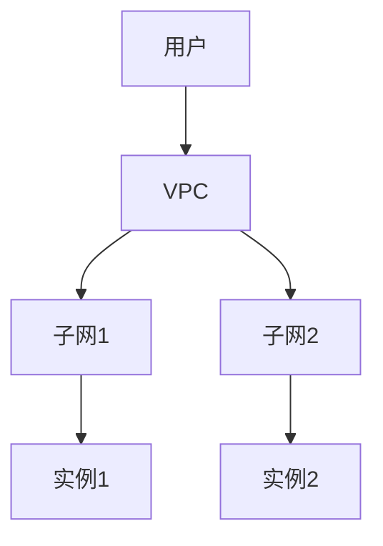

## 介绍

云网络安全是指保护云计算环境中的网络基础设施、数据和服务免受未经授权的访问、攻击和威胁的一系列措施。随着越来越多的企业和个人将数据和应用程序迁移到云端，云网络安全变得至关重要。它不仅涉及传统的网络安全措施，还需要考虑云环境的独特特性，如多租户架构、虚拟化和动态资源分配。

## 云网络安全的关键概念

### 1. **身份和访问管理（IAM）**
IAM 是云网络安全的核心组成部分，用于管理用户身份和访问权限。通过 IAM，云服务提供商可以确保只有经过授权的用户才能访问特定的资源。

```plaintext
示例代码：
{
  "Version": "2012-10-17",
  "Statement": [
    {
      "Effect": "Allow",
      "Action": "s3:GetObject",
      "Resource": "arn:aws:s3:::example-bucket/*"
    }
  ]
}
```

:::tip
IAM 策略可以精细控制用户对资源的访问权限，确保最小权限原则。
:::

### 2. **数据加密**
数据加密是保护云中数据的重要手段。无论是在传输过程中还是静态存储时，加密都可以防止数据被窃取或篡改。

```plaintext
示例代码：
openssl enc -aes-256-cbc -in plaintext.txt -out encrypted.txt -k mypassword
```

:::caution
确保加密密钥的安全存储和管理，否则加密将失去意义。
:::

### 3. **虚拟私有云（VPC）**
VPC 允许用户在云中创建一个隔离的网络环境，类似于传统的本地网络。通过 VPC，用户可以控制网络流量、配置子网和路由表，并设置安全组和网络访问控制列表（ACL）。



:::note
VPC 提供了更高的网络隔离性和安全性，适合需要严格控制的应用程序。
:::

### 4. **入侵检测和防御系统（IDS/IPS）**
IDS 和 IPS 用于监控和防御网络中的恶意活动。IDS 检测潜在的攻击，而 IPS 则可以主动阻止这些攻击。

```plaintext
示例代码：
alert tcp any any -> any 80 (msg:"HTTP Request"; content:"GET"; sid:1000001;)
```

:::warning
定期更新 IDS/IPS 的规则库，以应对最新的威胁。
:::

## 实际应用场景

### 1. **电子商务平台**
一个电子商务平台使用云服务来托管其网站和数据库。通过实施 IAM、数据加密和 VPC，平台可以保护用户的支付信息和交易数据，防止数据泄露和未经授权的访问。

### 2. **医疗保健系统**
医疗保健系统将患者的健康记录存储在云端。通过使用加密和 IDS/IPS，系统可以确保患者数据的机密性和完整性，同时防止网络攻击。

## 总结

云网络安全是保护云计算环境中数据和服务的基石。通过理解并实施身份和访问管理、数据加密、虚拟私有云以及入侵检测和防御系统等关键概念，用户可以有效地保护其云资源免受威胁。

## 附加资源

- [AWS 安全最佳实践](https://aws.amazon.com/security/)
- [Google Cloud 安全指南](https://cloud.google.com/security)
- [Microsoft Azure 安全文档](https://docs.microsoft.com/en-us/azure/security/)

## 练习

1. 创建一个 IAM 策略，允许用户仅读取特定 S3 存储桶中的文件。
2. 使用 OpenSSL 加密一个文本文件，并尝试解密它。
3. 设计一个 VPC 架构，包含两个子网，并配置安全组以限制流量。

通过完成这些练习，您将更好地理解云网络安全的关键概念及其实际应用。