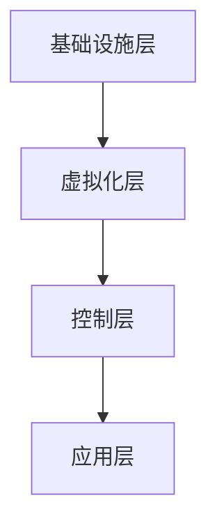

# 软件定义数据中心

## 介绍

软件定义数据中心（Software-Defined Data Center, SDDC）是一种通过软件来管理和控制数据中心资源的技术架构。它将计算、存储、网络等资源抽象化，并通过软件层进行统一管理，从而实现更高的灵活性、可扩展性和自动化。

在传统的数据中心中，硬件资源的管理和配置通常需要手动操作，这不仅耗时，还容易出错。而SDDC通过虚拟化和自动化技术，使得资源的管理更加高效和灵活。

## SDDC 的核心组件

SDDC 主要由以下几个核心组件构成：

1. **软件定义计算（SDC）**：通过虚拟化技术将物理服务器抽象为虚拟服务器，从而实现计算资源的灵活分配和管理。
2. **软件定义存储（SDS）**：将存储资源抽象化，并通过软件进行管理，使得存储资源可以按需分配和扩展。
3. **软件定义网络（SDN）**：通过软件控制网络流量，实现网络的灵活配置和管理。

## SDDC 的架构

SDDC 的架构通常包括以下几个层次：

1. **基础设施层**：包括物理服务器、存储设备和网络设备。
2. **虚拟化层**：通过虚拟化技术将物理资源抽象为虚拟资源。
3. **控制层**：通过软件对虚拟资源进行管理和控制。
4. **应用层**：运行在虚拟化环境上的应用程序。



## 实际案例

### 案例 1：VMware vSphere

VMware vSphere 是一个典型的 SDDC 解决方案。它通过虚拟化技术将物理服务器抽象为虚拟服务器，并通过 vCenter Server 进行统一管理。用户可以通过 vSphere Client 对虚拟资源进行配置和管理。

```bash
# 示例：通过 vSphere CLI 创建一个虚拟机
vmware-cli vm create --name "MyVM" --cpu 2 --memory 4096 --disk 100
```

### 案例 2：OpenStack

OpenStack 是一个开源的云计算平台，它提供了计算、存储和网络资源的虚拟化和管理功能。通过 OpenStack，用户可以轻松地创建和管理虚拟机、存储卷和网络。

```bash
# 示例：通过 OpenStack CLI 创建一个虚拟机
openstack server create --flavor m1.small --image cirros --nic net-id=my-network MyVM
```

## 总结

软件定义数据中心通过虚拟化和自动化技术，使得数据中心资源的管理更加高效和灵活。它不仅提高了资源的利用率，还降低了运维成本。对于初学者来说，理解 SDDC 的基本概念和架构是进入云计算和数据中心领域的重要一步。

## 附加资源

- [VMware vSphere 官方文档](https://docs.vmware.com/en/VMware-vSphere/index.html)
- [OpenStack 官方文档](https://docs.openstack.org/)
- [软件定义网络（SDN）入门指南](https://www.sdxcentral.com/sdn/definitions/what-is-sdn/)

## 练习

1. 尝试在 VMware vSphere 或 OpenStack 中创建一个虚拟机，并配置其网络和存储。
2. 研究并比较不同的 SDDC 解决方案，如 VMware vSphere、OpenStack 和 Microsoft Azure Stack。
3. 思考 SDDC 如何帮助企业实现数字化转型，并撰写一篇短文。

:::tip
在学习 SDDC 的过程中，建议多动手实践，通过实际操作来加深对概念的理解。
:::