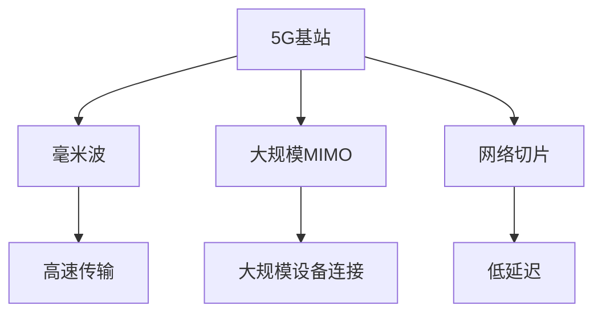

# 5G网络技术

## 介绍

5G是第五代移动通信技术，是继4G之后的最新无线通信标准。5G网络不仅提供了更高的数据传输速度，还显著降低了延迟，并支持更多设备的连接。这些特性使得5G成为物联网（IoT）、自动驾驶、远程医疗等新兴技术的关键推动力。

:::note
5G网络的目标是实现**超高速**、**超低延迟**和**大规模设备连接**。
:::

## 5G网络的核心特性

### 1. 高速传输
5G网络的峰值传输速度可以达到10 Gbps，比4G快100倍。这意味着你可以在几秒钟内下载一部高清电影。

### 2. 低延迟
5G网络的延迟可以低至1毫秒，这对于实时应用如自动驾驶和远程手术至关重要。

### 3. 大规模设备连接
5G网络支持每平方公里内连接多达100万个设备，这使得它非常适合物联网（IoT）应用。

## 5G网络的工作原理

5G网络采用了多种新技术来实现其高性能，包括：

- **毫米波（mmWave）**：使用高频段频谱，提供更高的带宽和速度。
- **大规模MIMO（Multiple Input Multiple Output）**：通过使用多个天线来增加网络容量和覆盖范围。
- **网络切片（Network Slicing）**：将网络划分为多个虚拟网络，以满足不同应用的需求。



## 实际应用场景

### 1. 自动驾驶
5G网络的低延迟和高可靠性使得自动驾驶汽车能够实时处理大量数据，确保行驶安全。

### 2. 远程医疗
通过5G网络，医生可以远程操控手术机器人，进行精确的手术操作。

### 3. 智能城市
5G网络支持大量设备的连接，使得智能城市中的各种传感器和设备能够实时通信，提高城市管理效率。

## 代码示例：模拟5G网络数据传输

以下是一个简单的Python代码示例，模拟5G网络中的数据传输：

```python
import time

def simulate_5g_transfer(data_size_gb):
    speed_gbps = 10  # 5G网络的理论峰值速度
    transfer_time = (data_size_gb * 8) / speed_gbps  # 将GB转换为Gb
    return transfer_time

data_size = 5  # 5GB的数据
transfer_time = simulate_5g_transfer(data_size)
print(f"传输 {data_size}GB 数据所需时间: {transfer_time:.2f} 秒")
```

**输出：**
```
传输 5GB 数据所需时间: 4.00 秒
```

:::tip
在实际应用中，5G网络的速度可能会受到多种因素的影响，如信号强度、网络拥塞等。
:::

## 总结

5G网络技术是未来通信技术的重要基石，它不仅提供了更高的速度和更低的延迟，还支持大规模设备连接。这些特性使得5G在自动驾驶、远程医疗、智能城市等领域具有广泛的应用前景。

## 附加资源与练习

- **资源：**
  - [5G技术白皮书](https://www.example.com/5g-whitepaper)
  - [5G网络架构详解](https://www.example.com/5g-architecture)

- **练习：**
  1. 修改上述Python代码，模拟不同数据大小在5G网络中的传输时间。
  2. 研究并比较4G和5G网络的主要区别，撰写一篇短文。

:::caution
5G网络的部署和优化仍在进行中，实际体验可能会因地区和服务提供商而异。
:::