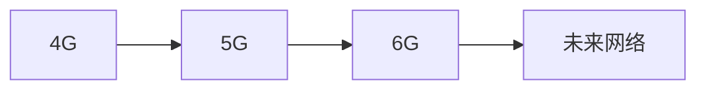

# 未来网络展望

随着技术的不断进步，网络技术也在快速发展。未来网络将不仅仅是连接设备和传输数据的工具，它将成为智能、高效和安全的生态系统。本文将带您了解未来网络的关键技术和发展趋势，并通过实际案例和代码示例帮助您更好地理解这些概念。

## 什么是未来网络？

未来网络是指通过新兴技术（如5G、物联网、边缘计算、人工智能等）构建的下一代网络架构。这些技术将共同推动网络向更高速、更智能、更安全的方向发展。

:::note
未来网络的核心目标是实现**无缝连接**、**低延迟**和**高可靠性**，从而支持更多创新应用。
:::

## 关键技术

### 1. 5G 和 6G

5G 是目前最先进的移动通信技术，它提供了更高的数据传输速度和更低的延迟。6G 则是未来网络的发展方向，预计将进一步提升速度和覆盖范围。



### 2. 物联网（IoT）

物联网是指通过互联网连接各种设备，使其能够相互通信和协作。未来网络将支持更多的物联网设备，并实现更高效的设备管理。

```javascript
// 示例：模拟物联网设备发送数据
const device = {
  id: "sensor-001",
  data: 25.3,
  sendData: function() {
    console.log(`Device ${this.id} sent data: ${this.data}`);
  }
};

device.sendData();
```

**输出：**
```
Device sensor-001 sent data: 25.3
```

### 3. 边缘计算

边缘计算将数据处理从中心服务器转移到网络边缘的设备上，从而减少延迟并提高效率。未来网络将更加依赖边缘计算来支持实时应用。

:::tip
边缘计算特别适用于需要快速响应的场景，如自动驾驶和智能城市。
:::

### 4. 人工智能（AI）

人工智能将在未来网络中发挥重要作用，例如通过机器学习优化网络流量、预测设备故障等。

```python
# 示例：使用 AI 预测网络流量
from sklearn.linear_model import LinearRegression
import numpy as np

# 模拟数据
X = np.array([[1], [2], [3], [4], [5]])
y = np.array([2, 4, 6, 8, 10])

# 训练模型
model = LinearRegression()
model.fit(X, y)

# 预测
prediction = model.predict([[6]])
print(f"Predicted network traffic: {prediction[0]}")
```

**输出：**
```
Predicted network traffic: 12.0
```

## 实际应用案例

### 1. 智能城市

未来网络将支持智能城市的建设，例如通过物联网设备监控交通流量、空气质量等，并通过边缘计算实时调整信号灯。

### 2. 远程医疗

5G 和边缘计算将推动远程医疗的发展，使医生能够通过高清视频和实时数据传输为患者提供远程诊断和治疗。

### 3. 自动驾驶

自动驾驶汽车需要低延迟和高可靠性的网络连接，以确保车辆能够实时接收和处理周围环境的信息。

## 总结

未来网络将是一个高度智能化和自动化的生态系统，它将深刻改变我们的生活方式和工作方式。通过了解这些新兴技术，您可以更好地为未来的编程挑战做好准备。

## 附加资源

- [5G 技术白皮书](https://example.com/5g-whitepaper)
- [物联网入门指南](https://example.com/iot-guide)
- [边缘计算与未来网络](https://example.com/edge-computing)

## 练习

1. 编写一个简单的 Python 程序，模拟物联网设备发送数据。
2. 研究并描述一个实际应用场景，说明边缘计算如何改善用户体验。

:::caution
请确保在编写代码时遵循最佳实践，并测试您的程序以确保其正确运行。
:::