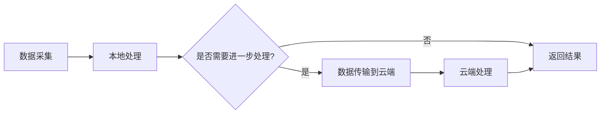

# 边缘计算网络

## 介绍

边缘计算网络（Edge Computing Network）是一种将计算资源和数据处理能力从传统的集中式数据中心转移到靠近数据源的网络边缘的技术。通过这种方式，边缘计算网络能够减少数据传输延迟、提高响应速度，并降低网络带宽的压力。

传统的云计算模式中，数据需要传输到远程的数据中心进行处理，而边缘计算网络则将计算任务分散到靠近用户的边缘节点上。这些边缘节点可以是智能手机、路由器、物联网设备等。

## 边缘计算网络的工作原理

边缘计算网络的核心思想是将计算任务尽可能地靠近数据源。以下是边缘计算网络的基本工作原理：

1. **数据采集**：边缘设备（如传感器、摄像头等）采集数据。
2. **本地处理**：数据在边缘设备或附近的边缘节点上进行初步处理。
3. **数据传输**：如果需要进一步处理，数据会被传输到云端或更高级的边缘节点。
4. **响应与反馈**：处理结果会被快速返回给用户或设备。



## 边缘计算网络的优势

1. **低延迟**：由于数据处理在边缘节点上进行，减少了数据传输的时间，从而降低了延迟。
2. **带宽节省**：只有必要的数据才会传输到云端，减少了网络带宽的占用。
3. **隐私与安全**：敏感数据可以在本地处理，减少了数据泄露的风险。
4. **可靠性**：即使网络连接不稳定，边缘节点仍然可以独立运行。

## 实际应用场景

### 1. 智能家居

在智能家居系统中，边缘计算网络可以用于实时处理来自各种传感器的数据。例如，智能摄像头可以在本地分析视频流，只有在检测到异常时才将数据上传到云端。

```python
# 示例：智能摄像头本地处理
def analyze_video(video_stream):
    if detect_anomaly(video_stream):
        upload_to_cloud(video_stream)
    else:
        discard_video(video_stream)
```

### 2. 自动驾驶

自动驾驶汽车需要实时处理大量的传感器数据（如摄像头、雷达、激光雷达等）。边缘计算网络可以在车辆内部进行处理，确保快速响应和决策。

```python
# 示例：自动驾驶汽车数据处理
def process_sensor_data(sensor_data):
    if detect_obstacle(sensor_data):
        apply_brakes()
    else:
        continue_driving()
```

### 3. 工业物联网

在工业物联网（IIoT）中，边缘计算网络可以用于实时监控和控制生产线上的设备。例如，传感器可以监测设备的运行状态，并在检测到异常时立即采取措施。

```python
# 示例：工业物联网设备监控
def monitor_equipment(sensor_data):
    if detect_failure(sensor_data):
        trigger_maintenance()
    else:
        continue_operation()
```

## 总结

边缘计算网络通过将计算任务分散到网络边缘，显著提高了数据处理的效率和响应速度。它在智能家居、自动驾驶、工业物联网等领域有着广泛的应用前景。随着物联网设备的普及和5G网络的发展，边缘计算网络的重要性将进一步提升。

## 附加资源与练习

- **资源**：
  - [边缘计算网络白皮书](https://example.com/edge-computing-whitepaper)
  - [边缘计算与物联网](https://example.com/edge-iot)

- **练习**：
  1. 设计一个简单的边缘计算网络模型，模拟智能家居中的传感器数据处理。
  2. 编写一个Python脚本，模拟自动驾驶汽车中的传感器数据处理流程。

:::tip
如果你对边缘计算网络感兴趣，可以尝试使用Raspberry Pi或Arduino等硬件设备搭建一个简单的边缘计算节点。
:::