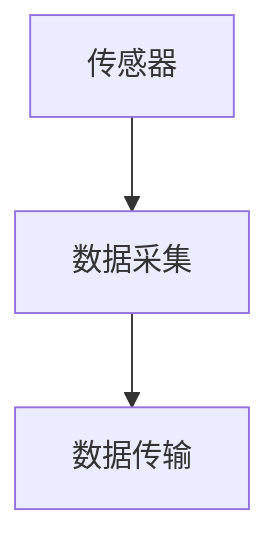
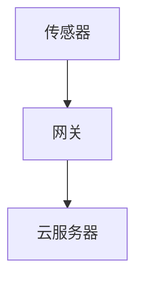
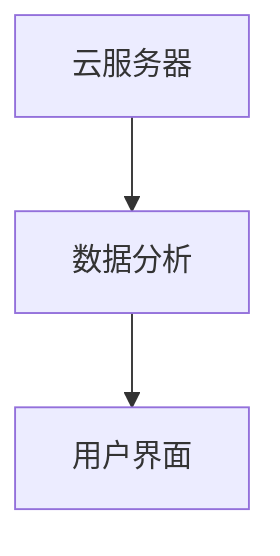
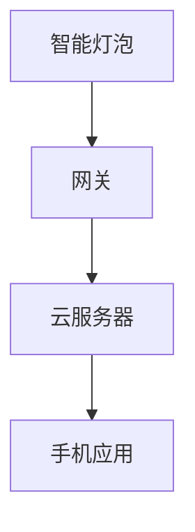
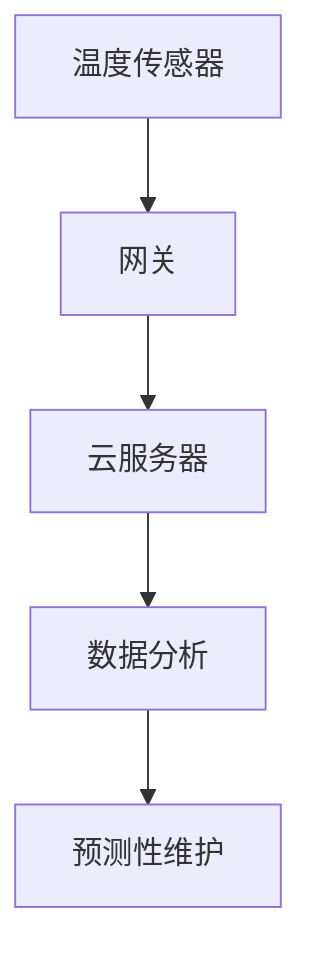

# 物联网网络架构

物联网（Internet of Things, IoT）是指通过互联网连接各种物理设备，使它们能够相互通信和协作。物联网网络架构是实现这一目标的基础框架，它定义了设备如何连接、通信以及如何处理数据。本文将详细介绍物联网网络架构的组成部分、工作原理以及实际应用。

## 什么是物联网网络架构？

物联网网络架构是一个分层的框架，用于描述物联网系统中各个组件之间的关系和交互方式。它通常包括感知层、网络层和应用层。每一层都有其特定的功能和职责，共同协作以实现物联网的目标。

### 感知层

感知层是物联网架构的最底层，负责收集物理世界的数据。这一层包括各种传感器、执行器和其他设备，它们能够感知环境中的变化并将这些数据转换为数字信号。



### 网络层

网络层负责将感知层收集到的数据传输到应用层。这一层包括各种通信协议和网络技术，如Wi-Fi、蓝牙、Zigbee、LoRa等。网络层的主要任务是确保数据能够安全、可靠地传输。



### 应用层

应用层是物联网架构的最顶层，负责处理和分析数据，并提供用户接口。这一层包括各种应用程序和服务，如数据分析、设备管理、用户界面等。



## 物联网网络架构的实际应用

### 智能家居

在智能家居系统中，物联网网络架构被广泛应用于各种设备，如智能灯泡、智能 thermostat 和智能门锁。这些设备通过感知层收集数据，通过网络层传输到应用层，最终通过用户界面进行控制和监控。



### 工业物联网（IIoT）

在工业物联网中，物联网网络架构用于监控和控制工业设备。例如，传感器可以监测机器的温度和振动，通过网络层将数据传输到应用层，进行分析和预测性维护。



## 代码示例

以下是一个简单的Python代码示例，展示了如何使用MQTT协议将传感器数据发送到云服务器。

```python
import paho.mqtt.client as mqtt

# 定义回调函数
def on_connect(client, userdata, flags, rc):
    print("Connected with result code "+str(rc))
    client.subscribe("sensor/data")

def on_message(client, userdata, msg):
    print(msg.topic+" "+str(msg.payload))

# 创建MQTT客户端
client = mqtt.Client()
client.on_connect = on_connect
client.on_message = on_message

# 连接到MQTT服务器
client.connect("mqtt.eclipse.org", 1883, 60)

# 发布传感器数据
client.publish("sensor/data", "Temperature: 25C")

# 保持连接
client.loop_forever()
```

:::note
**注意**：在实际应用中，您需要根据具体的MQTT服务器地址和端口进行配置。
:::

## 总结

物联网网络架构是实现物联网系统的关键框架。通过感知层、网络层和应用层的协同工作，物联网系统能够有效地收集、传输和处理数据。本文介绍了物联网网络架构的基本概念、组成部分以及实际应用，并提供了一个简单的代码示例。

## 附加资源

- [MQTT协议官方文档](https://mqtt.org/)
- [物联网架构设计指南](https://www.iot-architecture.com/)
- [Python MQTT客户端库](https://pypi.org/project/paho-mqtt/)

## 练习

1. 尝试修改上述代码示例，使其能够接收并处理来自多个传感器的数据。
2. 研究并比较不同的物联网通信协议，如MQTT、CoAP和HTTP。
3. 设计一个简单的物联网系统，包括感知层、网络层和应用层，并绘制其架构图。

通过本文的学习，您应该对物联网网络架构有了初步的了解。希望这些知识能够帮助您在物联网领域取得更大的进步！