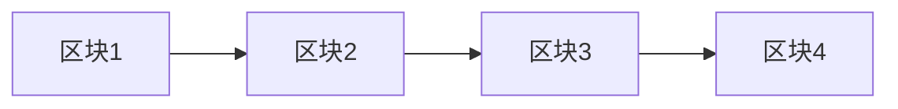

# 区块链网络

## 什么是区块链网络？

区块链网络是一种去中心化的分布式账本技术，用于记录交易数据。它的核心特点是**去中心化**、**不可篡改**和**透明性**。区块链网络由多个节点组成，每个节点都保存着完整的账本副本。每当有新的交易发生时，这些交易会被打包成一个区块，并通过共识机制添加到链上。

:::note
区块链最初是为比特币设计的，但现在已广泛应用于金融、供应链、医疗等多个领域。
:::

## 区块链的工作原理

### 1. 区块结构
每个区块包含以下内容：
- **区块头**：包含前一个区块的哈希值、时间戳、随机数（Nonce）等信息。
- **交易数据**：记录该区块中包含的所有交易。
- **区块哈希**：通过加密算法生成的唯一标识符。



### 2. 共识机制
区块链网络通过共识机制确保所有节点对账本的一致性。常见的共识机制包括：
- **工作量证明（PoW）**：节点通过解决复杂的数学问题来竞争记账权。
- **权益证明（PoS）**：节点根据持有的代币数量和时间来获得记账权。

### 3. 加密技术
区块链使用加密技术确保数据的安全性和完整性。每个区块的哈希值都是唯一的，任何对数据的篡改都会导致哈希值的变化。

:::tip
区块链的加密技术包括哈希函数（如 SHA-256）和非对称加密（如 RSA）。
:::

## 代码示例：创建一个简单的区块链

以下是一个使用 Python 实现的简单区块链示例：

```python
import hashlib
import time

class Block:
    def __init__(self, index, previous_hash, timestamp, data, nonce=0):
        self.index = index
        self.previous_hash = previous_hash
        self.timestamp = timestamp
        self.data = data
        self.nonce = nonce
        self.hash = self.calculate_hash()

    def calculate_hash(self):
        block_string = f"{self.index}{self.previous_hash}{self.timestamp}{self.data}{self.nonce}"
        return hashlib.sha256(block_string.encode()).hexdigest()

class Blockchain:
    def __init__(self):
        self.chain = [self.create_genesis_block()]

    def create_genesis_block(self):
        return Block(0, "0", time.time(), "Genesis Block")

    def get_latest_block(self):
        return self.chain[-1]

    def add_block(self, new_block):
        new_block.previous_hash = self.get_latest_block().hash
        new_block.hash = new_block.calculate_hash()
        self.chain.append(new_block)

# 创建一个区块链并添加区块
blockchain = Blockchain()
blockchain.add_block(Block(1, blockchain.get_latest_block().hash, time.time(), "Block 1 Data"))
blockchain.add_block(Block(2, blockchain.get_latest_block().hash, time.time(), "Block 2 Data"))

# 输出区块链内容
for block in blockchain.chain:
    print(f"Block {block.index} [Hash: {block.hash}, Previous Hash: {block.previous_hash}, Data: {block.data}]")
```

**输出示例：**
```
Block 0 [Hash: abc123..., Previous Hash: 0, Data: Genesis Block]
Block 1 [Hash: def456..., Previous Hash: abc123..., Data: Block 1 Data]
Block 2 [Hash: ghi789..., Previous Hash: def456..., Data: Block 2 Data]
```

## 实际应用场景

### 1. 加密货币
比特币是最著名的区块链应用，它利用区块链技术实现了去中心化的数字货币系统。

### 2. 供应链管理
区块链可以用于追踪产品的来源和流向，确保供应链的透明性和可追溯性。

### 3. 智能合约
以太坊等平台支持智能合约，允许在区块链上执行自动化的合约逻辑。

:::caution
智能合约一旦部署，无法修改，因此在编写时需要格外谨慎。
:::

## 总结

区块链网络是一种革命性的技术，它通过去中心化、加密和共识机制确保了数据的安全性和透明性。从加密货币到供应链管理，区块链的应用场景正在不断扩大。

## 附加资源与练习

- **资源**：
  - [比特币白皮书](https://bitcoin.org/bitcoin.pdf)
  - [以太坊官方文档](https://ethereum.org/en/developers/docs/)
- **练习**：
  - 尝试修改上述代码，实现一个简单的 PoW 共识机制。
  - 研究并实现一个简单的智能合约（可以使用 Solidity 语言）。

:::warning
区块链技术仍在快速发展，建议持续关注最新的技术动态和最佳实践。
:::