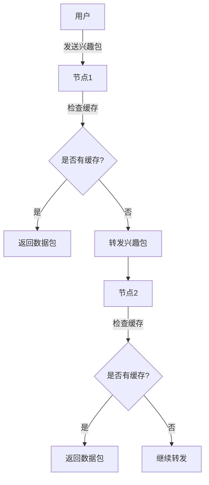

# 内容中心网络(CCN)

内容中心网络（Content-Centric Networking，简称 CCN）是一种新兴的网络架构，旨在通过以内容为中心的方式重新设计互联网。与传统的以主机为中心的互联网架构不同，CCN 关注的是内容本身，而不是内容所在的位置。这种设计使得网络更加高效、安全和可扩展。

## 什么是内容中心网络？

在传统的互联网架构中，数据是通过 IP 地址来定位和传输的。这意味着用户需要知道数据存储的具体位置（即服务器的 IP 地址）才能访问它。然而，内容中心网络（CCN）改变了这一模式，它将内容本身作为网络的核心，而不是内容所在的位置。

在 CCN 中，每个内容都有一个唯一的名称，用户通过请求内容的名称来获取数据，而不需要关心数据存储在哪里。这种设计使得网络更加灵活，能够更好地适应现代互联网的需求。

## CCN 的工作原理

CCN 的核心思想是通过名称来请求和传输内容。以下是 CCN 的基本工作流程：

1. **内容命名**：每个内容都有一个唯一的名称，通常采用分层结构。例如，一个视频文件的名称可能是 `/videos/movie.mp4`。
2. **兴趣包（Interest Packet）**：当用户想要获取某个内容时，他们会发送一个兴趣包，其中包含内容的名称。
3. **数据包（Data Packet）**：当网络中的某个节点（如路由器或缓存服务器）收到兴趣包时，如果它拥有请求的内容，就会返回一个数据包，其中包含实际的内容数据。
4. **缓存机制**：CCN 中的节点可以缓存内容，以便在未来的请求中快速响应。这大大减少了网络延迟和带宽消耗。

### 示例：请求内容

假设我们有一个简单的 CCN 网络，用户想要获取一个名为 `/videos/movie.mp4` 的视频文件。以下是请求的步骤：

1. 用户发送一个兴趣包，内容为 `/videos/movie.mp4`。
2. 网络中的节点接收到兴趣包后，检查是否有缓存的内容。如果有，直接返回数据包；如果没有，继续将兴趣包转发到其他节点。
3. 最终，拥有该内容的节点返回数据包，用户接收到视频文件。

## CCN 的优势

1. **高效性**：由于内容可以被缓存，CCN 减少了重复传输相同数据的需要，从而降低了网络负载。
2. **安全性**：CCN 通过内容名称来验证数据的真实性，确保用户获取的内容是可信的。
3. **可扩展性**：CCN 的设计使得网络能够更好地应对大规模的内容分发需求。

## 实际应用场景

CCN 在许多领域都有潜在的应用，以下是一些实际案例：

1. **视频流媒体**：在视频流媒体服务中，CCN 可以通过缓存热门视频来减少服务器负载，并提高用户的观看体验。
2. **物联网（IoT）**：在物联网设备中，CCN 可以帮助设备快速获取所需的数据，而不需要依赖中心化的服务器。
3. **内容分发网络（CDN）**：CCN 可以与传统 CDN 结合，进一步提高内容分发的效率。

## 总结

内容中心网络（CCN）是一种革命性的网络架构，它通过以内容为中心的方式重新定义了互联网的工作方式。CCN 不仅提高了网络的效率和安全性，还为未来的互联网应用提供了更多的可能性。

## 附加资源与练习

- **推荐阅读**：
  - [CCNx 项目](https://www.ccnx.org/)：CCN 的开源实现，提供了丰富的文档和工具。
  - [Named Data Networking (NDN)](https://named-data.net/)：CCN 的一个变种，专注于以命名数据为中心的网络架构。

- **练习**：
  - 尝试使用 CCNx 或 NDN 工具包搭建一个简单的 CCN 网络，并模拟内容请求的过程。
  - 思考如何在现有的互联网架构中引入 CCN 的概念，并讨论其潜在的挑战和优势。

:::tip
如果你对 CCN 感兴趣，建议深入研究 CCNx 或 NDN 项目，这些项目提供了丰富的资源和工具，帮助你更好地理解和应用 CCN 技术。
:::