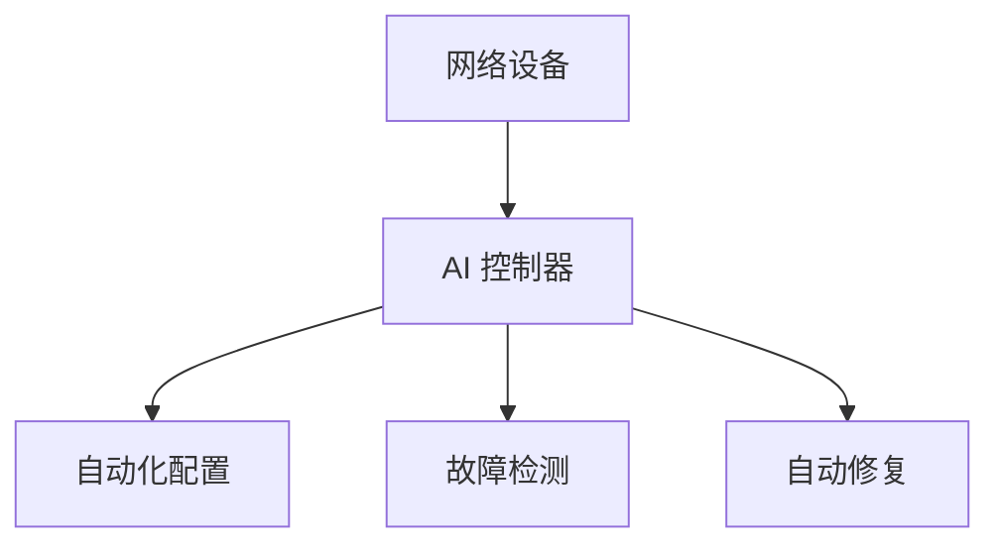

## 介绍

人工智能（AI）正在迅速改变我们与网络技术互动的方式。从优化网络性能到增强安全性，AI 正在成为现代网络架构中不可或缺的一部分。本文将带你了解人工智能在网络中的关键应用，并通过实际案例和代码示例帮助你更好地理解这些概念。

## 人工智能在网络中的关键应用

### 1. 网络优化

AI 可以通过分析大量网络数据来优化网络性能。例如，AI 可以预测网络流量模式，从而动态调整带宽分配，确保网络资源的高效利用。

```python
# 示例：使用机器学习预测网络流量
import pandas as pd
from sklearn.model_selection import train_test_split
from sklearn.ensemble import RandomForestRegressor

# 加载网络流量数据
data = pd.read_csv('network_traffic.csv')
X = data.drop('traffic', axis=1)
y = data['traffic']

# 划分训练集和测试集
X_train, X_test, y_train, y_test = train_test_split(X, y, test_size=0.2, random_state=42)

# 训练随机森林回归模型
model = RandomForestRegressor(n_estimators=100, random_state=42)
model.fit(X_train, y_train)

# 预测网络流量
predictions = model.predict(X_test)
print(predictions)
```

:::note
**注意**：在实际应用中，网络流量数据可能包含更多的特征和更复杂的模型。上述代码仅用于演示目的。
:::

### 2. 网络安全

AI 在网络安全中的应用尤为广泛。通过机器学习算法，AI 可以检测异常流量模式，识别潜在的网络攻击，并自动采取防御措施。

```python
# 示例：使用机器学习检测网络攻击
from sklearn.ensemble import IsolationForest

# 加载网络流量数据
data = pd.read_csv('network_traffic.csv')
X = data.drop('label', axis=1)
y = data['label']

# 训练孤立森林模型检测异常
model = IsolationForest(contamination=0.1, random_state=42)
model.fit(X)

# 预测异常流量
predictions = model.predict(X)
print(predictions)
```

:::tip
**提示**：孤立森林是一种常用的无监督学习方法，适用于检测异常数据点。
:::

### 3. 网络自动化

AI 还可以用于自动化网络管理任务，如配置管理、故障检测和修复。通过自动化，网络管理员可以更高效地管理复杂的网络环境。



:::caution
**警告**：虽然自动化可以提高效率，但在实施之前必须进行充分的测试，以避免潜在的网络中断。
:::

## 实际案例

### 案例 1：Google 的 B4 网络

Google 使用 AI 技术优化其全球 B4 网络的流量管理。通过机器学习算法，Google 能够预测流量峰值并动态调整路由，从而显著提高了网络性能和可靠性。

### 案例 2：Cisco 的 AI 网络安全解决方案

Cisco 利用 AI 技术开发了先进的网络安全解决方案，能够实时检测和响应网络威胁。通过分析大量网络数据，Cisco 的 AI 系统能够识别潜在的攻击模式并自动采取防御措施。

## 总结

人工智能在网络中的应用正在迅速扩展，从网络优化到网络安全和自动化，AI 正在改变我们管理和使用网络的方式。通过本文的介绍和示例，你应该对 AI 在网络中的关键应用有了初步的了解。

## 附加资源

- [Google B4 网络优化案例研究](https://research.google/pubs/pub43837/)
- [Cisco AI 网络安全解决方案](https://www.cisco.com/c/en/us/products/security/ai-network-security.html)
- [机器学习与网络安全](https://www.oreilly.com/library/view/machine-learning-for/9781492032652/)

## 练习

1. 尝试使用 Python 和 scikit-learn 库构建一个简单的网络流量预测模型。
2. 研究并实现一个基于孤立森林的网络异常检测系统。
3. 探索如何将 AI 技术应用于你所在组织的网络管理中，并撰写一份简短的报告。

:::warning
**警告**：在进行任何网络实验之前，请确保你有适当的权限和备份，以避免对生产环境造成影响。
:::