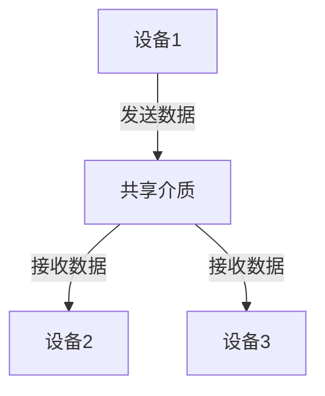

# 数据链路层概述

数据链路层是计算机网络体系结构中的重要组成部分，位于物理层和网络层之间。它的主要任务是为网络层提供可靠的数据传输服务，确保数据在物理介质上的正确传输。本文将详细介绍数据链路层的基本概念、功能及其在实际应用中的作用。

## 什么是数据链路层？

数据链路层（Data Link Layer）是OSI模型中的第二层，负责在相邻节点之间传输数据帧。它通过物理层提供的比特流服务，将数据封装成帧，并在接收端进行错误检测和纠正，以确保数据的完整性和可靠性。

:::note
数据链路层的主要功能包括：
- **帧封装**：将网络层的数据包封装成帧。
- **错误检测与纠正**：通过校验和等方法检测并纠正传输中的错误。
- **流量控制**：管理发送方和接收方之间的数据传输速率，防止数据丢失。
- **介质访问控制**：在共享介质上协调多个设备的访问。
:::

## 数据链路层的功能

### 1. 帧封装

数据链路层将网络层的数据包封装成帧，帧是数据链路层的基本传输单位。帧通常包括帧头、数据和帧尾。帧头包含源地址和目的地址等信息，帧尾包含用于错误检测的校验和。

```plaintext
+-------------------+-------------------+-------------------+
| 帧头 (Header)     | 数据 (Data)       | 帧尾 (Trailer)    |
+-------------------+-------------------+-------------------+
```

### 2. 错误检测与纠正

数据链路层使用多种技术来检测和纠正传输中的错误。常见的错误检测方法包括**循环冗余校验（CRC）**和**奇偶校验**。

:::tip
**循环冗余校验（CRC）**是一种广泛使用的错误检测方法，通过在帧尾添加校验和来检测传输中的错误。
:::

### 3. 流量控制

流量控制是数据链路层的另一个重要功能，用于管理发送方和接收方之间的数据传输速率。常见的流量控制方法包括**停止-等待协议**和**滑动窗口协议**。

```plaintext
发送方: 发送帧1 -> 等待确认 -> 发送帧2 -> 等待确认 -> ...
接收方: 接收帧1 -> 发送确认 -> 接收帧2 -> 发送确认 -> ...
```

### 4. 介质访问控制

在共享介质（如以太网）上，多个设备需要协调访问以避免冲突。数据链路层通过**介质访问控制（MAC）**协议来实现这一点。常见的MAC协议包括**CSMA/CD**（载波侦听多路访问/冲突检测）和**令牌环**。



## 实际应用案例

### 以太网（Ethernet）

以太网是最常见的数据链路层协议之一，广泛应用于局域网（LAN）中。以太网使用CSMA/CD协议来协调多个设备的访问，并通过MAC地址来标识设备。

:::caution
在以太网中，如果两个设备同时发送数据，会发生冲突。CSMA/CD协议通过检测冲突并重发数据来解决这一问题。
:::

### 无线局域网（Wi-Fi）

无线局域网（Wi-Fi）也使用数据链路层协议来管理数据传输。Wi-Fi使用CSMA/CA（载波侦听多路访问/冲突避免）协议来避免冲突，并通过MAC地址来标识设备。

## 总结

数据链路层在计算机网络中扮演着至关重要的角色，它通过帧封装、错误检测与纠正、流量控制和介质访问控制等功能，确保数据在物理介质上的可靠传输。理解数据链路层的基本概念和功能，对于深入学习计算机网络至关重要。

## 附加资源与练习

- **推荐阅读**：
  - 《计算机网络：自顶向下方法》 - James F. Kurose, Keith W. Ross
  - 《TCP/IP详解 卷1：协议》 - W. Richard Stevens

- **练习**：
  1. 解释数据链路层的主要功能。
  2. 描述以太网中CSMA/CD协议的工作原理。
  3. 编写一个简单的程序，模拟数据链路层的帧封装过程。

:::warning
在编写代码时，请确保正确处理帧头和帧尾，以实现正确的帧封装。
:::