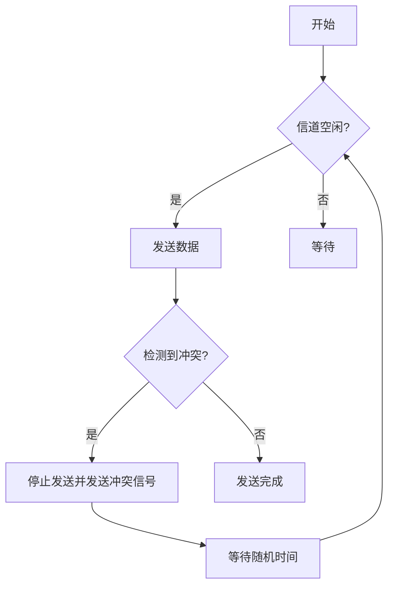

# CSMA/CD协议

CSMA/CD（Carrier Sense Multiple Access with Collision Detection，载波侦听多路访问/冲突检测）是一种用于以太网的网络协议，主要用于解决多个设备在同一共享介质上传输数据时可能发生的冲突问题。本文将详细介绍CSMA/CD的工作原理、实际应用场景以及相关代码示例。

## 什么是CSMA/CD？

CSMA/CD是一种介质访问控制（MAC）协议，用于管理多个设备如何共享同一通信信道。它的核心思想是：

1. **载波侦听（Carrier Sense）**：设备在发送数据之前会先侦听信道，确保信道空闲。
2. **多路访问（Multiple Access）**：多个设备可以同时访问同一信道。
3. **冲突检测（Collision Detection）**：如果两个设备同时发送数据导致冲突，设备会检测到冲突并采取相应措施。

CSMA/CD协议广泛应用于早期的以太网（如10BASE5和10BASE2），尽管现代以太网已经转向全双工通信，但理解CSMA/CD仍然对学习网络协议至关重要。

---

## CSMA/CD的工作原理

CSMA/CD的工作流程可以分为以下几个步骤：

1. **侦听信道**：设备在发送数据前会侦听信道，确保没有其他设备正在传输数据。
2. **发送数据**：如果信道空闲，设备开始发送数据。
3. **检测冲突**：如果在发送数据的过程中检测到冲突（即其他设备也在发送数据），设备会立即停止发送，并发送一个“冲突信号”以通知其他设备。
4. **等待随机时间**：设备会等待一段随机时间（称为“退避时间”），然后重新尝试发送数据。

以下是一个简单的流程图，展示了CSMA/CD的工作过程：



---

## 实际应用场景

CSMA/CD协议主要用于早期的以太网，例如10BASE5（粗缆以太网）和10BASE2（细缆以太网）。在这些网络中，所有设备共享同一根电缆，因此需要一种机制来避免数据冲突。

### 案例：办公室网络

假设在一个小型办公室中，多台计算机通过同轴电缆连接到同一网络。当一台计算机需要发送数据时，它会先侦听电缆是否空闲。如果空闲，它开始发送数据；如果检测到冲突，它会停止发送并等待一段时间后重试。这种机制确保了网络的高效运行。

---

## 代码示例

虽然CSMA/CD是一个硬件实现的协议，但我们可以通过模拟代码来理解其工作原理。以下是一个简单的Python示例，模拟两台设备在共享信道上发送数据的过程：

```python
import random
import time

class Device:
    def __init__(self, name):
        self.name = name

    def send_data(self, channel):
        print(f"{self.name} 正在侦听信道...")
        if channel.is_idle():
            print(f"{self.name} 开始发送数据。")
            channel.set_busy()
            time.sleep(1)  # 模拟数据传输时间
            if random.random() < 0.5:  # 模拟冲突发生的概率
                print(f"{self.name} 检测到冲突！停止发送并等待。")
                channel.set_idle()
                time.sleep(random.randint(1, 5))  # 随机退避时间
                self.send_data(channel)  # 重试发送
            else:
                print(f"{self.name} 数据发送成功。")
                channel.set_idle()
        else:
            print(f"{self.name} 信道繁忙，等待...")
            time.sleep(1)
            self.send_data(channel)

class Channel:
    def __init__(self):
        self.busy = False

    def is_idle(self):
        return not self.busy

    def set_busy(self):
        self.busy = True

    def set_idle(self):
        self.busy = False

# 创建信道和设备
channel = Channel()
device1 = Device("设备A")
device2 = Device("设备B")

# 模拟设备同时发送数据
device1.send_data(channel)
device2.send_data(channel)
```

**输出示例：**

```
设备A 正在侦听信道...
设备A 开始发送数据。
设备B 正在侦听信道...
设备B 信道繁忙，等待...
设备A 数据发送成功。
设备B 正在侦听信道...
设备B 开始发送数据。
设备B 数据发送成功。
```

---

## 总结

CSMA/CD协议是一种经典的网络协议，用于解决共享介质上的数据冲突问题。尽管现代以太网已经转向全双工通信，但理解CSMA/CD仍然对学习网络协议的基础知识非常重要。

:::tip
如果你想进一步学习，可以尝试以下练习：
1. 修改上面的Python代码，模拟更多设备同时发送数据的情况。
2. 研究现代以太网（如千兆以太网）如何避免使用CSMA/CD。
:::

---

## 附加资源

- [以太网协议详解](https://example.com/ethernet-protocol)
- [网络协议入门指南](https://example.com/networking-basics)
- [CSMA/CD维基百科页面](https://en.wikipedia.org/wiki/Carrier-sense_multiple_access_with_collision_detection)