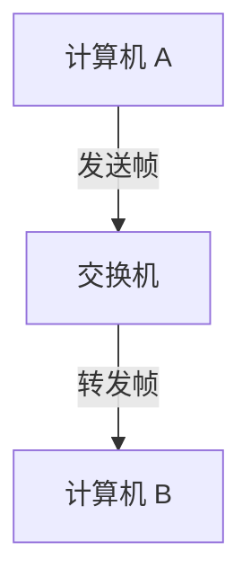

## 介绍

以太网（Ethernet）是一种广泛使用的局域网（LAN）技术，它定义了数据如何在网络中传输。以太网最初由 Xerox 公司在 1970 年代开发，后来由 IEEE 标准化为 IEEE 802.3。以太网的核心思想是通过共享介质（如电缆）在设备之间传输数据包。

以太网的主要特点包括：
- **高带宽**：现代以太网支持从 10 Mbps 到 100 Gbps 甚至更高的带宽。
- **灵活性**：以太网可以用于各种网络拓扑结构，如星型、总线型和环型。
- **兼容性**：以太网设备通常向后兼容，支持不同速度的设备在同一网络中运行。

## 以太网的工作原理

以太网使用 **载波侦听多路访问/冲突检测（CSMA/CD）** 协议来管理数据包的传输。CSMA/CD 的工作原理如下：

1. **载波侦听**：设备在发送数据之前会侦听网络，确保没有其他设备正在传输数据。
2. **多路访问**：如果网络空闲，设备可以开始发送数据。
3. **冲突检测**：如果两个设备同时发送数据，会发生冲突。设备会检测到冲突并停止发送。
4. **重传**：设备会等待一段随机时间后重新尝试发送数据。

:::note
现代以太网（如千兆以太网）通常在全双工模式下运行，因此不再需要 CSMA/CD。全双工模式允许设备同时发送和接收数据，避免了冲突。
:::

## 以太网帧结构

以太网数据以 **帧（Frame）** 的形式传输。每个帧包含多个字段，用于标识数据的目的地、源、类型以及数据本身。以下是典型的以太网帧结构：

```plaintext
| 前导码 (7字节) | 帧起始定界符 (1字节) | 目的MAC地址 (6字节) | 源MAC地址 (6字节) | 类型/长度 (2字节) | 数据 (46-1500字节) | 帧校验序列 (4字节) |
```

- **前导码**：用于同步接收设备的时钟。
- **帧起始定界符**：标识帧的开始。
- **目的MAC地址**：数据包的目标设备的物理地址。
- **源MAC地址**：发送数据包的设备的物理地址。
- **类型/长度**：指示帧中数据的类型或长度。
- **数据**：实际传输的数据。
- **帧校验序列**：用于检测传输过程中是否发生错误。

## 实际案例

假设我们有一个简单的局域网，包含两台计算机（A 和 B）和一个交换机。计算机 A 想要向计算机 B 发送一个文件。

1. **封装数据**：计算机 A 将文件数据封装成一个以太网帧，包括目标 MAC 地址（B 的 MAC 地址）和源 MAC 地址（A 的 MAC 地址）。
2. **发送帧**：计算机 A 通过以太网电缆将帧发送到交换机。
3. **转发帧**：交换机根据目标 MAC 地址将帧转发到计算机 B。
4. **接收帧**：计算机 B 接收到帧后，解封装数据并保存文件。

:::tip
在实际网络中，交换机通过学习 MAC 地址表来优化帧的转发，避免将帧广播到所有端口。
:::

## 总结

以太网是现代局域网的基础技术，它通过简单的帧结构和高效的传输协议实现了设备之间的可靠通信。理解以太网的原理对于学习网络技术至关重要。

## 附加资源

- [IEEE 802.3 标准文档](https://standards.ieee.org/standard/802_3-2018.html)
- [计算机网络：自顶向下方法](https://www.pearson.com/us/higher-education/program/Kurose-Computer-Networking-A-Top-Down-Approach-7th-Edition/PGM1101673.html)

## 练习

1. 解释 CSMA/CD 的工作原理，并描述它在现代以太网中的应用。
2. 绘制一个以太网帧的结构图，并标注每个字段的作用。
3. 假设你有一个包含 10 台计算机的局域网，描述数据如何从一台计算机传输到另一台计算机。



通过以上内容，你应该对以太网的原理有了初步的了解。继续深入学习，你将能够更好地理解网络通信的细节。