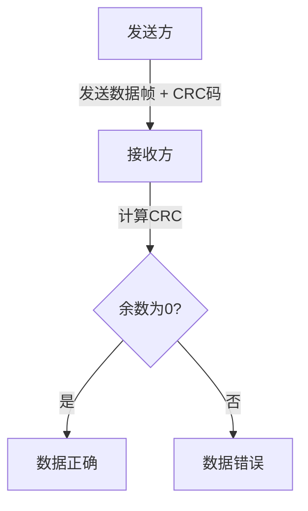

# 差错检测与纠正

在计算机网络中，数据链路层负责在物理链路上传输数据帧。然而，由于噪声、干扰或其他因素，数据在传输过程中可能会发生错误。为了确保数据的完整性和可靠性，数据链路层引入了**差错检测与纠正**技术。本文将详细介绍这些技术的基本原理、常见方法以及实际应用。

## 什么是差错检测与纠正？

差错检测与纠正是数据链路层中的一种机制，用于检测和纠正数据在传输过程中可能发生的错误。差错检测是指识别数据是否在传输过程中发生了改变，而差错纠正则是在检测到错误后，尝试修复数据。

:::note
**注意**：差错检测与纠正技术并不能完全消除错误，但可以显著降低错误发生的概率。
:::

## 常见的差错检测方法

### 1. 奇偶校验（Parity Check）

奇偶校验是最简单的差错检测方法之一。它通过在数据中添加一个额外的位（奇偶位），使得数据中“1”的个数为奇数（奇校验）或偶数（偶校验）。

#### 示例

假设我们有一个8位的数据 `10110101`，我们希望使用奇校验。

1. 计算数据中“1”的个数：5（奇数）。
2. 由于我们希望使用奇校验，奇偶位应为 `0`，以保持“1”的个数为奇数。
3. 最终传输的数据为 `101101010`。

如果接收方收到的数据中“1”的个数为偶数，则说明数据在传输过程中发生了错误。

:::caution
**注意**：奇偶校验只能检测单比特错误，无法检测多比特错误。
:::

### 2. 循环冗余校验（CRC）

循环冗余校验（CRC）是一种更强大的差错检测方法，广泛应用于网络通信中。CRC通过对数据帧进行多项式除法运算，生成一个固定长度的校验码（CRC码），并将其附加到数据帧中。

#### 示例

假设我们有一个数据帧 `1101011011`，生成多项式为 `x^4 + x + 1`（对应的二进制为 `10011`）。

1. 在数据帧后附加4个0（生成多项式的长度减1），得到 `11010110110000`。
2. 对 `11010110110000` 进行多项式除法运算，得到余数 `1110`。
3. 将余数附加到原始数据帧中，得到最终传输的数据帧 `11010110111110`。

接收方在接收到数据帧后，使用相同的生成多项式进行除法运算。如果余数为0，则说明数据帧没有错误。

:::tip
**提示**：CRC能够检测多比特错误，并且具有较高的检测效率。
:::

### 3. 海明码（Hamming Code）

海明码是一种既能检测错误又能纠正错误的编码方法。它通过在数据中插入多个校验位，使得接收方能够定位并纠正单个比特错误。

#### 示例

假设我们有一个4位的数据 `1011`，我们希望使用海明码进行编码。

1. 确定校验位的位置：在2的幂次方位置插入校验位（即第1、2、4位）。
2. 计算每个校验位的值，使得对应位置的比特满足奇偶校验。
3. 最终编码后的数据为 `0110011`。

如果接收方收到的数据为 `0110111`，通过计算可以发现第5位发生了错误，并将其纠正为 `0110011`。

:::warning
**警告**：海明码只能纠正单个比特错误，无法纠正多比特错误。
:::

## 实际应用场景

### 1. 以太网（Ethernet）

以太网使用CRC-32进行差错检测。每个以太网帧都包含一个32位的CRC码，用于检测数据在传输过程中是否发生了错误。

### 2. 无线通信（Wi-Fi）

在无线通信中，由于信号容易受到干扰，差错检测与纠正技术尤为重要。Wi-Fi协议使用CRC和卷积码等技术来确保数据的可靠性。

### 3. 存储系统

在硬盘和固态硬盘等存储系统中，数据在读写过程中可能会发生错误。存储系统通常使用ECC（Error Correction Code）技术来检测和纠正这些错误。

## 总结

差错检测与纠正是数据链路层中确保数据完整性和可靠性的关键技术。通过奇偶校验、CRC和海明码等方法，我们可以有效地检测和纠正数据传输中的错误。这些技术在现代网络通信和存储系统中得到了广泛应用。

## 附加资源与练习

- **练习1**：编写一个程序，实现奇偶校验的生成与验证。
- **练习2**：研究CRC-32算法，并尝试实现一个简单的CRC计算器。
- **附加资源**：阅读更多关于海明码的文献，了解其在现代通信系统中的应用。

通过学习和实践，你将能够更好地理解差错检测与纠正的原理，并将其应用到实际项目中。