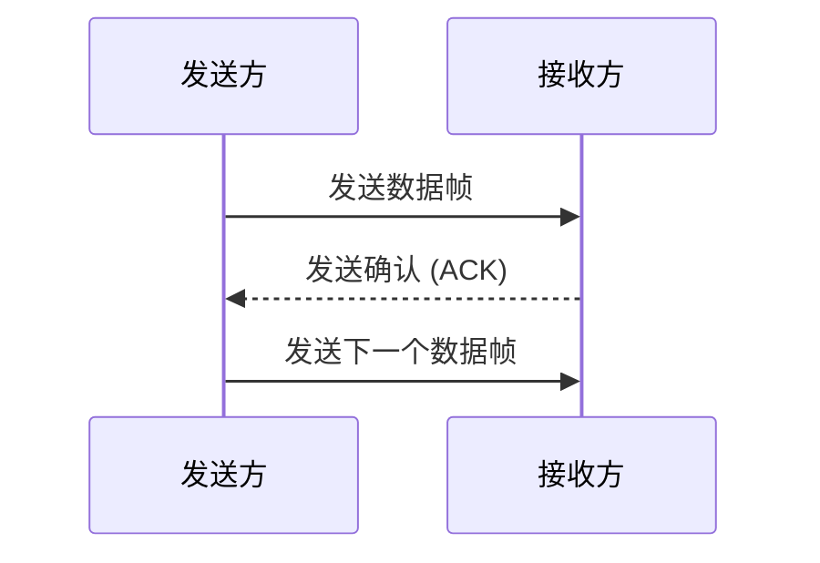
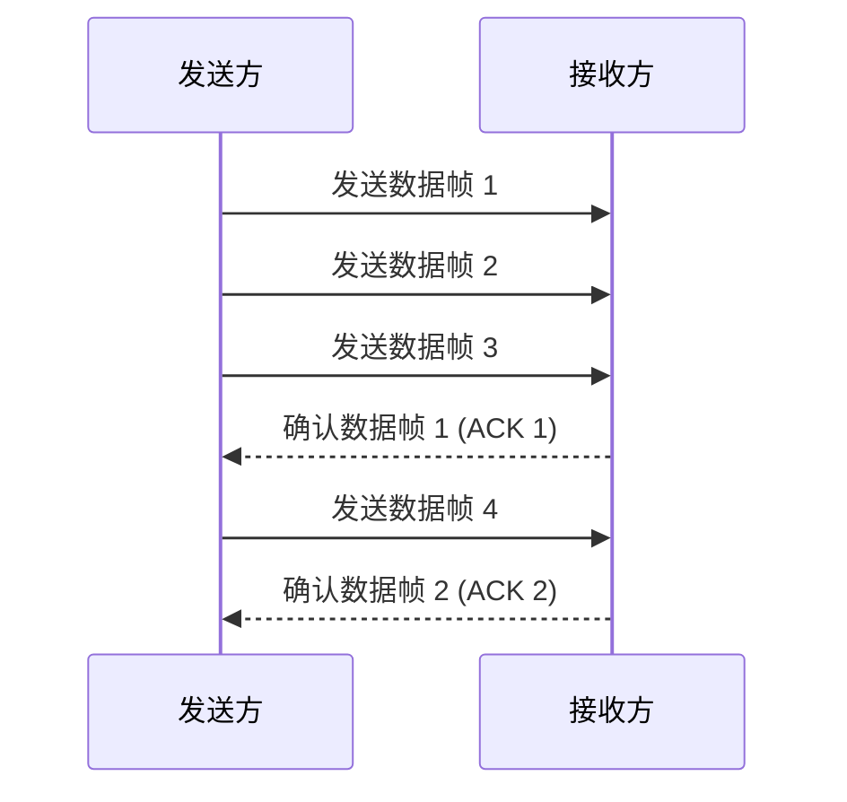

## 介绍

在计算机网络中，**流量控制**是数据链路层的一个重要功能，用于确保发送方和接收方之间的数据传输速率匹配。如果没有流量控制，发送方可能会以过快的速度发送数据，导致接收方无法及时处理，从而造成数据丢失或网络拥塞。

流量控制的主要目标是：
- 防止发送方发送数据过快，超出接收方的处理能力。
- 确保数据传输的可靠性和效率。

## 流量控制的基本原理

流量控制的核心思想是通过某种机制，让发送方知道接收方的处理能力，从而调整发送速率。常见的流量控制方法包括：

1. **停止-等待协议（Stop-and-Wait）**
2. **滑动窗口协议（Sliding Window）**

### 停止-等待协议

停止-等待协议是最简单的流量控制方法。发送方每发送一个数据帧后，必须等待接收方的确认（ACK）才能发送下一个数据帧。如果接收方没有发送确认，发送方会一直等待。

:::note
停止-等待协议的优点是实现简单，但缺点是效率较低，因为每次只能发送一个数据帧。
:::

### 滑动窗口协议

滑动窗口协议是一种更高效的流量控制方法。发送方和接收方各自维护一个窗口，窗口大小表示可以发送或接收的数据帧数量。发送方可以连续发送多个数据帧，而不需要等待每个帧的确认。

:::tip
滑动窗口协议可以显著提高数据传输的效率，因为它允许发送方在等待确认的同时继续发送数据帧。
:::

## 实际应用场景

### 1. TCP 协议中的流量控制

TCP 协议使用滑动窗口机制来实现流量控制。接收方通过 TCP 头部中的窗口字段告诉发送方自己还能接收多少数据。发送方根据这个信息调整发送速率。

### 2. 无线网络中的流量控制

在无线网络中，由于信号干扰和带宽限制，流量控制尤为重要。无线网络设备通常使用自适应流量控制机制，根据网络状况动态调整发送速率。

## 总结

流量控制是数据链路层中确保数据传输可靠性和效率的关键机制。通过停止-等待协议和滑动窗口协议，发送方和接收方可以有效地协调数据传输速率，避免数据丢失和网络拥塞。

## 附加资源与练习

- **练习 1**：实现一个简单的停止-等待协议模拟程序，模拟发送方和接收方之间的数据传输过程。
- **练习 2**：研究 TCP 协议中的滑动窗口机制，并尝试编写代码模拟 TCP 流量控制过程。

:::caution
在实际编程中，流量控制的实现可能会受到网络延迟、丢包等因素的影响，因此需要仔细测试和优化。
:::