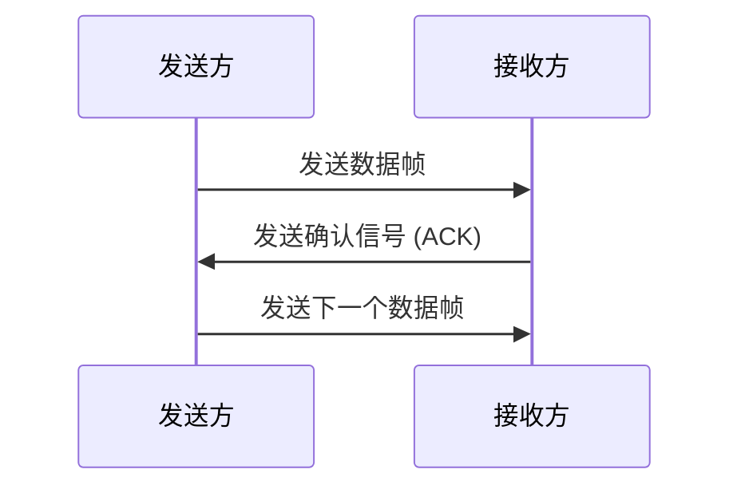

# 停止等待协议

停止等待协议（Stop-and-Wait Protocol）是数据链路层中一种简单的可靠数据传输协议。它通过发送方和接收方之间的确认机制，确保数据在传输过程中不会丢失或出错。对于初学者来说，停止等待协议是理解可靠数据传输的基础。

## 什么是停止等待协议？

停止等待协议的核心思想是：发送方在发送一个数据帧后，必须等待接收方的确认（ACK）信号，才能发送下一个数据帧。如果发送方在一定时间内没有收到确认信号，则会重新发送该数据帧。这种机制确保了数据的可靠传输。

### 工作原理

1. **发送方**发送一个数据帧。
2. **接收方**接收到数据帧后，检查其是否正确。如果正确，则发送一个确认信号（ACK）给发送方。
3. **发送方**收到确认信号后，继续发送下一个数据帧。
4. 如果发送方在一定时间内没有收到确认信号，则会重新发送之前的数据帧。



## 实现停止等待协议

下面是一个简单的停止等待协议的伪代码示例，帮助理解其实现逻辑。

```python
def sender():
    while True:
        data = get_next_data()  # 获取下一个数据帧
        send(data)              # 发送数据帧
        start_timer()           # 启动计时器
        while True:
            if received_ack():  # 收到确认信号
                stop_timer()    # 停止计时器
                break           # 继续发送下一个数据帧
            if timer_expired(): # 计时器超时
                send(data)      # 重新发送数据帧
                start_timer()   # 重新启动计时器

def receiver():
    while True:
        data = receive()        # 接收数据帧
        if check_data(data):    # 检查数据是否正确
            send_ack()          # 发送确认信号
```

### 输入和输出示例

假设发送方发送的数据帧为 `"Hello"`，接收方接收到数据后发送确认信号 `"ACK"`。

- **发送方**：
  - 发送 `"Hello"`
  - 等待 `"ACK"`
  - 收到 `"ACK"` 后，发送下一个数据帧

- **接收方**：
  - 接收 `"Hello"`
  - 发送 `"ACK"`

## 实际应用场景

停止等待协议常用于以下场景：

1. **低带宽网络**：在带宽有限的网络中，停止等待协议可以有效减少数据丢失。
2. **嵌入式系统**：在资源有限的嵌入式系统中，停止等待协议因其简单性而被广泛使用。
3. **教学示例**：由于其简单易懂的特性，停止等待协议常被用于教学示例，帮助学生理解可靠数据传输的基本概念。

:::tip
在实际应用中，停止等待协议的效率较低，因为它每次只能发送一个数据帧并等待确认。为了提高效率，通常会使用更复杂的协议，如滑动窗口协议。
:::

## 总结

停止等待协议是数据链路层中一种简单但有效的可靠数据传输协议。它通过发送方和接收方之间的确认机制，确保数据在传输过程中不会丢失或出错。虽然其效率较低，但在某些特定场景下仍然非常有用。

## 附加资源

- [《计算机网络：自顶向下方法》](https://example.com) - 一本经典的计算机网络教材，详细介绍了停止等待协议及其相关概念。
- [停止等待协议在线模拟器](https://example.com) - 一个在线工具，可以帮助你更好地理解停止等待协议的工作原理。

## 练习

1. 实现一个简单的停止等待协议程序，模拟发送方和接收方的交互过程。
2. 思考停止等待协议的优缺点，并尝试提出改进方案。
3. 研究滑动窗口协议，并与停止等待协议进行比较。

:::caution
在实际编程中，停止等待协议的实现可能会遇到各种问题，如网络延迟、数据包丢失等。请确保在实现时考虑到这些因素。
:::