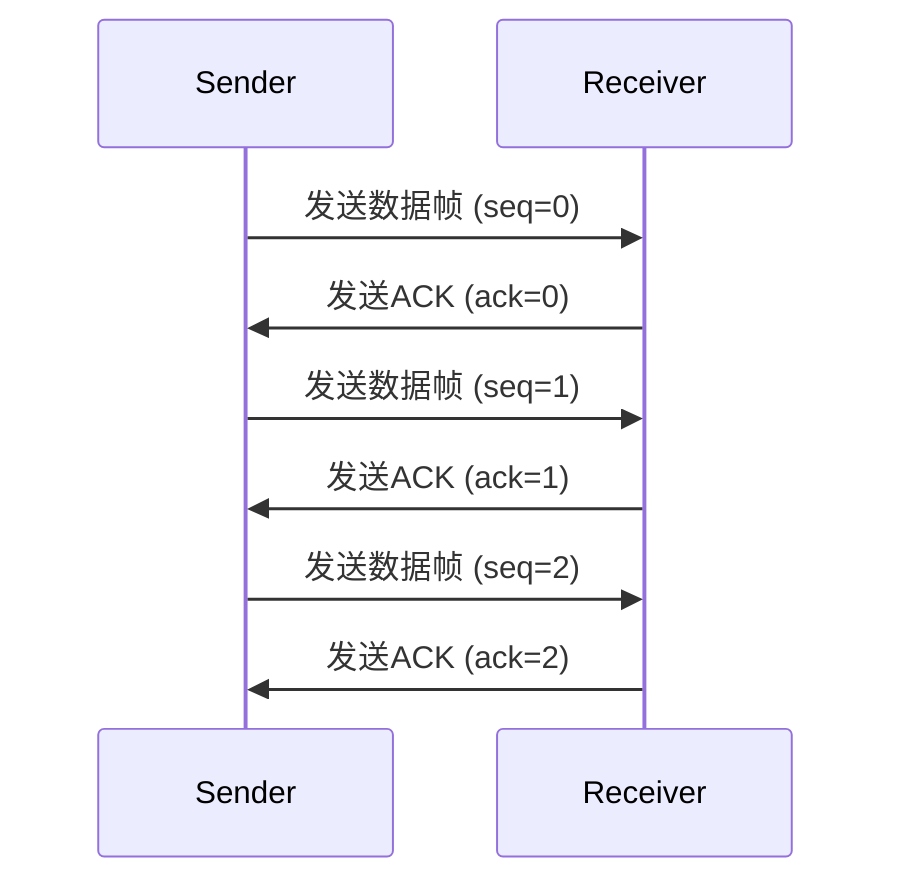

## 介绍

滑动窗口协议（Sliding Window Protocol）是数据链路层中用于流量控制和可靠数据传输的一种重要机制。它通过动态调整发送方和接收方之间的窗口大小，确保数据能够高效、有序地传输，同时避免网络拥塞。

在滑动窗口协议中，发送方和接收方各自维护一个窗口，窗口的大小决定了可以发送或接收的数据帧数量。发送方在收到确认（ACK）后，会滑动窗口以发送新的数据帧，而接收方则在成功接收数据帧后滑动窗口以接收更多数据。

## 滑动窗口协议的工作原理

### 1. 窗口的概念

滑动窗口协议的核心是“窗口”，它代表了发送方和接收方可以处理的数据帧范围。窗口的大小可以是固定的，也可以是动态调整的。

- **发送窗口**：发送方可以发送的数据帧范围。
- **接收窗口**：接收方可以接收的数据帧范围。

### 2. 滑动窗口的机制

滑动窗口协议通过以下步骤实现可靠的数据传输：

1. **发送数据帧**：发送方在窗口范围内发送数据帧。
2. **接收确认**：接收方收到数据帧后，发送确认（ACK）给发送方。
3. **滑动窗口**：发送方收到ACK后，滑动窗口以发送新的数据帧。

### 3. 流量控制

滑动窗口协议还用于流量控制，防止发送方发送过多的数据帧导致接收方无法处理。通过调整窗口大小，可以控制数据流的速率。

## 代码示例

以下是一个简单的滑动窗口协议的伪代码示例，展示了发送方和接收方的基本操作。

```python
# 发送方
def sender(window_size):
    window = [0] * window_size
    base = 0
    next_seq_num = 0

    while True:
        if next_seq_num < base + window_size:
            send_frame(next_seq_num)
            next_seq_num += 1

        if receive_ack():
            base += 1

# 接收方
def receiver(window_size):
    expected_seq_num = 0

    while True:
        frame = receive_frame()
        if frame.seq_num == expected_seq_num:
            process_frame(frame)
            send_ack(expected_seq_num)
            expected_seq_num += 1
```

### 输入和输出

- **输入**：数据帧序列号（`seq_num`）。
- **输出**：确认帧（`ACK`）。

## 实际案例

### 案例：TCP协议中的滑动窗口

TCP协议是滑动窗口协议的一个典型应用。在TCP连接中，发送方和接收方通过滑动窗口机制实现流量控制和可靠数据传输。

- **发送方**：根据接收方的窗口大小调整发送数据的速率。
- **接收方**：通过ACK确认接收到的数据，并动态调整窗口大小以控制流量。



## 总结

滑动窗口协议是数据链路层中用于流量控制和可靠数据传输的重要机制。通过动态调整窗口大小，发送方和接收方可以高效地传输数据，同时避免网络拥塞。本文介绍了滑动窗口协议的基本概念、工作原理，并通过代码示例和实际案例展示了其应用。

## 附加资源

- **书籍**：《计算机网络：自顶向下方法》——James F. Kurose, Keith W. Ross
- **在线课程**：Coursera上的《计算机网络基础》
- **练习**：尝试实现一个简单的滑动窗口协议，模拟发送方和接收方的交互。

:::tip
提示：理解滑动窗口协议的关键在于掌握窗口的动态调整机制以及ACK的作用。通过实际编程练习，可以更好地理解其工作原理。
:::