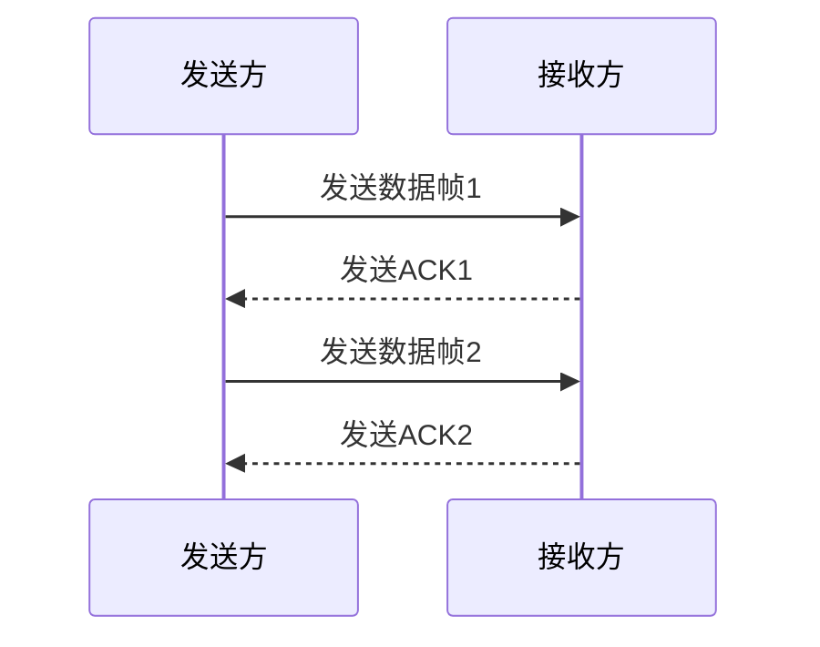
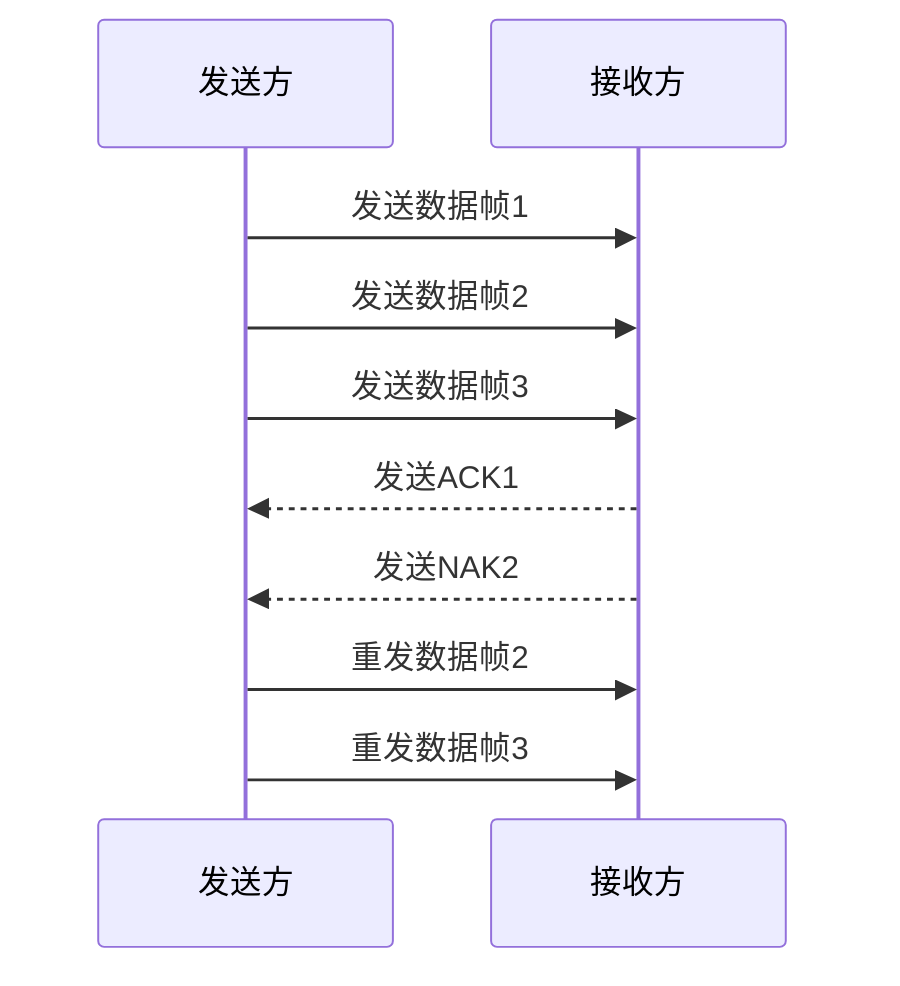
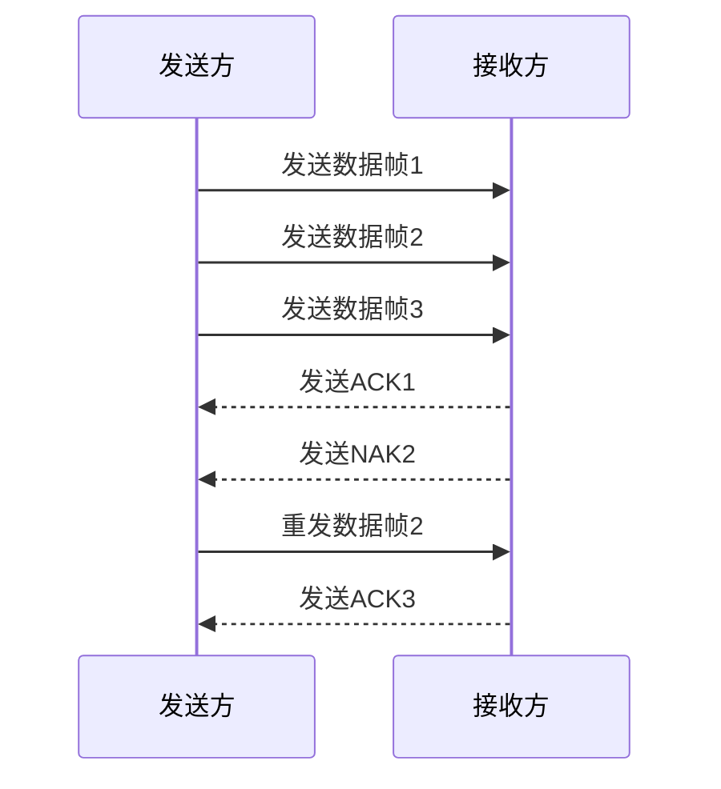

# ARQ协议

在计算机网络中，**ARQ（Automatic Repeat reQuest，自动重传请求）协议**是一种用于确保数据在不可靠的通信信道中可靠传输的机制。它通过检测和纠正传输错误，确保数据能够准确无误地从发送方传递到接收方。ARQ协议广泛应用于数据链路层，是许多网络协议的基础。

## ARQ协议的工作原理

ARQ协议的核心思想是通过**确认（ACK）**和**重传（Retransmission）**机制来保证数据的可靠传输。以下是ARQ协议的基本工作流程：

1. **发送方**发送数据帧。
2. **接收方**接收到数据帧后，检查数据是否正确。
3. 如果数据正确，接收方发送一个**确认（ACK）**信号给发送方。
4. 如果数据有误，接收方发送一个**否定确认（NAK）**信号，或者不发送任何信号（取决于协议类型）。
5. 发送方在收到NAK或超时未收到ACK时，会重新发送数据帧。

:::note
ARQ协议的关键在于**超时重传**机制。如果发送方在一定时间内没有收到ACK，它会认为数据帧丢失或损坏，并自动重传。
:::

## ARQ协议的类型

ARQ协议主要有三种类型：**停止等待ARQ（Stop-and-Wait ARQ）**、**回退N帧ARQ（Go-Back-N ARQ）**和**选择性重传ARQ（Selective Repeat ARQ）**。

### 1. 停止等待ARQ

停止等待ARQ是最简单的ARQ协议。发送方在发送一个数据帧后，必须等待接收方的ACK信号，才能发送下一个数据帧。如果超时未收到ACK，发送方会重传该数据帧。

:::caution
停止等待ARQ的缺点是效率较低，因为发送方在等待ACK时无法发送其他数据帧。
:::

### 2. 回退N帧ARQ

回退N帧ARQ允许发送方连续发送多个数据帧，而不需要等待每个数据帧的ACK。如果某个数据帧丢失或损坏，发送方会从该帧开始重新发送所有后续帧。

:::tip
回退N帧ARQ提高了传输效率，但在发生错误时需要重传多个数据帧，可能导致带宽浪费。
:::

### 3. 选择性重传ARQ

选择性重传ARQ允许发送方只重传丢失或损坏的数据帧，而不需要重传所有后续帧。接收方会缓存正确接收的数据帧，并在收到重传的帧后重新组装数据。

:::warning
选择性重传ARQ需要更复杂的缓冲区管理和协议设计，但可以显著减少不必要的重传。
:::

## 实际应用场景

ARQ协议广泛应用于各种网络通信场景中，例如：

- **TCP协议**：TCP使用类似于选择性重传ARQ的机制来确保数据的可靠传输。
- **无线通信**：在无线网络中，由于信道不稳定，ARQ协议被用来纠正传输错误。
- **卫星通信**：由于长距离传输的高延迟，ARQ协议在卫星通信中尤为重要。

## 总结

ARQ协议是数据链路层中确保数据可靠传输的关键机制。通过确认和重传机制，ARQ协议能够在不可靠的信道中实现可靠的数据传输。根据不同的应用场景，可以选择停止等待ARQ、回退N帧ARQ或选择性重传ARQ来优化传输效率。

## 附加资源与练习

- **练习**：尝试实现一个简单的停止等待ARQ协议的模拟程序，观察其在不同网络条件下的表现。
- **进一步阅读**：了解更多关于TCP协议中的ARQ机制，以及如何在无线网络中优化ARQ协议的性能。

:::tip
如果你对ARQ协议的实现细节感兴趣，可以参考相关的网络协议标准文档，如RFC 793（TCP协议）。
:::