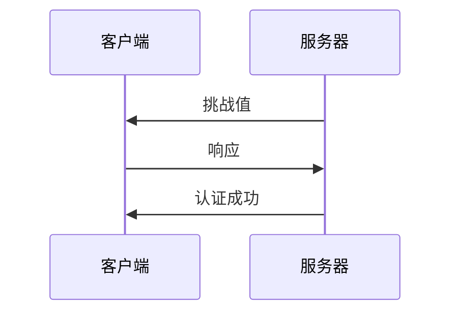
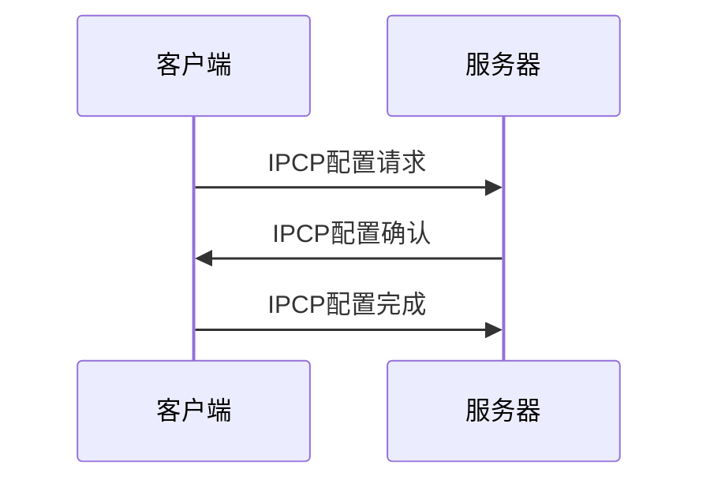
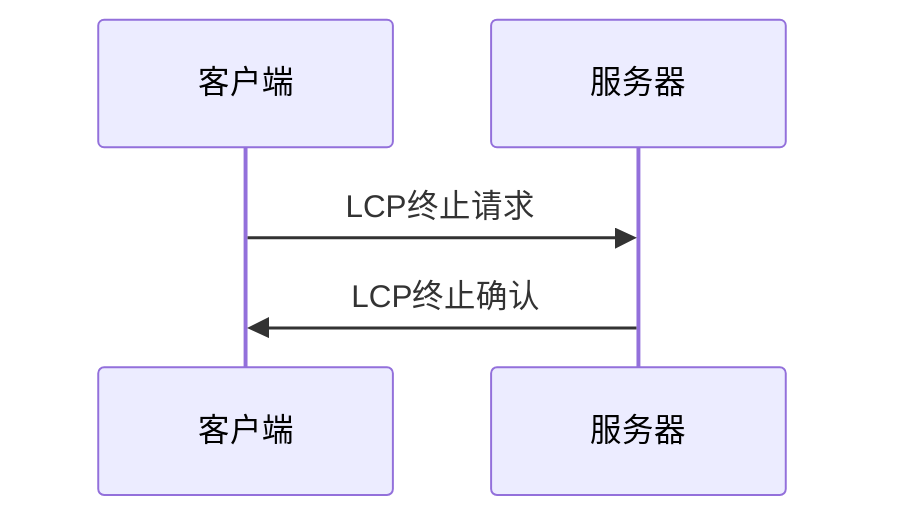

## 介绍

点对点协议（Point-to-Point Protocol，简称PPP）是一种数据链路层协议，主要用于在两个网络节点之间建立直接连接。PPP协议广泛应用于拨号连接、DSL、光纤等场景，是互联网接入的重要技术之一。

PPP协议的主要功能包括：
- **链路控制**：建立、配置和测试数据链路连接。
- **网络层协议封装**：支持多种网络层协议（如IP、IPX等）的封装。
- **错误检测**：通过校验和等方式检测数据传输中的错误。

## PPP协议的工作原理

PPP协议的工作过程可以分为以下几个阶段：

1. **链路建立阶段**：通过链路控制协议（LCP）建立连接。
2. **认证阶段**：可选阶段，使用PAP或CHAP进行身份验证。
3. **网络层协议阶段**：通过网络控制协议（NCP）配置网络层协议。
4. **数据传输阶段**：在建立好的链路上传输数据。
5. **链路终止阶段**：通过LCP终止连接。

### 链路建立阶段

在链路建立阶段，PPP使用LCP协议来协商链路参数，如最大帧大小、认证协议等。LCP协议通过交换配置包来达成一致。


### 认证阶段

认证阶段是可选的，常用的认证协议有PAP（Password Authentication Protocol）和CHAP（Challenge Handshake Authentication Protocol）。

- **PAP**：客户端发送用户名和密码，服务器验证后确认。
- **CHAP**：服务器发送一个挑战值，客户端使用密码和挑战值生成响应，服务器验证响应。



### 网络层协议阶段

在网络层协议阶段，PPP使用NCP协议来配置网络层协议。例如，对于IP协议，使用IPCP（Internet Protocol Control Protocol）来分配IP地址。



### 数据传输阶段

在数据传输阶段，PPP协议封装网络层数据包，并通过建立好的链路进行传输。PPP帧的格式如下：

```
| Flag | Address | Control | Protocol | Data | FCS | Flag |
```

- **Flag**：标志位，表示帧的开始和结束。
- **Address**：地址字段，通常为0xFF。
- **Control**：控制字段，通常为0x03。
- **Protocol**：协议字段，指示封装的数据类型。
- **Data**：数据字段，包含网络层数据包。
- **FCS**：帧校验序列，用于错误检测。

### 链路终止阶段

在链路终止阶段，LCP协议通过交换终止包来关闭连接。



## 实际应用场景

PPP协议广泛应用于以下场景：

1. **拨号上网**：通过电话线连接互联网时，使用PPP协议建立连接。
2. **DSL连接**：在DSL宽带接入中，PPP协议用于建立用户与ISP之间的连接。
3. **VPN连接**：在虚拟专用网络（VPN）中，PPP协议用于封装和传输数据。

:::tip
在实际应用中，PPP协议通常与PPPoE（PPP over Ethernet）结合使用，以支持以太网环境下的PPP连接。
:::

## 总结

PPP协议是一种重要的数据链路层协议，广泛应用于各种网络连接场景。通过LCP、NCP等子协议，PPP能够灵活地建立、配置和管理数据链路连接，支持多种网络层协议的封装和传输。

## 附加资源与练习

- **附加资源**：
  - [RFC 1661 - The Point-to-Point Protocol (PPP)](https://tools.ietf.org/html/rfc1661)
  - [PPP协议详解](https://en.wikipedia.org/wiki/Point-to-Point_Protocol)

- **练习**：
  1. 使用Wireshark抓取PPP协议的数据包，分析其帧结构。
  2. 配置一个简单的PPP连接，观察LCP、NCP等协议的交互过程。
