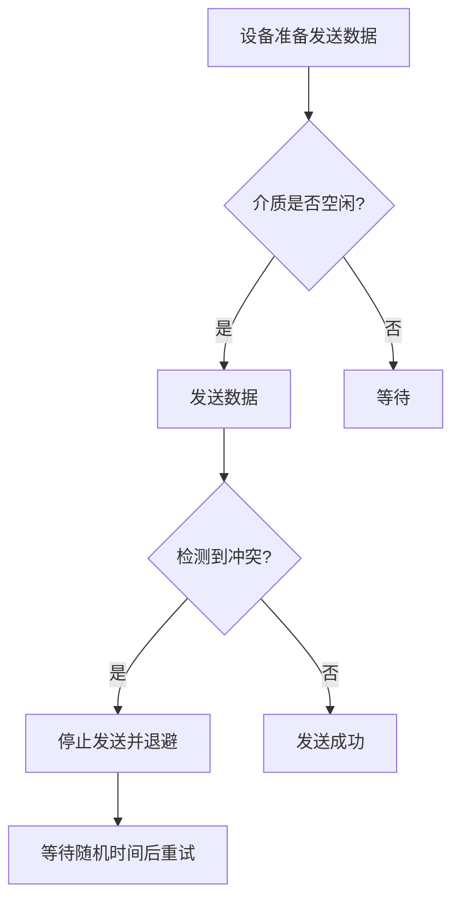
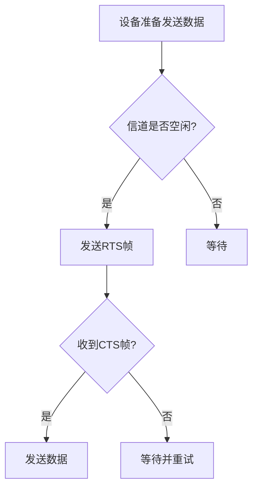
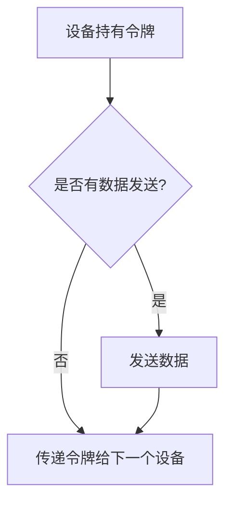

## 介绍

在计算机网络中，**介质访问控制（Medium Access Control, MAC）** 是数据链路层的一个重要子层。它的主要任务是管理多个设备如何共享同一通信介质（如电缆、无线信道等），以避免冲突并确保数据传输的可靠性。MAC 协议定义了设备何时可以发送数据、如何检测冲突以及如何处理冲突。

## 为什么需要介质访问控制？

在共享介质的环境中，多个设备可能会同时尝试发送数据，这会导致**冲突**（Collision）。冲突会导致数据损坏，降低网络效率。MAC 协议通过协调设备对介质的访问，确保数据传输的有序性和高效性。

## 常见的 MAC 协议

### 1. 载波侦听多路访问/冲突检测（CSMA/CD）

**CSMA/CD** 是一种经典的 MAC 协议，常用于以太网中。它的工作原理如下：

1. **载波侦听（Carrier Sense）**：设备在发送数据前会先侦听介质是否空闲。
2. **多路访问（Multiple Access）**：如果介质空闲，设备可以发送数据。
3. **冲突检测（Collision Detection）**：如果两个设备同时发送数据，它们会检测到冲突，并停止发送。
4. **退避（Backoff）**：设备会等待一段随机时间后重新尝试发送。

### 2. 载波侦听多路访问/冲突避免（CSMA/CA）

**CSMA/CA** 主要用于无线网络（如 Wi-Fi），因为无线环境中冲突检测较为困难。它的工作原理如下：

1. **载波侦听**：设备在发送数据前侦听信道。
2. **冲突避免**：如果信道空闲，设备会发送一个**请求发送（RTS）**帧，接收方回复**允许发送（CTS）**帧。
3. **发送数据**：设备在收到 CTS 后开始发送数据。

### 3. 令牌环（Token Ring）

**令牌环** 是一种基于令牌传递的 MAC 协议。设备只有在持有令牌时才能发送数据，从而避免了冲突。

## 实际应用场景

### 1. 以太网中的 CSMA/CD

以太网是最常见的局域网技术，使用 CSMA/CD 协议来管理设备对共享介质的访问。例如，在一个办公室网络中，多台计算机通过以太网交换机连接。当两台计算机同时发送数据时，CSMA/CD 会检测到冲突并协调重传。

### 2. Wi-Fi 中的 CSMA/CA

在家庭或公共场所的 Wi-Fi 网络中，CSMA/CA 协议用于避免多个设备同时发送数据导致的冲突。例如，当多部手机同时连接到同一个 Wi-Fi 热点时，CSMA/CA 会确保数据传输的有序性。

## 总结

介质访问控制（MAC）是数据链路层的核心功能之一，用于管理多个设备对共享介质的访问。常见的 MAC 协议包括 CSMA/CD、CSMA/CA 和令牌环。每种协议都有其适用的场景和优缺点。理解这些协议的工作原理对于设计和优化网络至关重要。

## 附加资源与练习

- **练习 1**：在模拟器中实现一个简单的 CSMA/CD 协议，观察冲突发生时的行为。
- **练习 2**：研究 Wi-Fi 网络中的 CSMA/CA 协议，分析其与 CSMA/CD 的区别。
- **推荐阅读**：
  - 《计算机网络：自顶向下方法》
  - 《TCP/IP 详解》
