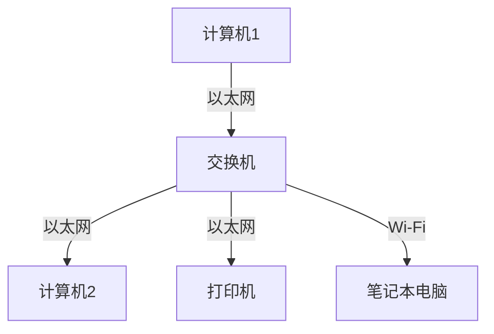

# 局域网概述

局域网（Local Area Network，简称 LAN）是一种在有限地理范围内（如家庭、办公室、学校等）连接多台计算机和其他设备的网络。它允许设备之间共享资源（如文件、打印机、互联网连接等），并支持高效的数据传输。局域网通常由交换机、路由器、网线或无线接入点等设备组成。

## 局域网的基本概念

局域网的主要特点包括：

1. **覆盖范围有限**：通常在一个建筑物或一组相邻建筑物内。
2. **高速传输**：局域网的数据传输速率较高，通常在 100 Mbps 到 10 Gbps 之间。
3. **低延迟**：由于覆盖范围小，数据传输的延迟较低。
4. **资源共享**：局域网内的设备可以共享文件、打印机、存储设备等资源。

:::note
局域网与广域网（WAN）的主要区别在于覆盖范围。广域网覆盖更大的地理区域，例如城市、国家甚至全球。
:::

## 局域网的工作原理

局域网通过以下方式实现设备之间的通信：

1. **物理连接**：使用网线（如以太网）或无线技术（如 Wi-Fi）连接设备。
2. **数据包传输**：数据被分割成小的数据包，通过网络传输到目标设备。
3. **协议支持**：局域网使用网络协议（如 TCP/IP）来管理数据传输和通信。

以下是一个简单的局域网拓扑图：

:::tip
在局域网中，交换机是核心设备，负责将数据包转发到正确的目标设备。
:::

## 局域网的常见技术

1. **以太网（Ethernet）**：最常见的局域网技术，使用网线连接设备，支持高速数据传输。
2. **Wi-Fi**：无线局域网技术，允许设备通过无线信号连接网络。
3. **网络协议**：如 TCP/IP、ARP、DHCP 等，用于管理网络通信和资源分配。

## 实际应用场景

1. **家庭网络**：通过路由器连接多台设备（如电脑、手机、智能电视等），共享互联网连接和文件。
2. **办公室网络**：连接员工的计算机、打印机和服务器，支持文件共享和协作。
3. **学校网络**：为学生和教师提供互联网接入和资源共享服务。

:::caution
在配置局域网时，务必注意网络安全，例如设置强密码、启用防火墙等。
:::

## 总结

局域网是现代网络技术的基础，广泛应用于家庭、办公室和学校等场景。通过学习局域网的基本概念、工作原理和常见技术，您可以更好地理解和管理自己的网络环境。

## 附加资源与练习

1. **练习**：尝试在家庭网络中配置一个简单的局域网，连接两台计算机并共享文件。
2. **资源**：
   - [TCP/IP 协议详解](https://example.com/tcp-ip)
   - [以太网技术指南](https://example.com/ethernet)
   - [Wi-Fi 配置教程](https://example.com/wifi-config)

希望本文能帮助您更好地理解局域网的概念和应用！如果您有任何问题，欢迎在评论区留言。