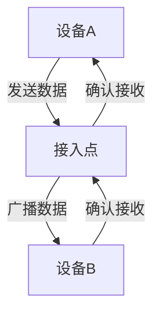

# IEEE 802.11标准

IEEE 802.11标准是无线局域网（WLAN）技术的核心规范，定义了无线网络设备之间的通信方式。它由电气和电子工程师协会（IEEE）制定，是Wi-Fi技术的基础。通过IEEE 802.11标准，设备可以在无需物理连接的情况下进行数据传输，广泛应用于家庭、办公室和公共场所。

## 什么是IEEE 802.11标准？

IEEE 802.11标准是一组协议，规定了无线局域网（WLAN）的物理层和数据链路层的实现方式。它定义了无线设备如何通过无线电波进行通信，包括频率、调制方式、数据传输速率等。

:::note
IEEE 802.11标准通常被称为Wi-Fi，但实际上Wi-Fi是Wi-Fi联盟的商标，用于认证符合IEEE 802.11标准的设备。
:::

## IEEE 802.11标准的版本演进

自1997年首次发布以来，IEEE 802.11标准经历了多次更新和改进。以下是主要版本的简要介绍：

1. **802.11 (1997)**  
   最早的版本，支持2.4 GHz频段，最大传输速率为2 Mbps。

2. **802.11b (1999)**  
   支持2.4 GHz频段，最大传输速率为11 Mbps。

3. **802.11a (1999)**  
   支持5 GHz频段，最大传输速率为54 Mbps。

4. **802.11g (2003)**  
   支持2.4 GHz频段，最大传输速率为54 Mbps，兼容802.11b。

5. **802.11n (2009)**  
   支持2.4 GHz和5 GHz频段，引入MIMO技术，最大传输速率可达600 Mbps。

6. **802.11ac (2013)**  
   支持5 GHz频段，进一步扩展MIMO技术，最大传输速率可达数Gbps。

7. **802.11ax (2019)**  
   也称为Wi-Fi 6，支持2.4 GHz和5 GHz频段，优化了多设备环境下的性能。

:::tip
802.11n及之后的版本引入了MIMO（多输入多输出）技术，通过多天线同时传输数据，显著提高了传输速率和网络容量。
:::

## IEEE 802.11的工作原理

IEEE 802.11标准定义了无线设备之间的通信方式，主要包括以下关键概念：

1. **频段**  
   无线网络通常工作在2.4 GHz或5 GHz频段。2.4 GHz频段覆盖范围广，但容易受到干扰；5 GHz频段干扰较少，但覆盖范围较小。

2. **信道**  
   频段被划分为多个信道，设备通过特定的信道进行通信。例如，2.4 GHz频段有14个信道，而5 GHz频段有更多信道。

3. **调制方式**  
   调制是将数据转换为无线电波的过程。常见的调制方式包括BPSK、QPSK和QAM。

4. **CSMA/CA**  
   载波侦听多路访问/冲突避免（CSMA/CA）是IEEE 802.11标准中用于避免数据冲突的机制。

## 实际应用场景

IEEE 802.11标准广泛应用于以下场景：

1. **家庭网络**  
   通过无线路由器，家庭成员可以连接互联网，共享文件和打印机。

2. **企业网络**  
   企业使用无线网络为员工提供灵活的办公环境，支持移动设备和远程办公。

3. **公共场所**  
   咖啡馆、机场和图书馆等公共场所提供免费Wi-Fi，方便用户上网。

:::caution
在公共场所使用Wi-Fi时，请注意网络安全，避免连接不安全的网络或传输敏感信息。
:::

## 总结

IEEE 802.11标准是无线局域网技术的基石，定义了无线设备之间的通信方式。通过不断演进，它支持更高的传输速率和更复杂的网络环境。无论是家庭、企业还是公共场所，IEEE 802.11标准都为我们提供了便捷的无线连接。

## 附加资源与练习

- **练习**  
  尝试配置一个简单的无线网络，使用不同版本的IEEE 802.11标准测试其性能差异。

- **资源**  
  - [IEEE 802.11标准官方文档](https://standards.ieee.org)  
  - [Wi-Fi联盟官方网站](https://www.wi-fi.org)  
  - 《无线网络技术详解》书籍

:::warning
在配置无线网络时，请确保启用WPA3等最新的安全协议，以保护您的网络免受攻击。
:::