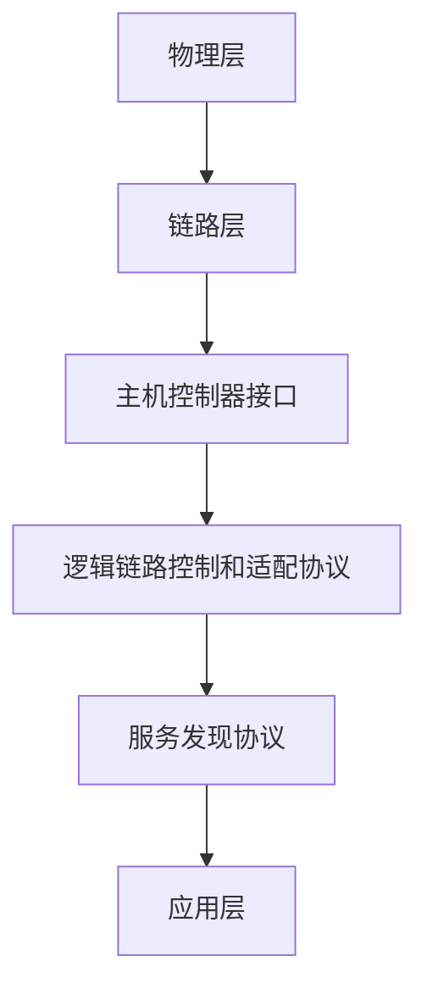

## 什么是蓝牙技术？

蓝牙技术是一种短距离无线通信技术，用于在设备之间传输数据。它最初由爱立信公司于1994年开发，旨在取代传统的有线连接方式。蓝牙技术广泛应用于手机、耳机、键盘、鼠标、智能家居设备等，是局域网技术中的重要组成部分。

蓝牙技术的主要特点包括：
- **低功耗**：适合电池供电的设备。
- **短距离通信**：通常在10米范围内，但某些版本可以扩展到100米。
- **低成本**：易于集成到各种设备中。

## 蓝牙技术的工作原理

蓝牙技术使用2.4 GHz的ISM（工业、科学和医疗）频段进行通信。它采用跳频扩频（FHSS）技术，通过快速切换频率来减少干扰并提高通信的可靠性。

### 蓝牙协议栈

蓝牙协议栈是蓝牙技术的核心，它定义了设备之间通信的规则和流程。以下是蓝牙协议栈的主要层次：

1. **物理层（PHY）**：负责无线信号的传输和接收。
2. **链路层（Link Layer）**：管理设备之间的连接和数据传输。
3. **主机控制器接口（HCI）**：连接蓝牙硬件和软件。
4. **逻辑链路控制和适配协议（L2CAP）**：提供数据分片和重组功能。
5. **服务发现协议（SDP）**：用于发现设备提供的服务。
6. **应用层**：实现具体的应用功能，如音频传输、文件传输等。



## 蓝牙技术的实际应用

蓝牙技术在许多场景中都有广泛应用，以下是一些常见的例子：

1. **无线音频传输**：蓝牙耳机和音箱通过蓝牙技术与手机或电脑连接，实现无线音频播放。
2. **文件传输**：通过蓝牙技术，用户可以在手机之间快速传输文件。
3. **智能家居**：蓝牙技术用于连接智能灯泡、智能门锁等设备，实现远程控制。
4. **健康监测**：蓝牙技术用于连接心率监测器、血压计等健康设备，将数据传输到手机或电脑。

:::tip
蓝牙技术的最新版本是蓝牙5.3，它提供了更高的传输速度、更低的功耗和更远的通信距离。
:::

## 代码示例：使用Python控制蓝牙设备

以下是一个简单的Python代码示例，展示了如何使用`pybluez`库扫描附近的蓝牙设备：

```python
import bluetooth

# 扫描附近的蓝牙设备
devices = bluetooth.discover_devices(duration=8, lookup_names=True, flush_cache=True, lookup_class=False)

# 打印扫描到的设备
for addr, name in devices:
    print(f"Found Bluetooth device: {name} - {addr}")
```

**输出示例：**
```
Found Bluetooth device: MyHeadset - 00:11:22:33:44:55
Found Bluetooth device: MyKeyboard - 66:77:88:99:AA:BB
```

:::caution
在使用蓝牙技术时，请确保设备之间的兼容性，并注意安全性问题，如避免连接到未知设备。
:::

## 总结

蓝牙技术是一种强大的短距离无线通信技术，广泛应用于各种设备中。通过了解其工作原理和应用场景，你可以更好地利用蓝牙技术来简化设备之间的连接和数据传输。

## 附加资源

- [蓝牙技术联盟官方网站](https://www.bluetooth.com/)
- [PyBluez库文档](https://pybluez.github.io/)
- [蓝牙协议栈详解](https://en.wikipedia.org/wiki/Bluetooth_stack)

## 练习

1. 使用Python编写一个程序，尝试连接到附近的蓝牙设备并发送一条消息。
2. 研究蓝牙5.3的新特性，并写一篇短文介绍其改进之处。
