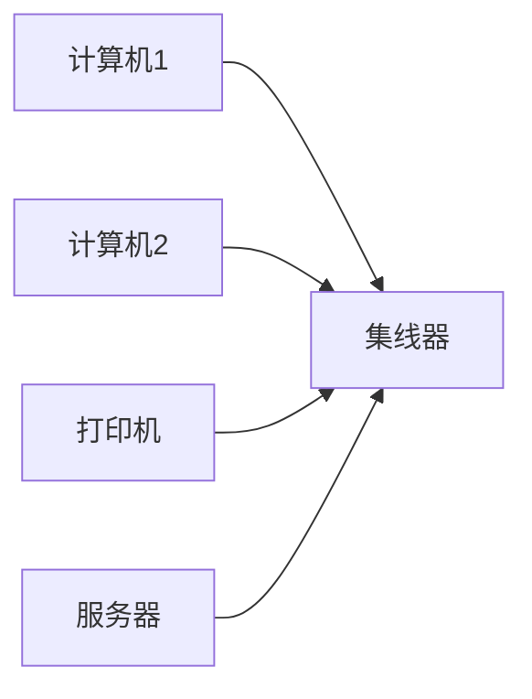
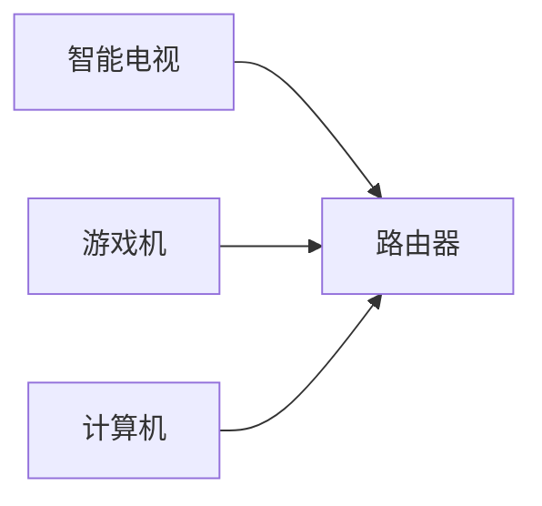

## 介绍

传统以太网（Ethernet）是一种广泛使用的局域网（LAN）技术，最早由 Xerox 公司在 1970 年代开发。它使用 **CSMA/CD**（载波侦听多路访问/冲突检测）协议来管理网络设备之间的通信。传统以太网通常运行在 **10 Mbps** 的速度下，使用同轴电缆或双绞线作为传输介质。

以太网的核心思想是通过共享的传输介质连接多个设备，并确保数据能够高效、可靠地传输。尽管现代以太网已经发展到更高的速度（如千兆以太网和万兆以太网），但理解传统以太网的工作原理仍然是学习网络技术的基础。

## 传统以太网的工作原理

### 1. CSMA/CD 协议

CSMA/CD 是传统以太网的核心协议，用于管理多个设备在共享介质上的通信。它的工作原理如下：

- **载波侦听（Carrier Sense）**：设备在发送数据之前会先侦听网络，确保当前没有其他设备正在传输数据。
- **多路访问（Multiple Access）**：多个设备共享同一传输介质。
- **冲突检测（Collision Detection）**：如果两个设备同时发送数据，会发生冲突。设备会检测到冲突并停止发送，等待一段随机时间后重试。

:::note
冲突是传统以太网中不可避免的现象，尤其是在网络负载较高时。CSMA/CD 协议通过随机退避机制来减少冲突的发生。
:::

### 2. 帧结构

以太网数据以 **帧（Frame）** 的形式传输。一个典型的以太网帧包括以下字段：

- **前导码（Preamble）**：7 字节，用于同步接收方的时钟。
- **帧起始定界符（Start Frame Delimiter, SFD）**：1 字节，标识帧的开始。
- **目标 MAC 地址（Destination MAC Address）**：6 字节，指定帧的目标设备。
- **源 MAC 地址（Source MAC Address）**：6 字节，标识发送帧的设备。
- **类型/长度（Type/Length）**：2 字节，指示帧中数据的类型或长度。
- **数据（Data）**：46 到 1500 字节，包含实际传输的数据。
- **帧校验序列（Frame Check Sequence, FCS）**：4 字节，用于错误检测。

```plaintext
| 前导码 (7B) | SFD (1B) | 目标 MAC (6B) | 源 MAC (6B) | 类型/长度 (2B) | 数据 (46-1500B) | FCS (4B) |
```

### 3. 物理介质

传统以太网使用以下物理介质：

- **10Base5**：使用粗同轴电缆，最大传输距离为 500 米。
- **10Base2**：使用细同轴电缆，最大传输距离为 185 米。
- **10Base-T**：使用双绞线，最大传输距离为 100 米。

:::tip
10Base-T 是最常见的传统以太网类型，因为它使用双绞线，成本较低且易于安装。
:::

## 实际应用场景

### 1. 小型办公室网络

在小型办公室中，传统以太网可以用于连接多台计算机、打印机和其他网络设备。通过集线器（Hub）或交换机（Switch），所有设备可以共享网络资源。



### 2. 家庭网络

在家庭网络中，传统以太网可以用于连接智能电视、游戏机和路由器，提供稳定的网络连接。



## 总结

传统以太网是局域网技术的基础，尽管它的速度较慢，但其简单、可靠的设计使其在早期网络中得到了广泛应用。通过学习传统以太网，你可以更好地理解现代高速以太网的工作原理。

## 附加资源

- [以太网协议详解](https://example.com/ethernet-protocol)
- [CSMA/CD 协议的工作原理](https://example.com/csma-cd)
- [传统以太网与现代以太网的比较](https://example.com/ethernet-comparison)

## 练习

1. 解释 CSMA/CD 协议的工作原理。
2. 描述以太网帧的结构，并说明每个字段的作用。
3. 比较 10Base5、10Base2 和 10Base-T 的优缺点。