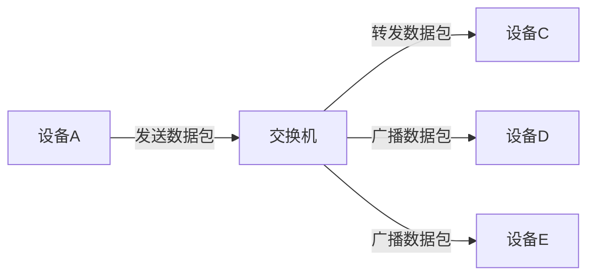

# 以太网交换技术

以太网交换技术是现代局域网（LAN）中不可或缺的一部分。它通过高效的数据传输和网络管理，使得局域网能够支持更多的设备并提供更高的带宽。本文将详细介绍以太网交换技术的基本概念、工作原理以及实际应用场景。

## 什么是以太网交换技术？

以太网交换技术是一种用于局域网中的数据传输技术，它通过交换机（Switch）来实现设备之间的数据交换。与传统的集线器（Hub）不同，交换机能够识别数据包的目标地址，并将数据包直接发送到目标设备，从而减少了网络冲突并提高了数据传输效率。

:::note
**以太网交换机**：一种网络设备，用于连接多个设备并转发数据包到正确的目标设备。
:::

## 以太网交换机的工作原理

以太网交换机的核心功能是学习和转发数据包。以下是交换机工作的基本步骤：

1. **学习**：交换机通过监听网络流量来学习设备的MAC地址，并将其存储在MAC地址表中。
2. **转发**：当交换机接收到数据包时，它会查找目标MAC地址，并将数据包转发到相应的端口。
3. **过滤**：如果目标MAC地址不在MAC地址表中，交换机会将数据包广播到所有端口（除了接收端口）。
4. **更新**：交换机会定期更新MAC地址表，以确保其准确性。

:::tip
**MAC地址表**：交换机内部维护的一个表，用于存储设备的MAC地址和对应的端口号。
:::

## 以太网交换机的类型

以太网交换机可以根据其功能和性能分为多种类型，常见的包括：

1. **非管理型交换机**：适用于小型网络，无需配置即可使用。
2. **管理型交换机**：适用于大型网络，支持高级功能如VLAN、QoS等。
3. **PoE交换机**：支持通过以太网线为设备供电，常用于IP摄像头和无线接入点。

## 实际应用场景

以太网交换技术广泛应用于各种网络环境中，以下是一些常见的应用场景：

1. **办公室网络**：在办公室中，交换机用于连接员工的计算机、打印机和服务器，确保高效的数据传输。
2. **数据中心**：在数据中心中，高性能交换机用于连接大量的服务器和存储设备，提供高带宽和低延迟的网络环境。
3. **家庭网络**：在家庭网络中，交换机用于连接智能家居设备、游戏机和流媒体设备，提供稳定的网络连接。

:::caution
**网络冲突**：在传统的集线器网络中，多个设备同时发送数据会导致网络冲突，而交换机可以有效避免这一问题。
:::

## 总结

以太网交换技术是现代局域网中不可或缺的一部分。通过学习和转发数据包，交换机能够高效地管理网络流量，减少网络冲突并提高数据传输效率。无论是办公室、数据中心还是家庭网络，以太网交换机都发挥着重要作用。

## 附加资源与练习

- **推荐阅读**：
  - 《计算机网络：自顶向下方法》 - 了解网络协议和交换技术的更多细节。
  - 《以太网交换技术详解》 - 深入探讨以太网交换机的工作原理和配置方法。

- **练习**：
  1. 使用模拟工具（如Packet Tracer）搭建一个简单的局域网，并配置交换机。
  2. 观察交换机的MAC地址表，并尝试理解其工作原理。

通过本文的学习，你应该对以太网交换技术有了初步的了解。继续探索和实践，你将能够更好地掌握这一重要的网络技术。