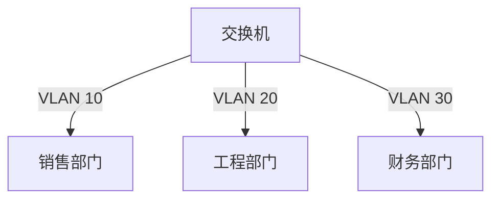

# VLAN技术

## 什么是VLAN？

VLAN（Virtual Local Area Network，虚拟局域网）是一种将物理局域网划分为多个逻辑网络的技术。通过VLAN，网络管理员可以在同一台交换机上创建多个独立的广播域，从而增强网络的安全性、灵活性和管理效率。

:::note
VLAN的主要目的是将网络设备逻辑分组，而不是物理分组。这意味着即使设备位于不同的物理位置，它们也可以属于同一个VLAN。
:::

## VLAN的工作原理

VLAN通过在以太网帧中添加一个VLAN标签（VLAN Tag）来实现。这个标签包含了VLAN的ID（VID），用于标识数据帧属于哪个VLAN。交换机根据这个标签来决定如何处理数据帧。

### VLAN标签的结构

VLAN标签通常包含以下字段：

- **TPID（Tag Protocol Identifier）**：标识这是一个带有VLAN标签的帧。
- **PRI（Priority）**：用于服务质量（QoS）的优先级。
- **CFI（Canonical Format Indicator）**：指示MAC地址的格式。
- **VID（VLAN Identifier）**：标识VLAN的ID，范围是1到4094。

### VLAN的配置

在交换机上配置VLAN通常涉及以下步骤：

1. **创建VLAN**：为每个逻辑网络创建一个VLAN。
2. **分配端口**：将交换机的端口分配给特定的VLAN。
3. **配置Trunk端口**：用于在不同交换机之间传输多个VLAN的数据。

以下是一个简单的VLAN配置示例：

```bash
# 创建VLAN 10和VLAN 20
Switch(config)# vlan 10
Switch(config-vlan)# name Sales
Switch(config-vlan)# exit
Switch(config)# vlan 20
Switch(config-vlan)# name Engineering
Switch(config-vlan)# exit

# 将端口分配给VLAN
Switch(config)# interface FastEthernet0/1
Switch(config-if)# switchport mode access
Switch(config-if)# switchport access vlan 10
Switch(config-if)# exit

Switch(config)# interface FastEthernet0/2
Switch(config-if)# switchport mode access
Switch(config-if)# switchport access vlan 20
Switch(config-if)# exit

# 配置Trunk端口
Switch(config)# interface FastEthernet0/24
Switch(config-if)# switchport mode trunk
Switch(config-if)# exit
```

## VLAN的实际应用场景

### 1. 部门隔离

在一个企业中，不同部门（如销售、工程、财务）可能需要访问不同的网络资源。通过VLAN，可以将每个部门的设备划分到不同的VLAN中，从而实现网络隔离和安全控制。



### 2. 网络分段

在大型网络中，VLAN可以用于将网络划分为多个较小的广播域，从而减少广播流量，提高网络性能。

### 3. 安全隔离

通过VLAN，可以将敏感数据（如财务数据）与其他网络流量隔离，从而增强网络的安全性。

## 总结

VLAN技术是现代网络设计中的重要组成部分，它通过逻辑划分网络，提供了更高的灵活性、安全性和管理效率。无论是部门隔离、网络分段还是安全隔离，VLAN都能发挥重要作用。

:::tip
在实际应用中，VLAN的配置需要根据具体的网络需求进行规划和调整。建议在配置VLAN时，仔细考虑网络的拓扑结构和业务需求。
:::

## 附加资源与练习

- **练习1**：在一个模拟网络环境中，尝试创建两个VLAN，并将不同的设备分配到这两个VLAN中。
- **练习2**：研究如何在不同的交换机之间配置Trunk端口，以实现VLAN的跨交换机通信。

通过以上内容的学习和实践，您将能够更好地理解和应用VLAN技术。