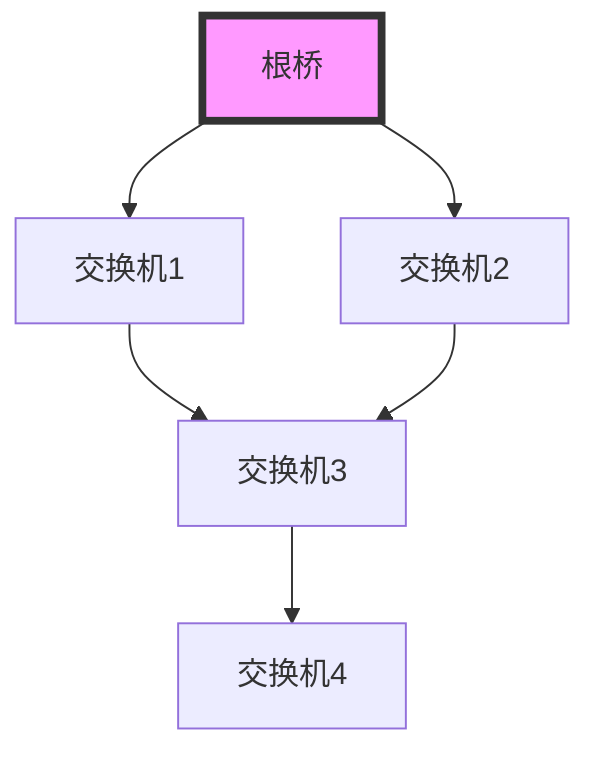
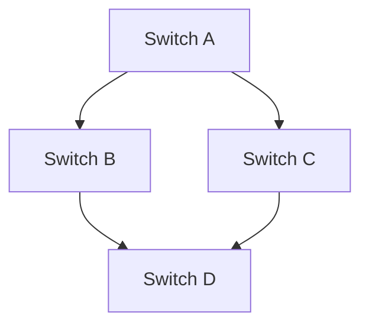

## 什么是生成树协议(STP)？

生成树协议（Spanning Tree Protocol，STP）是一种网络协议，用于防止局域网（LAN）中的环路（Loop）问题。在复杂的网络拓扑中，交换机之间可能存在多条路径连接，这会导致数据包在网络中无限循环，从而引发广播风暴、MAC地址表不稳定等问题。STP通过逻辑上断开某些冗余链路，确保网络中没有环路，同时提供冗余路径以应对链路故障。

:::note
STP 是 IEEE 802.1D 标准的一部分，广泛应用于以太网交换机中。
:::

## STP 的工作原理

STP 的核心思想是通过选举一个**根桥（Root Bridge）**，并计算从每个交换机到根桥的最短路径，从而确定哪些链路应该被阻塞（Blocked），哪些链路应该被激活（Forwarding）。以下是 STP 的工作步骤：

1. **选举根桥**：网络中所有交换机通过交换 BPDU（Bridge Protocol Data Unit）消息，选举出一个根桥。根桥是网络中的中心节点，通常具有最低的桥 ID（Bridge ID）。
2. **计算最短路径**：每个非根桥交换机计算到根桥的最短路径，并选择一条**根端口（Root Port）**。
3. **选择指定端口**：在每个网段中，选举一个**指定端口（Designated Port）**，用于转发数据。
4. **阻塞冗余链路**：所有未被选为根端口或指定端口的端口将被阻塞，以防止环路。

:::tip
STP 的选举过程基于桥 ID 和路径成本（Path Cost）。桥 ID 由优先级和 MAC 地址组成，路径成本则取决于链路的带宽。
:::

## STP 的实际应用

假设我们有一个小型企业网络，包含四台交换机（Switch A、Switch B、Switch C 和 Switch D）。网络拓扑如下：

1. **选举根桥**：假设 Switch A 被选为根桥，因为它具有最低的桥 ID。
2. **计算最短路径**：
   - Switch B 和 Switch C 选择直接连接到 Switch A 的端口作为根端口。
   - Switch D 选择连接到 Switch B 的端口作为根端口，因为这条路径的成本更低。
3. **选择指定端口**：
   - Switch A 的所有端口都是指定端口。
   - Switch B 和 Switch C 的连接到 Switch D 的端口被选为指定端口。
4. **阻塞冗余链路**：Switch D 的连接到 Switch C 的端口被阻塞，以防止环路。

:::caution
如果网络中没有 STP，数据包可能会在 Switch B 和 Switch C 之间无限循环，导致网络瘫痪。
:::

## STP 的改进版本

STP 虽然有效，但收敛速度较慢。为了解决这个问题，IEEE 推出了快速生成树协议（RSTP，IEEE 802.1w）和多生成树协议（MSTP，IEEE 802.1s）。RSTP 显著加快了收敛速度，而 MSTP 则支持多个生成树实例，适用于更复杂的网络环境。

:::warning
在实际网络中，建议使用 RSTP 或 MSTP 来替代传统的 STP，以提高网络的稳定性和性能。
:::

## 总结

生成树协议（STP）是局域网中防止环路的关键技术。它通过选举根桥、计算最短路径和阻塞冗余链路，确保网络的稳定运行。虽然 STP 有一些局限性，但其改进版本（如 RSTP 和 MSTP）已经广泛应用于现代网络中。

## 附加资源与练习

- **练习**：尝试在一个模拟网络环境中配置 STP，观察根桥选举和端口阻塞的过程。
- **资源**：
  - [IEEE 802.1D 标准文档](https://standards.ieee.org/standard/802_1D-2004.html)
  - [Cisco STP 配置指南](https://www.cisco.com/c/en/us/support/docs/lan-switching/spanning-tree-protocol/10556-16.html)

通过学习和实践，你将更好地理解 STP 的工作原理及其在网络中的重要性。