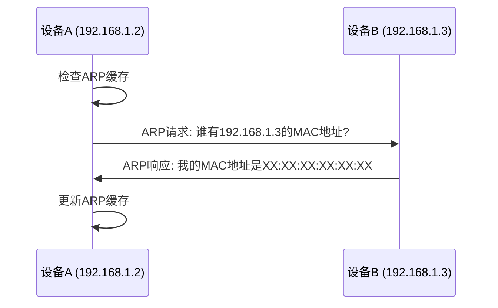

# ARP协议

## 介绍

ARP（Address Resolution Protocol，地址解析协议）是网络层中的一个重要协议，用于将IP地址解析为物理MAC地址。在网络通信中，设备需要知道目标设备的MAC地址才能发送数据帧。ARP协议的作用就是帮助设备找到目标设备的MAC地址。

:::note
ARP协议主要用于IPv4网络中。在IPv6中，类似的协议称为NDP（Neighbor Discovery Protocol，邻居发现协议）。
:::

## ARP协议的工作原理

ARP协议的工作原理可以分为以下几个步骤：

1. **ARP请求**：当一台设备需要知道某个IP地址对应的MAC地址时，它会发送一个ARP请求广播到局域网中的所有设备。
2. **ARP响应**：拥有该IP地址的设备会响应这个请求，返回自己的MAC地址。
3. **ARP缓存**：发送请求的设备会将IP地址和MAC地址的映射关系存储在本地ARP缓存中，以便后续通信时直接使用。

### ARP请求与响应示例

假设设备A（IP地址为`192.168.1.2`）想要与设备B（IP地址为`192.168.1.3`）通信，但不知道设备B的MAC地址。设备A会发送一个ARP请求广播，询问“谁有`192.168.1.3`的MAC地址？”设备B收到请求后，会回复自己的MAC地址。



## ARP缓存

ARP缓存是设备存储IP地址与MAC地址映射关系的地方。缓存中的条目通常有一个生存时间（TTL），超过这个时间后，条目会被删除，设备需要重新发送ARP请求来获取MAC地址。

:::tip
你可以使用命令 `arp -a` 在Windows或Linux系统中查看本地ARP缓存。
:::

## 实际应用场景

### 局域网通信

在局域网中，ARP协议是设备之间通信的基础。例如，当你在浏览器中输入一个本地服务器的IP地址时，你的计算机会使用ARP协议来找到该服务器的MAC地址，然后才能发送数据包。

### 网络安全

ARP协议也可以被用于网络攻击，如ARP欺骗（ARP Spoofing）。攻击者可以伪造ARP响应，将流量重定向到自己的设备，从而进行中间人攻击。为了防止这种攻击，可以使用静态ARP条目或启用ARP防护功能。

## 代码示例

以下是一个简单的Python脚本，用于发送ARP请求并解析ARP响应。这个示例使用了`scapy`库。

```python
from scapy.all import ARP, sr1

# 创建一个ARP请求包
arp_request = ARP(pdst="192.168.1.3")

# 发送ARP请求并等待响应
arp_response = sr1(arp_request, timeout=2, verbose=False)

if arp_response:
    print(f"IP地址: {arp_response.psrc}, MAC地址: {arp_response.hwsrc}")
else:
    print("未收到ARP响应")
```

### 输入与输出

- **输入**：目标IP地址（例如`192.168.1.3`）。
- **输出**：目标设备的MAC地址（例如`XX:XX:XX:XX:XX:XX`）。

## 总结

ARP协议是网络通信中不可或缺的一部分，它帮助设备将IP地址解析为MAC地址，从而实现数据包的传输。理解ARP协议的工作原理对于网络管理员和开发人员来说非常重要，尤其是在处理网络故障或安全问题时。

## 附加资源与练习

- **练习**：尝试在本地网络中捕获ARP请求和响应包，使用工具如Wireshark进行分析。
- **资源**：
  - [RFC 826](https://tools.ietf.org/html/rfc826) - ARP协议的官方文档。
  - [Scapy文档](https://scapy.readthedocs.io/) - 用于网络数据包操作的Python库。

:::caution
在实际网络环境中操作ARP协议时，请确保你有权限，并且不会干扰到其他设备的正常通信。
:::