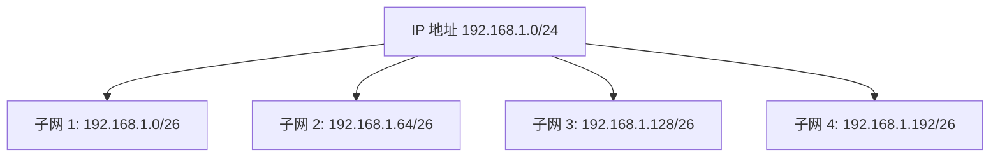

## 什么是子网划分？

子网划分（Subnetting）是将一个大的 IP 网络划分为多个较小的子网络的过程。通过子网划分，网络管理员可以更高效地管理 IP 地址，减少网络拥塞，并提高网络性能。子网划分是网络层中的一个重要概念，尤其在 IPv4 网络中，由于 IP 地址资源有限，子网划分显得尤为重要。

### 为什么需要子网划分？

1. **提高 IP 地址利用率**：通过将一个大网络划分为多个子网，可以更有效地利用有限的 IP 地址资源。
2. **减少网络拥塞**：子网划分可以将广播域缩小，减少网络中的广播流量，从而降低网络拥塞。
3. **增强安全性**：通过将不同的部门或功能划分到不同的子网中，可以更好地控制网络访问权限，增强网络安全性。

## 子网划分的基本原理

子网划分的核心是通过借用主机位来创建子网。在 IPv4 中，IP 地址由 32 位组成，通常表示为四个 8 位的十进制数（例如 `192.168.1.1`）。IP 地址分为网络部分和主机部分，子网划分就是通过借用主机部分的位来扩展网络部分。

### 子网掩码

子网掩码（Subnet Mask）用于标识 IP 地址中哪些位属于网络部分，哪些位属于主机部分。子网掩码也是一个 32 位的二进制数，通常表示为四个 8 位的十进制数（例如 `255.255.255.0`）。

:::note
子网掩码中的 `1` 表示网络部分，`0` 表示主机部分。
:::

例如，IP 地址 `192.168.1.1` 和子网掩码 `255.255.255.0` 表示前 24 位是网络部分，后 8 位是主机部分。

### 子网划分的步骤

1. **确定所需的子网数量**：首先需要确定需要划分多少个子网。
2. **计算所需的子网位数**：根据子网数量，计算需要借用的主机位数。
3. **确定新的子网掩码**：根据借用的位数，计算新的子网掩码。
4. **计算每个子网的 IP 地址范围**：根据新的子网掩码，计算每个子网的 IP 地址范围。

### 示例：子网划分

假设我们有一个 IP 地址 `192.168.1.0/24`，我们需要将其划分为 4 个子网。

1. **确定所需的子网数量**：我们需要 4 个子网。
2. **计算所需的子网位数**：2 的 2 次方等于 4，所以我们需要借用 2 位主机位。
3. **确定新的子网掩码**：原来的子网掩码是 `/24`，借用 2 位后，新的子网掩码是 `/26`（即 `255.255.255.192`）。
4. **计算每个子网的 IP 地址范围**：

   - 子网 1：`192.168.1.0/26`，IP 地址范围：`192.168.1.0` - `192.168.1.63`
   - 子网 2：`192.168.1.64/26`，IP 地址范围：`192.168.1.64` - `192.168.1.127`
   - 子网 3：`192.168.1.128/26`，IP 地址范围：`192.168.1.128` - `192.168.1.191`
   - 子网 4：`192.168.1.192/26`，IP 地址范围：`192.168.1.192` - `192.168.1.255`

:::tip
在子网划分中，每个子网的第一个 IP 地址是网络地址，最后一个 IP 地址是广播地址，不能分配给主机使用。
:::

## 实际应用场景

### 企业网络设计

在一个大型企业中，通常会有多个部门，每个部门可能需要独立的子网。通过子网划分，可以将不同部门的设备划分到不同的子网中，从而提高网络管理效率，减少广播流量，并增强安全性。

例如，一个企业可能有以下部门：

- 财务部
- 人力资源部
- 研发部
- 市场部

通过子网划分，可以为每个部门分配一个独立的子网，确保各部门之间的网络流量互不干扰。

### 家庭网络

在家庭网络中，子网划分可以用于将不同的设备（如电脑、手机、智能家居设备）划分到不同的子网中，从而提高网络性能和安全性。

## 总结

子网划分是网络设计中的一个重要概念，通过将一个大网络划分为多个子网，可以提高 IP 地址的利用率，减少网络拥塞，并增强网络安全性。掌握子网划分的基本原理和步骤，对于网络管理员和网络工程师来说至关重要。

## 附加资源与练习

- **练习 1**：给定 IP 地址 `10.0.0.0/24`，将其划分为 8 个子网，并计算每个子网的 IP 地址范围。
- **练习 2**：给定 IP 地址 `172.16.0.0/16`，将其划分为 16 个子网，并计算每个子网的 IP 地址范围。

:::caution
在进行子网划分时，务必确保每个子网的主机数量足够，避免 IP 地址浪费。
:::

通过以上内容，你应该对子网划分有了一个全面的了解。继续练习和探索，你将能够熟练地应用子网划分来解决实际的网络设计问题。