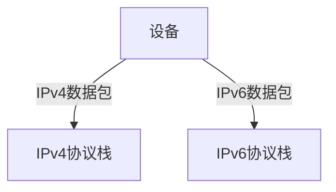
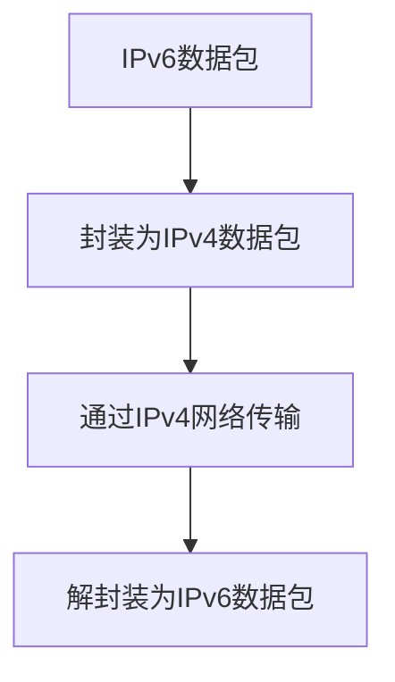
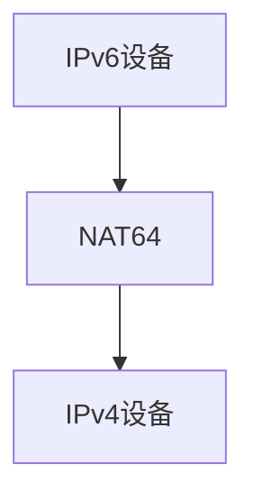

# IPv4向IPv6过渡技术

随着互联网的快速发展，IPv4地址的枯竭问题日益严重。为了解决这一问题，IPv6应运而生。然而，IPv4和IPv6并不直接兼容，因此需要一些过渡技术来实现从IPv4到IPv6的平滑迁移。本文将介绍几种常见的IPv4向IPv6过渡技术，并通过实际案例帮助初学者理解这些技术的应用。

## 1. 什么是IPv4向IPv6过渡技术？

IPv4向IPv6过渡技术是指在IPv4和IPv6共存的情况下，通过一系列技术手段实现两者之间的互操作和平滑迁移。这些技术包括双栈（Dual Stack）、隧道（Tunneling）和协议转换（Protocol Translation）等。

## 2. 双栈技术（Dual Stack）

双栈技术是最简单的过渡技术之一。它要求网络设备同时支持IPv4和IPv6协议栈，从而能够处理两种协议的数据包。

### 2.1 双栈的工作原理

在双栈网络中，设备同时运行IPv4和IPv6协议栈。当设备接收到IPv4数据包时，使用IPv4协议栈进行处理；当接收到IPv6数据包时，使用IPv6协议栈进行处理。

### 2.2 实际应用

双栈技术常用于企业网络和互联网服务提供商（ISP）的网络中。例如，一个企业可能在其内部网络中同时部署IPv4和IPv6，以便逐步迁移到IPv6。

:::tip
双栈技术的优点是简单易行，但缺点是需要在所有设备上同时支持IPv4和IPv6，增加了配置和管理的复杂性。
:::

## 3. 隧道技术（Tunneling）

隧道技术通过在IPv4网络中封装IPv6数据包，实现IPv6数据包在IPv4网络中的传输。

### 3.1 隧道的工作原理

隧道技术将IPv6数据包封装在IPv4数据包中，通过IPv4网络传输到目的地，然后在目的地解封装，恢复为IPv6数据包。

### 3.2 实际应用

隧道技术常用于连接两个IPv6网络，而中间的网络仍然是IPv4的情况。例如，6to4隧道技术就是一种常见的隧道技术，它允许IPv6数据包通过IPv4网络传输。

:::caution
隧道技术的缺点是增加了数据包的开销，并且可能引入额外的延迟。
:::

## 4. 协议转换技术（Protocol Translation）

协议转换技术通过将IPv4数据包转换为IPv6数据包，或者将IPv6数据包转换为IPv4数据包，实现两种协议之间的互操作。

### 4.1 协议转换的工作原理

协议转换器（NAT64）是一种常见的协议转换技术。它通过将IPv6数据包转换为IPv4数据包，使得IPv6设备能够与IPv4设备通信。

### 4.2 实际应用

协议转换技术常用于IPv6设备需要访问IPv4资源的情况。例如，一个IPv6-only的网络可能需要通过NAT64访问IPv4的互联网资源。

:::warning
协议转换技术的缺点是可能引入额外的复杂性，并且某些应用可能无法正常工作。
:::

## 5. 实际案例

### 5.1 双栈技术的应用

某大型企业决定逐步迁移到IPv6。为了确保业务不中断，他们在所有网络设备上启用了双栈技术。这样，企业内部的IPv4和IPv6设备可以同时运行，逐步将IPv4设备替换为IPv6设备。

### 5.2 隧道技术的应用

某ISP需要连接两个IPv6网络，但中间的网络仍然是IPv4。他们使用6to4隧道技术，将IPv6数据包封装在IPv4数据包中，通过IPv4网络传输到目的地，然后在目的地解封装，恢复为IPv6数据包。

### 5.3 协议转换技术的应用

某IPv6-only的网络需要访问IPv4的互联网资源。他们部署了NAT64设备，将IPv6数据包转换为IPv4数据包，从而实现了IPv6设备与IPv4资源的通信。

## 6. 总结

IPv4向IPv6的过渡是一个复杂的过程，需要多种技术的配合。双栈技术、隧道技术和协议转换技术是实现这一过渡的关键手段。每种技术都有其优缺点，适用于不同的场景。通过合理选择和组合这些技术，可以实现从IPv4到IPv6的平滑迁移。

## 7. 附加资源与练习

- **附加资源**：
  - [IPv6过渡技术概述](https://www.ietf.org/rfc/rfc4213.txt)
  - [双栈技术详解](https://www.cisco.com/c/en/us/support/docs/ip/ip-version-6-ipv6/116376-configure-ipv6-dual-stack-00.html)
  - [隧道技术实践指南](https://www.juniper.net/documentation/en_US/junos/topics/concept/ipv6-tunneling-overview.html)

- **练习**：
  1. 在你的本地网络中启用双栈技术，并测试IPv4和IPv6的连通性。
  2. 使用6to4隧道技术连接两个IPv6网络，并通过IPv4网络传输数据。
  3. 部署NAT64设备，并测试IPv6设备访问IPv4资源的能力。

通过以上学习和实践，你将能够更好地理解IPv4向IPv6过渡技术，并为未来的网络部署做好准备。