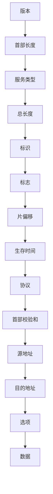

## 介绍

在网络通信中，IP（Internet Protocol）是用于在互联网上传输数据的基本协议。IP数据报是IP协议中用于传输数据的基本单位。理解IP数据报的格式对于理解网络通信的工作原理至关重要。

IP数据报由多个字段组成，每个字段都有其特定的功能。这些字段共同协作，确保数据能够正确地从源地址传输到目的地址。

## IP数据报格式

IP数据报的格式由以下几个主要部分组成：

1. **版本（Version）**：4位，表示IP协议的版本。IPv4的版本号为4，IPv6的版本号为6。
2. **首部长度（Header Length）**：4位，表示IP数据报首部的长度，以32位字为单位。
3. **服务类型（Type of Service, ToS）**：8位，用于指定数据报的优先级和服务类型。
4. **总长度（Total Length）**：16位，表示整个IP数据报的长度，包括首部和数据部分。
5. **标识（Identification）**：16位，用于标识数据报的唯一性，通常用于分片和重组。
6. **标志（Flags）**：3位，用于控制数据报的分片。
7. **片偏移（Fragment Offset）**：13位，表示分片在原始数据报中的位置。
8. **生存时间（Time to Live, TTL）**：8位，表示数据报在网络中的最大存活时间。
9. **协议（Protocol）**：8位，表示上层协议的类型，如TCP、UDP等。
10. **首部校验和（Header Checksum）**：16位，用于校验首部的完整性。
11. **源地址（Source Address）**：32位，表示数据报的源IP地址。
12. **目的地址（Destination Address）**：32位，表示数据报的目的IP地址。
13. **选项（Options）**：可变长度，用于提供额外的功能。
14. **数据（Data）**：可变长度，包含上层协议的数据。



## 实际案例

假设我们有一个IPv4数据报，其首部长度为20字节，总长度为100字节，源地址为192.168.1.1，目的地址为192.168.1.2，协议为TCP（协议号为6），TTL为64。

```plaintext
版本: 4
首部长度: 5 (20字节)
服务类型: 0
总长度: 100
标识: 12345
标志: 0x2 (不分片)
片偏移: 0
生存时间: 64
协议: 6 (TCP)
首部校验和: 0x1234
源地址: 192.168.1.1
目的地址: 192.168.1.2
数据: (80字节的TCP数据)
```

:::note
在实际网络中，IP数据报的格式可能会因不同的网络设备和协议实现而有所不同。理解这些字段的作用有助于调试和优化网络通信。
:::

## 总结

IP数据报是网络通信中的基本单位，理解其格式和各个字段的功能对于掌握网络协议至关重要。通过本文的学习，你应该能够理解IP数据报的各个组成部分及其在网络通信中的作用。

## 附加资源

- [RFC 791 - Internet Protocol](https://tools.ietf.org/html/rfc791)
- [TCP/IP Illustrated, Volume 1: The Protocols](https://www.amazon.com/TCP-Illustrated-Protocols-Addison-Wesley-Professional/dp/0321336313)

## 练习

1. 解释IP数据报中“生存时间”字段的作用。
2. 编写一个简单的程序，解析一个IPv4数据报的首部字段。
3. 研究IPv6数据报的格式，并与IPv4进行比较。

:::tip
尝试使用Wireshark等网络分析工具捕获和分析实际的IP数据报，以加深对IP数据报格式的理解。
:::