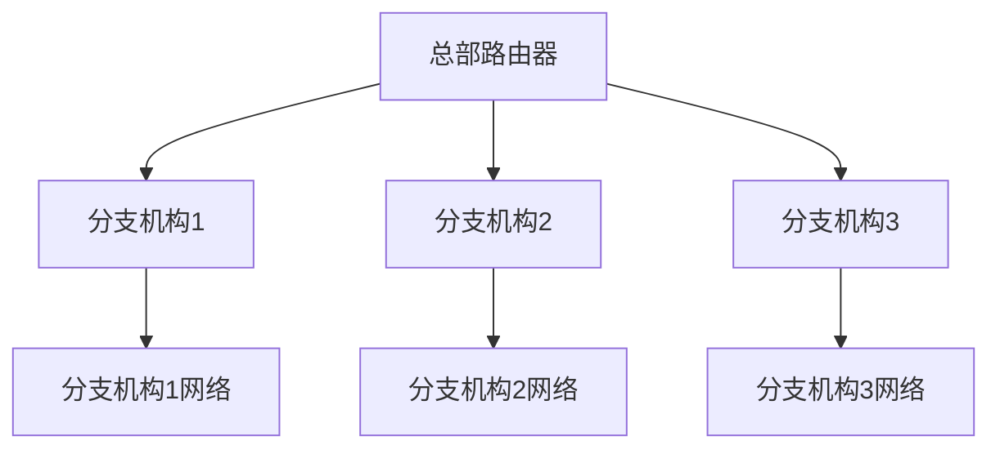

# 路由协议概述

路由协议是计算机网络中用于确定数据包从源设备到目标设备传输路径的规则和算法。它是网络通信的核心组成部分，确保数据能够高效、准确地传输到目的地。本文将逐步介绍路由协议的基本概念、工作原理以及实际应用场景。

## 什么是路由协议？

路由协议是一种网络协议，用于在网络中的路由器之间交换信息，以确定数据包的最佳传输路径。它通过动态或静态的方式，帮助路由器构建和维护路由表，从而指导数据包的转发。

:::note
**路由表**：路由表是路由器中存储的一张表，记录了到达不同网络的最佳路径信息。
:::

## 路由协议的分类

路由协议可以根据其工作方式分为两大类：

1. **静态路由协议**：管理员手动配置路由表，适用于小型网络或特定场景。
2. **动态路由协议**：路由器之间自动交换信息，动态更新路由表，适用于大型复杂网络。

常见的动态路由协议包括：
- **RIP（Routing Information Protocol）**：基于距离向量的路由协议，适用于小型网络。
- **OSPF（Open Shortest Path First）**：基于链路状态的路由协议，适用于大型网络。
- **BGP（Border Gateway Protocol）**：用于互联网中不同自治系统之间的路由。

## 路由协议的工作原理

### 1. 路由发现
路由器通过路由协议与其他路由器交换信息，了解网络的拓扑结构。例如，RIP 使用跳数作为度量标准，而 OSPF 使用链路状态信息。

### 2. 路由计算
路由器根据收到的信息计算到达目标网络的最佳路径。例如，OSPF 使用 Dijkstra 算法计算最短路径。

### 3. 路由更新
当网络拓扑发生变化时，路由器会通过路由协议更新路由表，确保数据包能够正确转发。

## 实际应用场景

### 案例：企业网络中的 OSPF
假设某企业有多个分支机构，每个分支机构通过路由器连接到总部。为了确保数据能够高效传输，管理员可以使用 OSPF 协议动态管理路由表。当某个分支机构的网络出现故障时，OSPF 会自动更新路由表，将数据包转发到其他可用路径。

## 总结

路由协议是网络通信中不可或缺的一部分，它通过动态或静态的方式帮助路由器确定数据包的最佳传输路径。本文介绍了路由协议的基本概念、分类、工作原理以及实际应用场景，适合初学者理解这一重要主题。

## 附加资源与练习

- **练习**：尝试在模拟器中配置静态路由和动态路由（如 OSPF），观察路由表的变化。
- **资源**：阅读 RFC 文档，深入了解 OSPF 和 BGP 的协议细节。

:::tip
**提示**：学习路由协议时，建议结合网络模拟工具（如 GNS3 或 Packet Tracer）进行实践，以加深理解。
:::