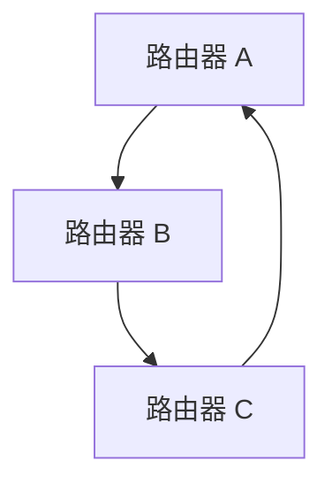
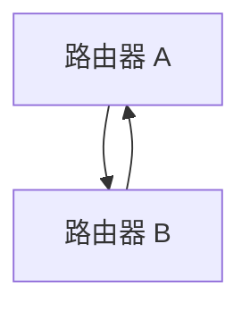

# 路由环路问题

在网络通信中，路由协议负责决定数据包从源地址到目的地址的传输路径。然而，在某些情况下，路由协议可能会导致数据包在网络中无限循环，这种现象被称为**路由环路问题**。本文将详细介绍路由环路问题的定义、成因、影响以及如何检测和解决这一问题。

## 什么是路由环路问题？

路由环路问题是指数据包在网络中传输时，由于路由表配置错误或协议设计缺陷，导致数据包在网络中不断循环，无法到达目的地。这种情况不仅会浪费网络资源，还可能导致网络拥塞甚至崩溃。

### 路由环路的成因

路由环路问题通常由以下原因引起：

1. **路由表配置错误**：管理员手动配置路由表时，可能会错误地将数据包指向错误的下一跳地址。
2. **动态路由协议的收敛问题**：在动态路由协议（如 RIP、OSPF）中，当网络拓扑发生变化时，路由表需要一段时间来重新计算和更新。在此期间，可能会出现临时环路。
3. **路由协议的缺陷**：某些路由协议（如 RIP）在设计上存在缺陷，容易导致环路问题。

## 路由环路的影响

路由环路问题会对网络性能产生严重影响，包括：

- **带宽浪费**：数据包在网络中不断循环，占用大量带宽。
- **延迟增加**：数据包无法及时到达目的地，导致网络延迟增加。
- **网络拥塞**：大量循环的数据包可能导致网络拥塞，甚至使整个网络瘫痪。

## 如何检测路由环路？

检测路由环路问题通常需要借助网络监控工具或路由协议的调试功能。以下是一些常见的检测方法：

1. **Traceroute**：使用 `traceroute` 命令可以查看数据包从源地址到目的地址的路径。如果发现数据包在某些节点之间反复循环，则可能存在路由环路。
2. **路由表检查**：检查路由表，确保没有错误的路由条目。
3. **路由协议日志**：查看路由协议的日志，寻找可能的环路迹象。

### 示例：使用 Traceroute 检测路由环路

假设我们有一个网络拓扑如下：



在这个拓扑中，路由器 A、B、C 之间形成了一个环路。我们可以使用 `traceroute` 命令来检测这个问题：

```bash
traceroute 192.168.1.1
```

输出可能如下：

```
1  192.168.1.1 (192.168.1.1)  1.234 ms  1.123 ms  1.345 ms
2  192.168.1.2 (192.168.1.2)  2.456 ms  2.567 ms  2.678 ms
3  192.168.1.3 (192.168.1.3)  3.789 ms  3.890 ms  3.901 ms
4  192.168.1.1 (192.168.1.1)  4.012 ms  4.123 ms  4.234 ms
5  192.168.1.2 (192.168.1.2)  5.345 ms  5.456 ms  5.567 ms
...
```

从输出中可以看到，数据包在 192.168.1.1、192.168.1.2、192.168.1.3 之间不断循环，这表明存在路由环路。

## 如何解决路由环路问题？

解决路由环路问题通常需要采取以下措施：

1. **配置静态路由**：在某些情况下，手动配置静态路由可以避免动态路由协议导致的环路问题。
2. **启用路由协议的防环机制**：许多现代路由协议（如 OSPF、EIGRP）都内置了防环机制，如 OSPF 的 SPF 算法和 EIGRP 的 DUAL 算法。
3. **使用 TTL（Time to Live）**：TTL 是 IP 数据包中的一个字段，用于限制数据包在网络中的生存时间。当 TTL 减至 0 时，数据包将被丢弃，从而防止无限循环。

### 示例：配置静态路由

假设我们有一个简单的网络拓扑，包含两个路由器：



为了避免环路，我们可以在路由器 A 和路由器 B 上配置静态路由：

```bash
# 在路由器 A 上配置静态路由
ip route 192.168.2.0 255.255.255.0 192.168.1.2

# 在路由器 B 上配置静态路由
ip route 192.168.1.0 255.255.255.0 192.168.1.1
```

通过手动配置静态路由，我们可以确保数据包不会在路由器 A 和路由器 B 之间循环。

## 实际案例：RIP 协议中的路由环路

RIP（Routing Information Protocol）是一种早期的动态路由协议，由于其简单的设计，容易导致路由环路问题。以下是一个典型的 RIP 路由环路案例：

1. **网络拓扑**：假设有三个路由器 A、B、C，它们之间通过 RIP 协议交换路由信息。
2. **环路形成**：当路由器 A 的某个接口失效时，路由器 A 会向路由器 B 和路由器 C 发送更新，告知它们该接口不可达。然而，由于 RIP 的更新机制，路由器 B 和路由器 C 可能会错误地认为可以通过对方到达该接口，从而导致环路。

:::caution
RIP 协议的最大跳数限制为 15 跳，超过该跳数的路由将被标记为不可达。这一机制可以在一定程度上缓解路由环路问题，但并不能完全避免。
:::

## 总结

路由环路问题是网络通信中的一个常见问题，可能导致严重的网络性能下降甚至崩溃。通过理解路由环路的成因、影响以及检测和解决方法，我们可以更好地管理和维护网络。

### 附加资源

- [Routing Information Protocol (RIP) - Wikipedia](https://en.wikipedia.org/wiki/Routing_Information_Protocol)
- [Open Shortest Path First (OSPF) - Wikipedia](https://en.wikipedia.org/wiki/Open_Shortest_Path_First)
- [Traceroute Command - Linux Man Page](https://linux.die.net/man/8/traceroute)

### 练习

1. 使用 `traceroute` 命令检测你所在网络中的路由环路问题。
2. 在一个模拟网络环境中配置静态路由，观察其对路由环路的影响。
3. 研究 RIP 协议的防环机制，并尝试在一个小型网络中模拟路由环路问题。

通过以上学习和实践，你将能够更好地理解和解决路由环路问题。