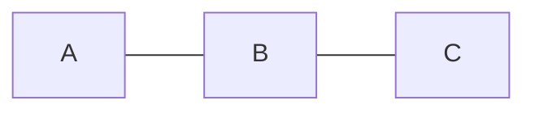

# 路由收敛

路由收敛（Routing Convergence）是网络中的一个重要概念，指的是当网络拓扑发生变化时，路由器通过动态路由协议重新计算并更新路由表，最终使所有路由器对网络拓扑达成一致状态的过程。路由收敛的速度直接影响网络的稳定性和性能。

## 什么是路由收敛？

在网络中，路由器通过动态路由协议（如 OSPF、EIGRP、BGP 等）交换路由信息，并根据这些信息计算最佳路径。当网络拓扑发生变化时（例如链路故障或新增路由器），路由器需要重新计算路由表，并确保所有路由器对新的拓扑结构达成一致。这个过程就是路由收敛。

路由收敛的目标是使网络中的所有路由器尽快达成一致，避免数据包丢失或路由环路。

## 路由收敛的工作原理

路由收敛的过程可以分为以下几个步骤：

1. **检测变化**：路由器通过路由协议检测到网络拓扑的变化（例如链路断开或恢复）。
2. **传播更新**：检测到变化的路由器将更新信息发送给邻居路由器。
3. **重新计算**：所有路由器根据新的信息重新计算最佳路径。
4. **更新路由表**：路由器将新的最佳路径更新到路由表中。
5. **达成一致**：所有路由器对新的网络拓扑达成一致，路由收敛完成。

### 示例：OSPF 中的路由收敛

以下是一个简单的 OSPF 路由收敛示例：

```plaintext
Router A --- Router B --- Router C
```

假设 `Router A` 和 `Router B` 之间的链路断开，以下是路由收敛的过程：

1. **检测变化**：`Router A` 和 `Router B` 检测到链路断开。
2. **传播更新**：`Router A` 和 `Router B` 向邻居路由器发送链路状态更新（LSA）。
3. **重新计算**：所有路由器根据新的链路状态数据库（LSDB）重新计算最短路径。
4. **更新路由表**：路由器更新路由表，选择新的最佳路径（例如通过 `Router C`）。
5. **达成一致**：所有路由器对新的拓扑达成一致，路由收敛完成。

## 路由收敛的实际应用场景

### 场景 1：链路故障恢复

假设一个企业网络中有三台路由器（A、B、C），拓扑如下：



如果 `Router A` 和 `Router B` 之间的链路断开，路由协议会重新计算路径，使流量通过 `Router C` 转发。路由收敛完成后，网络恢复正常。

### 场景 2：新增路由器

当网络中新增一台路由器时，路由协议会检测到新设备，并更新路由表以包含新路由器的信息。路由收敛完成后，所有路由器都能正确转发数据包到新路由器。

## 路由收敛的优化

路由收敛的速度对网络性能至关重要。以下是一些优化路由收敛的方法：

1. **使用快速收敛协议**：例如 EIGRP 或 OSPF 的快速收敛特性。
2. **调整计时器**：减少路由协议的 Hello 和 Dead 计时器，以加快变化检测。
3. **分层设计**：通过分层网络设计（如核心层、汇聚层、接入层）减少路由更新的传播范围。

:::tip
在实际网络中，路由收敛的速度通常以毫秒或秒为单位。快速收敛可以显著减少网络中断时间。
:::

## 总结

路由收敛是网络稳定性和性能的关键因素。通过动态路由协议，路由器能够在网络拓扑变化时快速重新计算并更新路由表，确保数据包的正确转发。理解路由收敛的工作原理和优化方法，有助于设计高效、可靠的网络。

## 附加资源与练习

- **练习 1**：使用模拟工具（如 GNS3 或 Packet Tracer）搭建一个简单的网络，模拟链路故障并观察路由收敛过程。
- **练习 2**：研究不同路由协议（如 OSPF、EIGRP、BGP）的收敛机制，并比较它们的收敛速度。
- **资源**：阅读 RFC 文档，深入了解路由协议的实现细节。

通过学习和实践，你将能够更好地掌握路由收敛的概念及其在网络中的应用。